# Olympe Blueprint Editor — Interactive Visual Diagrams

> **Version**: 2.0 (Phase 5-8)  
> **Format**: Mermaid Diagrams (render in GitHub, VS Code, or Markdown viewers)  
> **Status**: ✅ Current — Reflects production v4 system

---

## Table of Contents

1. [Complete Editor Architecture](#complete-editor-architecture)
2. [Asset Loading Pipeline](#asset-loading-pipeline)
3. [Graph Creation Workflow](#graph-creation-workflow)
4. [Runtime Execution Flow](#runtime-execution-flow)
5. [SubGraph Call Stack](#subgraph-call-stack)
6. [Data Flow Architecture](#data-flow-architecture)
7. [Debug System State Machine](#debug-system-state-machine)
8. [Command Stack Operations](#command-stack-operations)
9. [Validation Pipeline](#validation-pipeline)
10. [Profiler Data Flow](#profiler-data-flow)

---

## Complete Editor Architecture

### Class Hierarchy

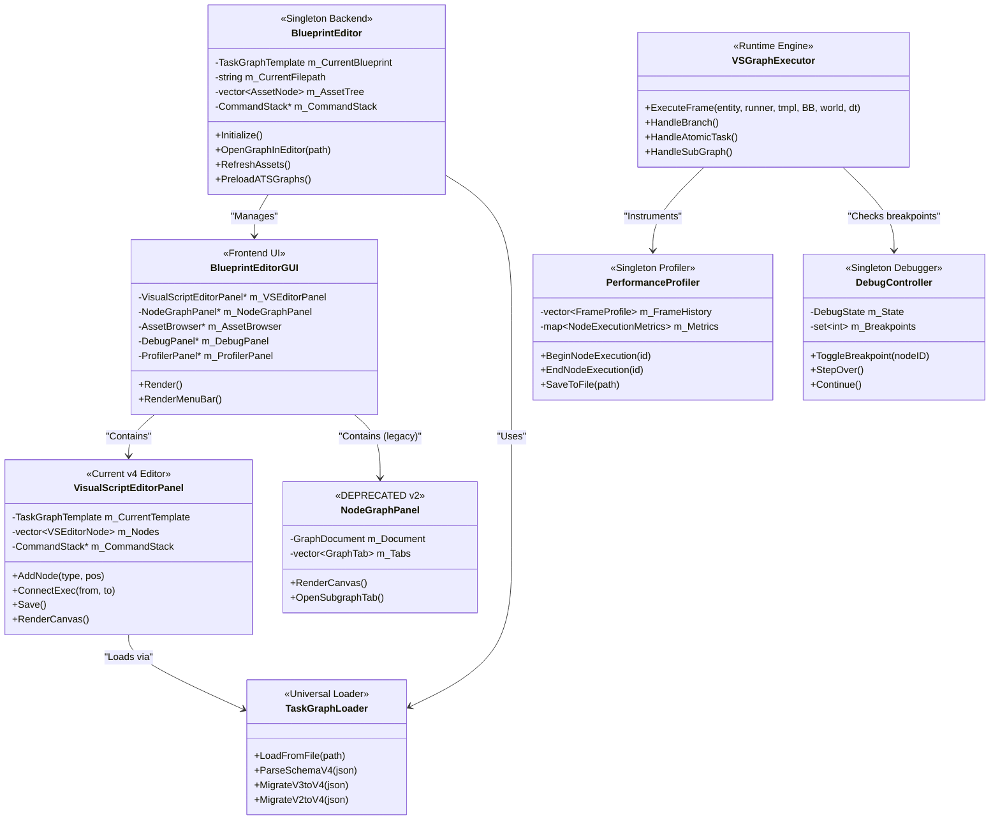

---

## Asset Loading Pipeline

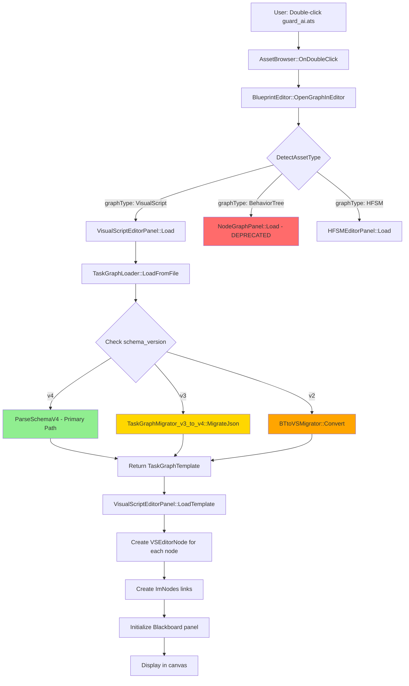

---

## Graph Creation Workflow

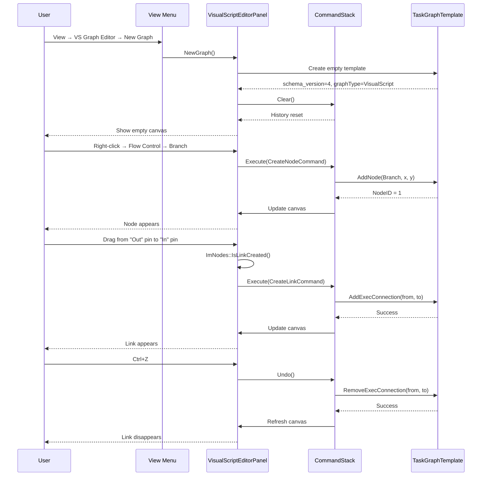

---

## Runtime Execution Flow

```mermaid
stateDiagram-v2
    [*] --> EntryPoint: Frame Start

    EntryPoint --> Branch: Follow "Out" exec pin
    Branch --> ResolveDataPins: Before node execution
    ResolveDataPins --> EvaluateCondition: Read DataPinCache
    
    EvaluateCondition --> TruePath: Condition = true
    EvaluateCondition --> FalsePath: Condition = false
    
    TruePath --> AtomicTask: Follow "True" exec pin
    FalsePath --> SetBBValue: Follow "False" exec pin
    
    AtomicTask --> CheckTaskState: IAtomicTask::Execute()
    CheckTaskState --> Running: Task not complete
    CheckTaskState --> Success: Task finished
    
    Running --> [*]: Keep CurrentNodeID, wait next frame
    Success --> GetBBValue: Follow "Completed" exec pin
    
    GetBBValue --> ReadBlackboard: Resolve "BBKey"
    ReadBlackboard --> StoreInCache: DataPinCache[output] = value
    StoreInCache --> SubGraph: Follow "Out" exec pin
    
    SubGraph --> CheckCycle: SubGraphCallStack::Contains?
    CheckCycle --> Error: Cycle detected
    CheckCycle --> LoadChild: No cycle
    
    LoadChild --> RecursiveExecute: VSGraphExecutor::ExecuteFrame(child)
    RecursiveExecute --> CopyOutput: Child completed
    CopyOutput --> FollowExecOutput: Success/Failure pin
    
    FollowExecOutput --> [*]: Frame End
    SetBBValue --> [*]: Frame End
    Error --> [*]: Frame End (error state)
```

---

## SubGraph Call Stack

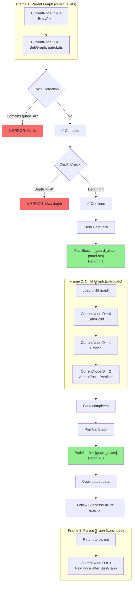

---

## Data Flow Architecture

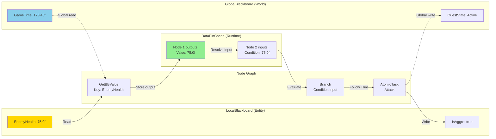

---

## Debug System State Machine

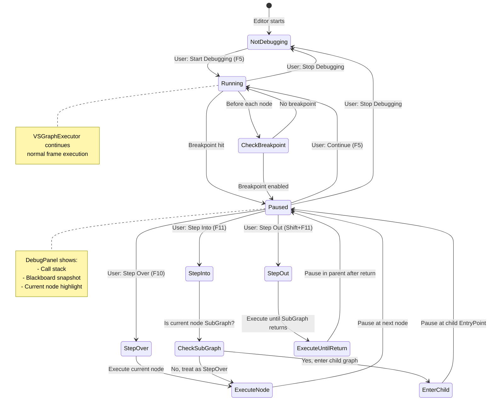

---

## Command Stack Operations

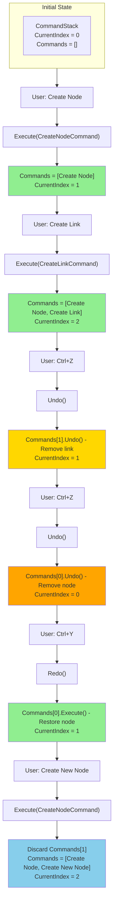

---

## Validation Pipeline

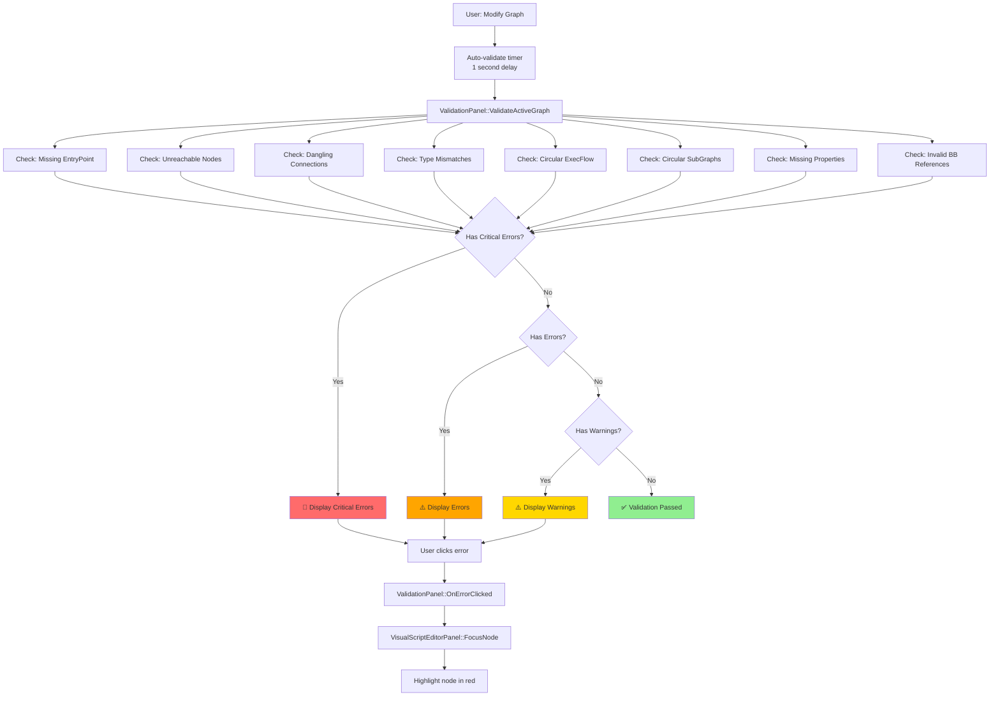

---

## Profiler Data Flow

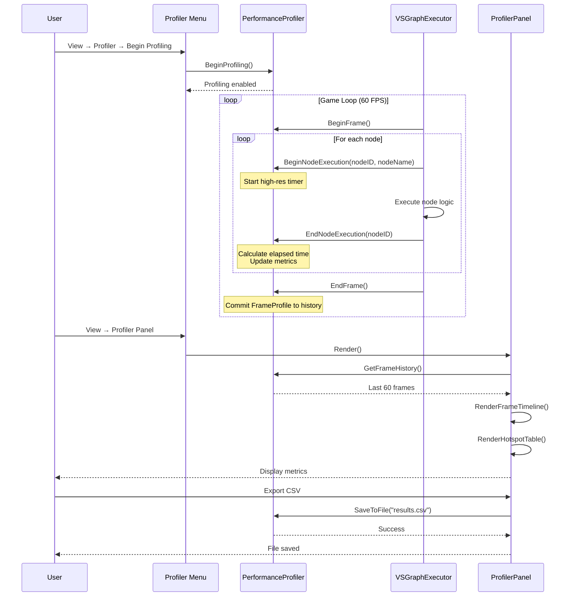

---

## Blackboard Scoping Hierarchy

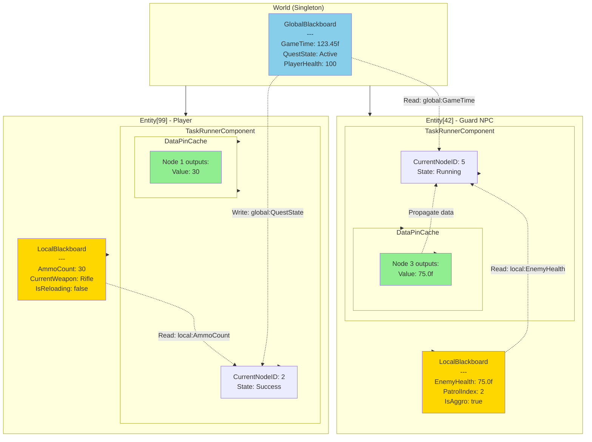

---

## Template System Workflow

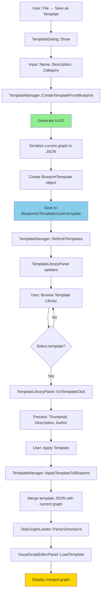

---

## Multi-Tab SubGraph Navigation

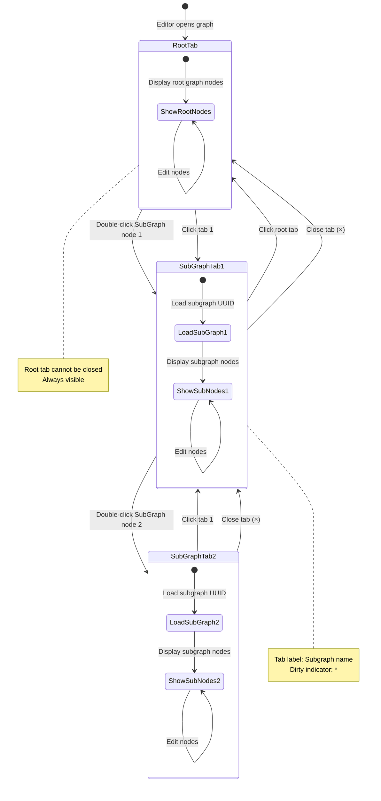

---

## Type System & Data Pin Validation

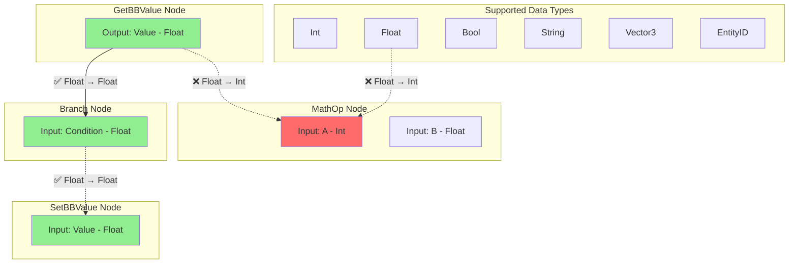

---

## Summary

These interactive diagrams visualize the complete Olympe Blueprint Editor v4 architecture:

1. **Class Hierarchy** — Backend/Frontend separation, plugin system
2. **Asset Loading** — Multi-version migration (v2/v3/v4)
3. **Graph Creation** — Command pattern, undo/redo
4. **Runtime Execution** — Node-by-node execution flow
5. **SubGraphs** — Call stack, cycle detection, depth limiting
6. **Data Flow** — DataPinCache, Blackboard scoping
7. **Debug System** — State machine, breakpoints, step controls
8. **Command Stack** — Undo/redo with branching history
9. **Validation** — Real-time error detection and navigation
10. **Profiler** — Per-node metrics collection and visualization

All diagrams are **Mermaid-compatible** and can be rendered in:
- GitHub README
- VS Code (with Mermaid extension)
- Markdown viewers (Typora, MarkText, etc.)
- Online editors (mermaid.live, draw.io)

---

**Related Documentation**:
- [Blueprint Editor User Guide v4](Blueprint_Editor_User_Guide_v4.md) — Basic workflows
- [Advanced Systems Documentation](Blueprint_Editor_Advanced_Systems.md) — Technical details
- [ATS Visual Script Complete Documentation](../Documentation/Olympe_ATS_VisualScript_Complete_Doc.md) — Node reference
