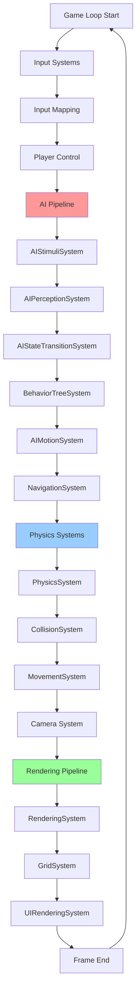
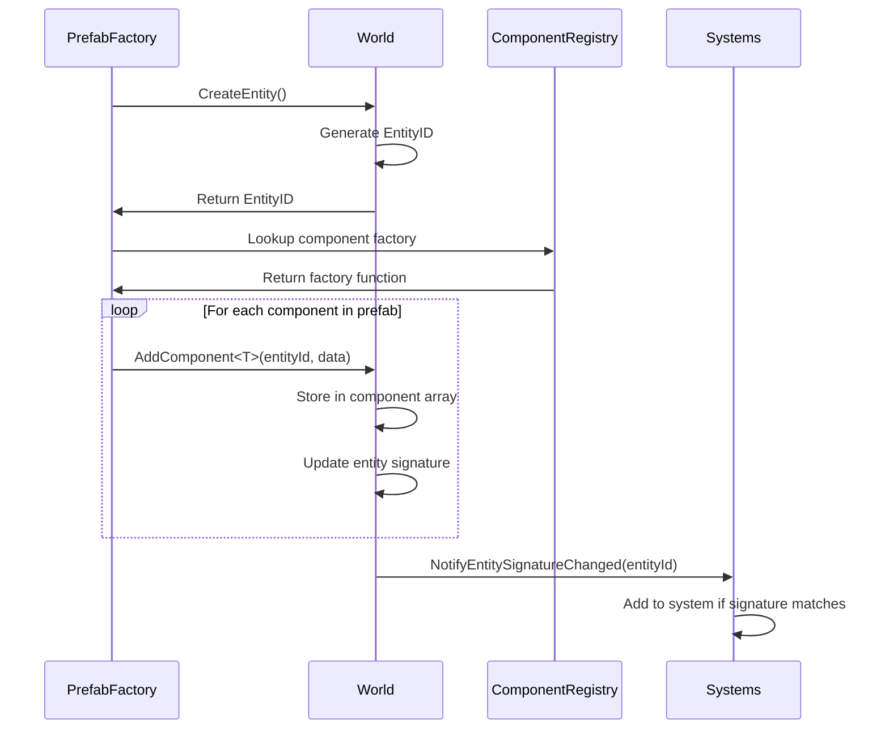
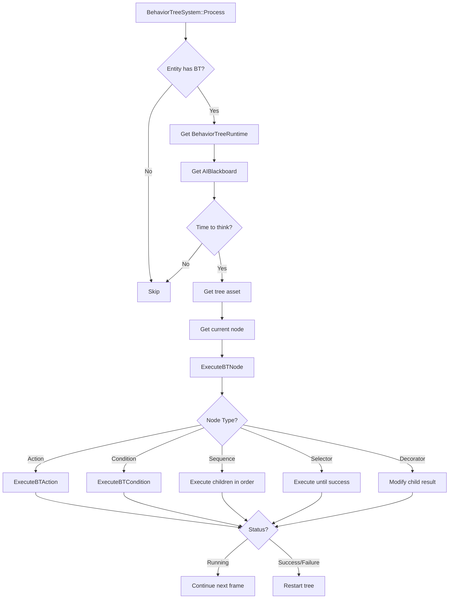

# 🏗️ Olympe Engine - Architecture Overview

**Last Updated:** February 2026  
**Target Audience:** Engine developers, contributors, and technical designers

---

## 📖 Table of Contents
1. [Core Architecture](#core-architecture)
2. [System Interaction Flow](#system-interaction-flow)
3. [Data Flow Diagram](#data-flow-diagram)
4. [Module Organization](#module-organization)
5. [Key Design Patterns](#key-design-patterns)
6. [Quick Navigation](#quick-navigation)

---

## Core Architecture

Olympe Engine is built on a **pure Entity Component System (ECS)** architecture with the following principles:

### 🎯 Core Principles
- **Data-Oriented Design**: Components are pure data structs
- **System-Based Logic**: All game logic lives in Systems
- **Separation of Concerns**: Clear boundaries between modules
- **Performance First**: Cache-friendly data layouts, minimal indirection

### 🧩 Three Pillars

#### 1. **Entities** (ECS_Entity.h)
- Lightweight 64-bit IDs (`EntityID = uint64_t`)
- No logic, just an identifier
- Created via `World::CreateEntity()`
- Destroyed via `World::DestroyEntity()`

#### 2. **Components** (ECS_Components*.h)
- Pure data structures (POD when possible)
- No methods (except constructors)
- Registered at compile-time via `AUTO_REGISTER_COMPONENT()`
- Examples: `Position_data`, `Velocity_data`, `AIBlackboard_data`

#### 3. **Systems** (ECS_Systems*.cpp)
- Process entities with specific component signatures
- Execute in **fixed order** (critical for correctness)
- Independent and reusable
- Examples: `PhysicsSystem`, `BehaviorTreeSystem`, `RenderingSystem`

---

## System Interaction Flow



**Critical Ordering Rules:**
1. **Input → AI → Navigation → Physics → Rendering**
2. AI systems MUST run after input (to react to player actions)
3. Navigation MUST run after AI (to calculate paths based on AI decisions)
4. Physics MUST run after Navigation (to apply movement)
5. Rendering MUST run last (to display current state)

---

## Data Flow Diagram

### Entity Creation & Initialization



### Behavior Tree Execution



---

## Module Organization

### 📁 Source Code Structure

```
Source/
├── AI/                          # AI & Behavior Trees
│   ├── BehaviorTree.h/.cpp      # BT node types, execution
│   ├── BehaviorTreeManager.cpp  # Tree loading & registry
│   └── BehaviorTreeDependencyScanner.cpp
│
├── ECS_Entity.h                 # Entity ID definitions
├── ECS_Components*.h            # All component definitions
│   ├── ECS_Components.h         # Core: Position, Velocity, etc.
│   ├── ECS_Components_AI.h      # AI: Blackboard, Senses, etc.
│   └── ECS_Components_Rendering.h
│
├── ECS_Systems*.cpp/.h          # System implementations
│   ├── ECS_Systems.cpp          # Core systems
│   ├── ECS_Systems_AI.cpp       # AI systems
│   └── ECS_Systems_Rendering.cpp
│
├── World.h/.cpp                 # ECS manager, entity lifecycle
├── CollisionMap.h/.cpp          # Tile collision & navigation
├── NavigationMap.h/.cpp         # A* pathfinding
├── PrefabFactory.h/.cpp         # Entity instantiation from JSON
├── ComponentRegistry.h          # Auto-registration system
│
└── TiledLevelLoader/            # Tiled map parsing
    ├── include/TiledStructures.h
    └── src/TiledToOlympe.cpp
```

### 🗂️ Data Files Structure

```
Gamedata/
├── Levels/                      # .tmj Tiled map files
│   └── iso-test.tmj
│
├── Prefabs/                     # Entity blueprints (.json)
│   ├── Characters/
│   │   ├── Player.json
│   │   └── Guard.json
│   └── Items/
│       └── Chest.json
│
└── Tilesets/                    # Graphics & collision data
    └── isometric_tiles.tsx

Blueprints/
└── AI/                          # Behavior trees (.json)
    ├── npc_patrol.json
    └── npc_wander.json
```

---

## Key Design Patterns

### 1. **Component Auto-Registration**
```cpp
// In ECS_Components.h
struct Position_data
{
    Vector position;
    float rotation = 0.0f;
};
AUTO_REGISTER_COMPONENT(Position_data);  // ← Automatic registration at startup
```

**Benefits:**
- No manual registration needed
- Compile-time safety
- Zero runtime overhead

### 2. **System Signature Matching**
```cpp
// In System constructor
BehaviorTreeSystem::BehaviorTreeSystem()
{
    requiredSignature.set(GetComponentTypeID_Static<BehaviorTreeRuntime_data>(), true);
    requiredSignature.set(GetComponentTypeID_Static<AIBlackboard_data>(), true);
}
```

**How it works:**
1. System declares required components
2. When entity gains/loses components, World updates its signature
3. World notifies systems → systems add/remove entity from their lists

### 3. **Prefab Factory Pattern**
```cpp
// Prefab defines components
{
  "components": {
    "Position": { "x": 100, "y": 200 },
    "BehaviorTree": { "treeAsset": "npc_wander.json" }
  }
}

// Factory instantiates
EntityID entity = PrefabFactory::InstantiateEntity("Guard.json");
```

**Benefits:**
- Data-driven entity creation
- No code recompilation for entity changes
- Designer-friendly

### 4. **Blackboard Pattern (AI)**
```cpp
struct AIBlackboard_data
{
    EntityID targetEntity;
    Vector moveGoal;
    float distanceToTarget;
    // ... typed fields for AI state
};
```

**Why not std::map<std::string, Any>?**
- **Performance**: No string lookups in hot path
- **Type Safety**: Compile-time checks
- **Cache Friendly**: Contiguous memory layout

### 5. **Intent-Based Architecture**
```cpp
// AI System sets intent
MoveIntent_data& intent = GetComponent<MoveIntent_data>(entity);
intent.targetPosition = destination;
intent.hasIntent = true;

// Motion System reads intent and applies movement
if (intent.hasIntent)
    ApplyMovement(entity, intent);
```

**Benefits:**
- Decouples decision-making from execution
- Multiple systems can coordinate via intents
- Easy to debug (inspect intent state)

---

## Quick Navigation

### 🚀 Getting Started
- **New to Engine?** → Start with [ECS Components Quick Ref](01_ECS_Components/_QuickRef_Components.md)
- **Adding Features?** → See [Adding New System Guide](02_ECS_Systems/Adding_New_System_Guide.md)
- **Creating Content?** → Check [Prefabs Quick Ref](03_Prefabs/_QuickRef_Prefabs.md)
- **AI Development?** → Read [Behavior Trees Guide](04_Behavior_Trees/Creating_BT_Actions_Guide.md)

### 📚 Reference Guides
| Module | Quick Ref | Detailed Guide |
|--------|-----------|----------------|
| **Components** | [Quick Ref](01_ECS_Components/_QuickRef_Components.md) | [Full Guide](01_ECS_Components/Adding_New_Component_Guide.md) |
| **Systems** | [Quick Ref](02_ECS_Systems/_QuickRef_Systems.md) | [Full Guide](02_ECS_Systems/Adding_New_System_Guide.md) |
| **Prefabs** | [Quick Ref](03_Prefabs/_QuickRef_Prefabs.md) | [Full Guide](03_Prefabs/Creating_Prefabs_Guide.md) |
| **Behavior Trees** | [Quick Ref](04_Behavior_Trees/_QuickRef_BehaviorTrees.md) | [Full Guide](04_Behavior_Trees/Creating_BT_Actions_Guide.md) |
| **AI Systems** | [Quick Ref](05_AI_Systems/_QuickRef_AI_Pipeline.md) | [Full Guide](05_AI_Systems/AI_Blackboard_Guide.md) |
| **Level Loading** | [Quick Ref](06_Level_Loading/_QuickRef_Level_Format.md) | [Full Guide](06_Level_Loading/Level_Loading_Pipeline_Guide.md) |

### ⚠️ Common Issues
- [Missing Component Registration](07_Common_Pitfalls/Missing_Component_Registration.md)
- [System Execution Order Problems](07_Common_Pitfalls/System_Order_Issues.md)
- [BT Action Not Implemented](07_Common_Pitfalls/BT_Action_Not_Implemented.md)

---

## Contributing

When contributing to the engine:

1. **Read the relevant guide** before making changes
2. **Follow existing patterns** in similar code
3. **Update documentation** if you change APIs
4. **Test thoroughly** - run all relevant systems
5. **Ask questions** - better to clarify than break things

**Questions?** Open an issue or discussion on GitHub.

---

*This documentation is generated for Olympe Engine V2 (2025+)*
