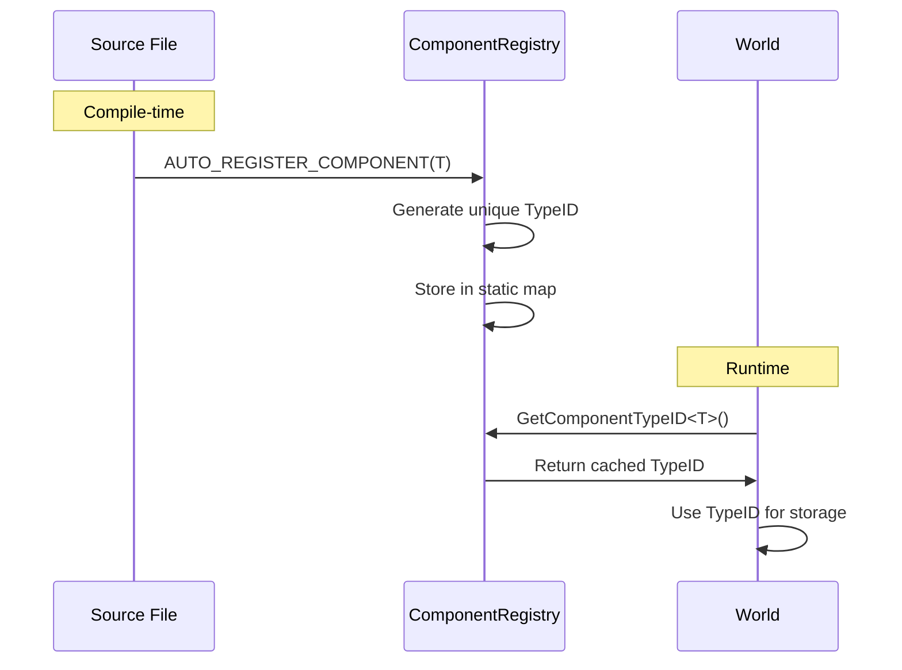
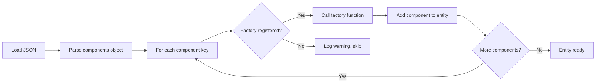

# 🧩 Adding New Components - Complete Guide

**Comprehensive guide for implementing new ECS components in Olympe Engine**

---

## 📖 Table of Contents
1. [Overview](#overview)
2. [Step-by-Step Guide](#step-by-step-guide)
3. [Component Registration](#component-registration)
4. [Prefab Integration](#prefab-integration)
5. [Serialization](#serialization)
6. [Testing](#testing)
7. [Common Patterns](#common-patterns)
8. [Troubleshooting](#troubleshooting)

---

## Overview

### What Are Components?

Components are **pure data containers** that define what an entity IS:
- No logic (methods)
- No references to systems
- Simple, serializable data
- Cache-friendly layouts

### Component Lifecycle

```mermaid
stateDiagram-v2
    [*] --> Defined: Define struct
    Defined --> Registered: AUTO_REGISTER_COMPONENT()
    Registered --> Created: World::AddComponent()
    Created --> Used: Systems access via GetComponent()
    Used --> Destroyed: World::RemoveComponent()
    Destroyed --> [*]
```

---

## Step-by-Step Guide

### Step 1: Choose the Right Header File

**File Organization:**
- `ECS_Components.h` - Core gameplay (Position, Velocity, Sprite, etc.)
- `ECS_Components_AI.h` - AI-related (Blackboard, Senses, BehaviorTree, etc.)
- `ECS_Components_Rendering.h` - Graphics (Animation, Camera, RenderLayer)

**Decision Tree:**
```
Is it related to AI? → ECS_Components_AI.h
Is it rendering/graphics? → ECS_Components_Rendering.h
Everything else → ECS_Components.h
```

---

### Step 2: Define the Component Struct

**Template:**
```cpp
/**
 * @brief Brief description of what this component represents
 * 
 * Detailed explanation of:
 * - What entities should have this component
 * - How it interacts with systems
 * - Any important constraints or invariants
 */
struct MyComponent_data
{
    // Primary data
    float primaryValue = 0.0f;      ///< Description (include units if applicable)
    Vector position;                 ///< World position in pixels
    
    // State flags
    bool isActive = true;            ///< Whether this component is enabled
    bool needsUpdate = false;        ///< Dirty flag for updates
    
    // References (use with caution)
    EntityID linkedEntity = INVALID_ENTITY_ID;  ///< Related entity (if any)
    
    // Configuration
    float maxValue = 100.0f;         ///< Upper bound for primaryValue
    int frameCount = 0;              ///< Number of frames since activation
};
```

**Naming Convention:**
- Suffix with `_data` (e.g., `Position_data`, not `Position`)
- Use descriptive names (e.g., `WanderDestination`, not `Dest`)
- Boolean flags: `is*`, `has*`, `needs*`

**Data Type Guidelines:**

| Use Case | Recommended Type | Avoid |
|----------|------------------|-------|
| Positions, velocities | `Vector` (custom struct) | `std::pair<float, float>` |
| Entity references | `EntityID` (uint64_t) | Raw pointers |
| Small strings | `char[32]` or enum | `std::string` |
| Lists (fixed size) | `T array[N]` | `std::vector<T>` |
| Lists (dynamic) | `std::vector<T>` (if necessary) | `std::list<T>` |
| Flags | `bool` or bitfield | `int` |

---

### Step 3: Register the Component

**CRITICAL:** Every component MUST be registered!

```cpp
struct MyComponent_data
{
    // ... fields ...
};
AUTO_REGISTER_COMPONENT(MyComponent_data);  // ← Add immediately after struct
```

**What AUTO_REGISTER_COMPONENT does:**
1. Generates a unique type ID at compile-time
2. Registers the component name in the global registry
3. Enables `World::AddComponent<MyComponent_data>()`
4. Allows serialization/deserialization

**Without registration:**
- Component won't work with World APIs
- Prefabs can't instantiate it
- Systems can't query for it
- **You WILL get crashes!**

---

### Step 4: Add to PrefabFactory (If Needed)

If you want designers to use this component in prefab JSON files, add factory support.

#### 4.1 Declare Instantiation Function

**In `prefabfactory.h`:**
```cpp
class PrefabFactory
{
    // ... existing declarations ...
    
    static void InstantiateMyComponent(EntityID entity, const json& componentData);
};
```

#### 4.2 Implement Instantiation Function

**In `PrefabFactory.cpp`:**
```cpp
void PrefabFactory::InstantiateMyComponent(EntityID entity, const json& data)
{
    MyComponent_data comp;
    
    // Parse fields from JSON
    comp.primaryValue = JsonHelper::GetFloat(data, "primaryValue", 0.0f);
    comp.isActive = JsonHelper::GetBool(data, "isActive", true);
    comp.maxValue = JsonHelper::GetFloat(data, "maxValue", 100.0f);
    
    // Parse Vector fields
    if (data.contains("position") && data["position"].is_object())
    {
        comp.position.x = JsonHelper::GetFloat(data["position"], "x", 0.0f);
        comp.position.y = JsonHelper::GetFloat(data["position"], "y", 0.0f);
    }
    
    // Parse entity references
    if (data.contains("linkedEntity"))
    {
        // NOTE: Entity IDs are resolved after all entities are created
        // For now, store as INVALID and resolve in a second pass if needed
        comp.linkedEntity = INVALID_ENTITY_ID;
    }
    
    // Add component to entity
    World::Get().AddComponent(entity, comp);
}
```

**JSON Helper Functions:**
- `JsonHelper::GetFloat(json, key, default)` - Parse float
- `JsonHelper::GetInt(json, key, default)` - Parse int
- `JsonHelper::GetBool(json, key, default)` - Parse bool
- `JsonHelper::GetString(json, key, default)` - Parse string

#### 4.3 Register Factory Function

**In `PrefabFactory::RegisterAllComponentFactories()` (PrefabFactory.cpp):**
```cpp
void PrefabFactory::RegisterAllComponentFactories()
{
    // ... existing registrations ...
    
    RegisterComponentFactory("MyComponent", [](EntityID entity, const json& data)
    {
        InstantiateMyComponent(entity, data);
    });
}
```

**Component Name Rules:**
- Use the struct name WITHOUT `_data` suffix
- Example: `MyComponent_data` → `"MyComponent"`
- Must match JSON key exactly (case-sensitive)

---

### Step 5: Use in Prefab JSON

**Example Prefab (`Gamedata/Prefabs/MyEntity.json`):**
```json
{
  "name": "MyEntity",
  "components": {
    "Position": {
      "x": 100.0,
      "y": 200.0,
      "rotation": 0.0
    },
    "MyComponent": {
      "primaryValue": 42.0,
      "isActive": true,
      "maxValue": 100.0,
      "position": {
        "x": 10.0,
        "y": 20.0
      }
    }
  }
}
```

---

## Component Registration

### How Registration Works



### Manual Registration (Rare)

In 99% of cases, use `AUTO_REGISTER_COMPONENT()`. Manual registration is only needed for:
- Template components
- Components defined in external libraries
- Special compile-time conditional components

**Manual registration example:**
```cpp
// In a .cpp file (NOT header!)
namespace
{
    struct ComponentRegistrar
    {
        ComponentRegistrar()
        {
            ComponentRegistry::RegisterComponent<MyComponent_data>("MyComponent");
        }
    };
    static ComponentRegistrar s_registrar;  // Runs at program startup
}
```

---

## Prefab Integration

### Full Integration Workflow

1. **Define component** in header
2. **Auto-register** with `AUTO_REGISTER_COMPONENT()`
3. **Add factory function** in PrefabFactory.cpp
4. **Register factory** in `RegisterAllComponentFactories()`
5. **Test in prefab JSON**

### Prefab Loading Pipeline



### Component Override System

Prefabs support **scoped overrides** for certain components:

```json
{
  "name": "MyEntity",
  "components": {
    "Position": {
      "x": 100,
      "y": 200
    }
  },
  "scopedOverrides": {
    "Position": {
      "x": "$PARAM_X",  // Replaced with spawn parameter
      "y": "$PARAM_Y"
    }
  }
}
```

**See:** [COMPONENT_SCOPED_OVERRIDES.md](../../COMPONENT_SCOPED_OVERRIDES.md) for details

---

## Serialization

### Saving Components (Planned Feature)

```cpp
// Future API (not yet implemented)
json MyComponent_data::Serialize() const
{
    json j;
    j["primaryValue"] = primaryValue;
    j["isActive"] = isActive;
    j["position"] = {{"x", position.x}, {"y", position.y}};
    return j;
}

void MyComponent_data::Deserialize(const json& j)
{
    primaryValue = JsonHelper::GetFloat(j, "primaryValue", 0.0f);
    isActive = JsonHelper::GetBool(j, "isActive", true);
    // ... etc
}
```

---

## Testing

### Unit Test Template

```cpp
#include "gtest/gtest.h"
#include "World.h"
#include "ECS_Components.h"

TEST(MyComponentTest, AddAndRetrieve)
{
    // Setup
    World& world = World::Get();
    world.Reset();  // Clean slate
    
    // Create entity
    EntityID entity = world.CreateEntity();
    
    // Add component
    MyComponent_data comp;
    comp.primaryValue = 42.0f;
    comp.isActive = true;
    world.AddComponent(entity, comp);
    
    // Verify
    ASSERT_TRUE(world.HasComponent<MyComponent_data>(entity));
    MyComponent_data& retrieved = world.GetComponent<MyComponent_data>(entity);
    EXPECT_EQ(retrieved.primaryValue, 42.0f);
    EXPECT_TRUE(retrieved.isActive);
    
    // Cleanup
    world.DestroyEntity(entity);
}

TEST(MyComponentTest, RemoveComponent)
{
    World& world = World::Get();
    EntityID entity = world.CreateEntity();
    
    MyComponent_data comp;
    world.AddComponent(entity, comp);
    ASSERT_TRUE(world.HasComponent<MyComponent_data>(entity));
    
    world.RemoveComponent<MyComponent_data>(entity);
    EXPECT_FALSE(world.HasComponent<MyComponent_data>(entity));
    
    world.DestroyEntity(entity);
}

TEST(MyComponentTest, PrefabInstantiation)
{
    // Test prefab loading
    json prefabJson = R"({
      "name": "TestEntity",
      "components": {
        "MyComponent": {
          "primaryValue": 99.0,
          "isActive": false
        }
      }
    })"_json;
    
    EntityID entity = PrefabFactory::InstantiateFromJson(prefabJson);
    
    ASSERT_TRUE(World::Get().HasComponent<MyComponent_data>(entity));
    MyComponent_data& comp = World::Get().GetComponent<MyComponent_data>(entity);
    EXPECT_EQ(comp.primaryValue, 99.0f);
    EXPECT_FALSE(comp.isActive);
    
    World::Get().DestroyEntity(entity);
}
```

---

## Common Patterns

### 1. State Machine Component

```cpp
enum class MyState : uint8_t
{
    Idle = 0,
    Active,
    Cooldown,
    Disabled
};

struct StateMachineComponent_data
{
    MyState currentState = MyState::Idle;
    float stateTimer = 0.0f;         // Time in current state
    float stateDuration = 1.0f;      // How long to stay in state
};
AUTO_REGISTER_COMPONENT(StateMachineComponent_data);
```

### 2. Timer Component

```cpp
struct TimerComponent_data
{
    float elapsed = 0.0f;
    float duration = 1.0f;
    bool isRunning = false;
    bool loop = false;
    
    bool IsExpired() const { return elapsed >= duration; }
    void Reset() { elapsed = 0.0f; }
};
AUTO_REGISTER_COMPONENT(TimerComponent_data);
```

### 3. Resource Pool Component

```cpp
struct ResourcePoolComponent_data
{
    float current = 100.0f;
    float maximum = 100.0f;
    float regenRate = 5.0f;  // Per second
    
    float GetPercentage() const { return current / maximum; }
    bool IsFull() const { return current >= maximum; }
    bool IsEmpty() const { return current <= 0.0f; }
};
AUTO_REGISTER_COMPONENT(ResourcePoolComponent_data);
```

### 4. Reference Component

```cpp
struct OwnerComponent_data
{
    EntityID ownerEntity = INVALID_ENTITY_ID;
    
    bool HasOwner() const { return ownerEntity != INVALID_ENTITY_ID; }
};
AUTO_REGISTER_COMPONENT(OwnerComponent_data);
```

---

## Troubleshooting

### Issue: Component Not Found

**Symptoms:**
```
Error: Component type not registered
```

**Solution:**
1. Verify `AUTO_REGISTER_COMPONENT()` is present after struct definition
2. Check that the header is included somewhere in the build
3. Rebuild entire project (registration is compile-time)

---

### Issue: Prefab Fails to Load Component

**Symptoms:**
```
Warning: No factory registered for component 'MyComponent'
```

**Solution:**
1. Ensure factory is registered in `RegisterAllComponentFactories()`
2. Check component name matches (without `_data` suffix)
3. Verify factory function doesn't throw exceptions

---

### Issue: Component Data Corrupted

**Symptoms:**
- Random values in component fields
- Crashes when accessing component

**Solution:**
1. Check that all fields have default initializers
2. Verify no out-of-bounds array accesses
3. Ensure component is POD-compatible (no virtual functions)

---

### Issue: System Not Seeing Component

**Symptoms:**
- Entity created with component
- System doesn't process it

**Solution:**
1. Check system's required signature includes component
2. Verify component was added AFTER system initialization
3. Call `World::NotifySystemsOfEntityChange()` if adding component manually

---

## Performance Considerations

### Memory Layout

**Good (cache-friendly):**
```cpp
struct GoodComponent_data
{
    float frequentlyAccessed1;
    float frequentlyAccessed2;
    int flags;  // Hot data first
    
    char rarely[64];  // Cold data last
};
```

**Bad (cache-unfriendly):**
```cpp
struct BadComponent_data
{
    char padding[256];  // Cold data first
    float x, y;  // Hot data lost in cache misses
};
```

### Size Guidelines

| Size | Rating | Notes |
|------|--------|-------|
| < 64 bytes | ⭐⭐⭐ Excellent | Fits in single cache line |
| 64-128 bytes | ⭐⭐ Good | Acceptable for most components |
| 128-256 bytes | ⭐ Acceptable | Consider splitting if possible |
| > 256 bytes | ⚠️ Review | May cause performance issues |

---

## Checklist

Before submitting your component implementation:

- [ ] Component defined in appropriate header file
- [ ] All fields have default initializers
- [ ] Includes Doxygen comments
- [ ] `AUTO_REGISTER_COMPONENT()` called immediately after struct
- [ ] Prefab factory function implemented (if needed)
- [ ] Factory registered in `RegisterAllComponentFactories()`
- [ ] JSON parsing handles all fields correctly
- [ ] Unit tests written and passing
- [ ] Component size < 256 bytes
- [ ] No virtual functions or inheritance
- [ ] Documentation updated

---

## See Also

- [Component Quick Reference](_QuickRef_Components.md)
- [Systems Guide](../02_ECS_Systems/Adding_New_System_Guide.md)
- [Prefabs Guide](../03_Prefabs/Creating_Prefabs_Guide.md)
- [Component Auto-Registration](../../ComponentAutoRegistration.md)

---

*Need help? Open an issue on GitHub or ask in discussions!*
