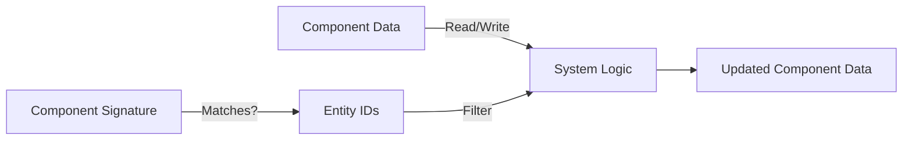
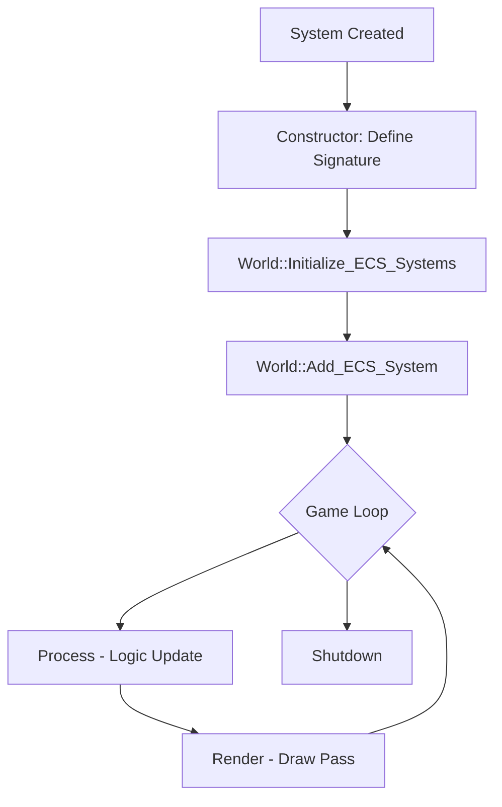
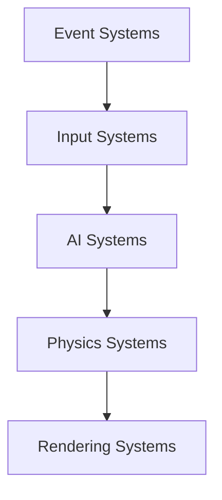

# Adding New ECS Systems - Complete Guide

**Audience:** Developers extending Olympe Engine with new gameplay logic  
**Prerequisites:** Understanding of ECS architecture (see `00_Architecture_Overview.md`)  
**Related:** `_QuickRef_Systems.md`, `01_ECS_Components/Adding_New_Component_Guide.md`

---

## Table of Contents

1. [Overview](#overview)
2. [System Lifecycle](#system-lifecycle)
3. [Creating Your First System](#creating-your-first-system)
4. [Component Signature Definition](#component-signature-definition)
5. [Implementing Process Methods](#implementing-process-methods)
6. [System Registration](#system-registration)
7. [System Categories & Patterns](#system-categories--patterns)
8. [Performance Considerations](#performance-considerations)
9. [Testing Your System](#testing-your-system)
10. [Advanced Patterns](#advanced-patterns)
11. [Troubleshooting](#troubleshooting)
12. [Common Pitfalls](#common-pitfalls)

---

## Overview

### What is an ECS System?

In Olympe Engine, **Systems** are the "S" in ECS (Entity-Component-System). They:
- Contain **pure logic** (no state storage)
- Operate on **entities** that match a component signature
- Execute in a **deterministic order** each frame
- Are **data-oriented** for cache efficiency

### System Design Philosophy



**Key Principles:**
- **Single Responsibility:** Each system does one thing well
- **Data-Driven:** Systems query components, not entities
- **Stateless:** All state lives in components, not systems
- **Order Matters:** Systems execute sequentially

---

## System Lifecycle

### Lifecycle Stages



### When Methods Are Called

| Method | Frequency | Purpose |
|--------|-----------|---------|
| **Constructor** | Once at startup | Define component signature |
| **Process()** | Every frame | Update component logic |
| **Render()** | Every frame (after Process) | Draw entities to screen |
| **RenderDebug()** | When debug mode enabled | Draw debug overlays |

**Important:** Systems are never destroyed during runtime—they persist for the entire game session.

---

## Creating Your First System

### Step 1: Create Header File

Create `Source/MyCustomSystem.h`:

```cpp
#pragma once
#include "ECS_Systems.h"
#include "World.h"
#include "ECS_Components.h"
#include "GameEngine.h"

/// @brief System that applies gravity to physics bodies
class GravitySystem : public ECS_System
{
public:
    /// @brief Constructor defines required components
    GravitySystem();
    
    /// @brief Applies gravity acceleration to all physics entities
    void Process() override;
};
```

### Step 2: Implement Constructor (Define Signature)

Create `Source/MyCustomSystem.cpp`:

```cpp
#include "MyCustomSystem.h"

GravitySystem::GravitySystem()
{
    // Require Position_data and PhysicsBody_data
    requiredSignature.set(GetComponentTypeID_Static<Position_data>(), true);
    requiredSignature.set(GetComponentTypeID_Static<PhysicsBody_data>(), true);
}
```

**What this does:**
- `requiredSignature` is a `std::bitset<MAX_COMPONENTS>` (32 bits)
- Each bit represents one component type
- Only entities with **ALL** required components will be added to `m_entities`

### Step 3: Implement Process Method

```cpp
void GravitySystem::Process()
{
    // Early exit if no entities match
    if (m_entities.empty()) return;
    
    // Gravity constant (units per second²)
    const float GRAVITY = 980.0f;
    
    // Iterate all matching entities
    for (EntityID entity : m_entities)
    {
        try
        {
            // Get components (fast direct pool access)
            PhysicsBody_data& body = World::Get().GetComponent<PhysicsBody_data>(entity);
            
            // Skip if gravity disabled
            if (!body.useGravity) continue;
            
            // Apply downward acceleration (scaled by delta-time)
            body.velocity.y -= GRAVITY * GameEngine::fDt;
        }
        catch (const std::exception& e)
        {
            SYSTEM_LOG << "GravitySystem error for entity " 
                       << entity << ": " << e.what() << std::endl;
        }
    }
}
```

**Key Points:**
1. **Early exit:** Always check `m_entities.empty()` first
2. **Exception safety:** Wrap logic in try-catch to prevent crash propagation
3. **Delta-time scaling:** Use `GameEngine::fDt` for frame-rate independence
4. **Direct component access:** `World::Get().GetComponent<T>(entity)` is fast

---

## Component Signature Definition

### Understanding Signatures

The component signature is a **bitmask** that determines which entities the system processes:

```cpp
// Example: System needs Position AND Movement
requiredSignature.set(GetComponentTypeID_Static<Position_data>(), true);
requiredSignature.set(GetComponentTypeID_Static<Movement_data>(), true);

// Bitwise representation (example):
// Position_data = bit 0 = 0b00000001
// Movement_data = bit 1 = 0b00000010
// Signature      = combined = 0b00000011
```

### Signature Matching Logic

```cpp
// When an entity's components change, World checks:
if ((entitySignature & systemSignature) == systemSignature)
{
    system->AddEntity(entity);  // All required components present
}
else
{
    system->RemoveEntity(entity);  // Missing at least one component
}
```

**Example Scenarios:**

| Entity Components | System Signature | Match? |
|-------------------|------------------|--------|
| Position, Movement | Position, Movement | ✅ Yes |
| Position, Movement, Health | Position, Movement | ✅ Yes (extra components OK) |
| Position only | Position, Movement | ❌ No (missing Movement) |
| Movement only | Position, Movement | ❌ No (missing Position) |

### Optional Components Pattern

If you need **optional** components, check at runtime:

```cpp
void MySystem::Process()
{
    for (EntityID entity : m_entities)
    {
        // Required component (guaranteed present)
        Position_data& pos = World::Get().GetComponent<Position_data>(entity);
        
        // Optional component (check first)
        if (World::Get().HasComponent<Health_data>(entity))
        {
            Health_data& health = World::Get().GetComponent<Health_data>(entity);
            // Use health data...
        }
    }
}
```

**Warning:** Optional components add branching overhead. Prefer multiple specialized systems over one system with many optional branches.

---

## Implementing Process Methods

### Process() - Logic Updates

The `Process()` method runs **every frame** during the logic update phase.

#### Template Pattern

```cpp
void YourSystem::Process()
{
    // 1. Early exit optimization
    if (m_entities.empty()) return;
    
    // 2. Cache frequently accessed data
    const float dt = GameEngine::fDt;
    World& world = World::Get();
    
    // 3. Main entity loop
    for (EntityID entity : m_entities)
    {
        try
        {
            // 4. Get required components
            ComponentA& compA = world.GetComponent<ComponentA>(entity);
            ComponentB& compB = world.GetComponent<ComponentB>(entity);
            
            // 5. Apply logic
            compA.value += compB.rate * dt;
            
            // 6. Conditional logic (avoid deep nesting)
            if (compA.value > threshold)
            {
                // Handle threshold crossing
            }
        }
        catch (const std::exception& e)
        {
            // 7. Error handling (never crash on one entity)
            LogError(entity, e.what());
        }
    }
}
```

### Render() - Drawing Pass

The `Render()` method runs **after all Process()** methods complete.

```cpp
void YourSystem::Render()
{
    if (m_entities.empty()) return;
    
    SDL_Renderer* renderer = GameEngine::GetRenderer();
    CameraSystem* camera = World::Get().GetCameraSystem();
    
    for (EntityID entity : m_entities)
    {
        try
        {
            Position_data& pos = World::Get().GetComponent<Position_data>(entity);
            VisualSprite_data& sprite = World::Get().GetComponent<VisualSprite_data>(entity);
            
            // Transform world coords to screen coords
            Vector screenPos = camera->WorldToScreen(pos.position);
            
            // Draw sprite
            SDL_Rect destRect = {
                static_cast<int>(screenPos.x),
                static_cast<int>(screenPos.y),
                sprite.width,
                sprite.height
            };
            
            SDL_RenderCopy(renderer, sprite.texture, nullptr, &destRect);
        }
        catch (const std::exception& e)
        {
            LogError(entity, e.what());
        }
    }
}
```

**Rendering Best Practices:**
- Sort entities by layer/z-order before rendering
- Batch draw calls by texture when possible
- Use camera culling to skip off-screen entities
- Cache renderer/camera pointers at function start

### RenderDebug() - Debug Visualization

```cpp
void YourSystem::RenderDebug()
{
    if (m_entities.empty() || !GameEngine::IsDebugMode()) return;
    
    SDL_Renderer* renderer = GameEngine::GetRenderer();
    CameraSystem* camera = World::Get().GetCameraSystem();
    
    for (EntityID entity : m_entities)
    {
        // Draw bounding boxes, velocity vectors, etc.
        Position_data& pos = World::Get().GetComponent<Position_data>(entity);
        Vector screenPos = camera->WorldToScreen(pos.position);
        
        // Draw entity ID
        DrawText(renderer, std::to_string(entity), screenPos);
    }
}
```

---

## System Registration

### Registration Process

Systems are registered in `World::Initialize_ECS_Systems()` (`World.cpp`):

```cpp
void World::Initialize_ECS_Systems()
{
    // Order matters! Systems execute in registration order.
    
    // 1. Event systems (input/events → component updates)
    Add_ECS_System(std::make_unique<InputEventConsumeSystem>());
    Add_ECS_System(std::make_unique<GameEventConsumeSystem>());
    
    // 2. AI systems (decision-making)
    Add_ECS_System(std::make_unique<AIStimuliSystem>());
    Add_ECS_System(std::make_unique<AIPerceptionSystem>());
    Add_ECS_System(std::make_unique<BehaviorTreeSystem>());
    
    // 3. Physics systems (movement/collision)
    Add_ECS_System(std::make_unique<PhysicsSystem>());
    Add_ECS_System(std::make_unique<MovementSystem>());
    
    // 4. Your new system
    Add_ECS_System(std::make_unique<GravitySystem>());
    
    // 5. Rendering systems (layered)
    Add_ECS_System(std::make_unique<RenderingSystem>());   // World layer
    Add_ECS_System(std::make_unique<GridSystem>());        // Grid overlay
    Add_ECS_System(std::make_unique<UIRenderingSystem>()); // UI layer (top)
}
```

### Execution Order Guidelines



**Typical Order:**
1. **Event Consumers** - Convert external events to component data
2. **Input Systems** - Process player controls
3. **AI Systems** - NPC decision-making
4. **Physics/Logic** - Update positions, apply forces
5. **Rendering** - Draw entities (world → grid → UI)

**Why Order Matters:**
- AI systems need updated perception data before thinking
- Physics must run before rendering to avoid lag
- UI renders last to be on top of everything

### Adding System to Header

If your system needs to be accessed globally, add it to `World.h`:

```cpp
class World {
private:
    std::vector<std::unique_ptr<ECS_System>> m_systems;
    
    // Specialized system pointers for direct access
    RenderingSystem* m_renderingSystem = nullptr;
    CameraSystem* m_cameraSystem = nullptr;
    GravitySystem* m_gravitySystem = nullptr;  // <-- Add your system
    
public:
    // Getter for global access
    GravitySystem* GetGravitySystem() const { return m_gravitySystem; }
};
```

Then in `World::Initialize_ECS_Systems()`:

```cpp
auto gravitySystem = std::make_unique<GravitySystem>();
m_gravitySystem = gravitySystem.get();  // Store pointer before moving
Add_ECS_System(std::move(gravitySystem));
```

---

## System Categories & Patterns

### 1. Event Consumer Systems

**Purpose:** Convert external events to component updates

```cpp
class DamageEventSystem : public ECS_System
{
public:
    DamageEventSystem()
    {
        requiredSignature.set(GetComponentTypeID_Static<Health_data>(), true);
    }
    
    void Process() override
    {
        EventQueue& events = EventQueue::Get();
        
        events.ForEachDomainEvent([this](const Event& evt)
        {
            if (evt.type == EventType::EventType_Hit)
            {
                EntityID target = evt.data.hit.targetEntity;
                float damage = evt.data.hit.damage;
                
                if (World::Get().HasComponent<Health_data>(target))
                {
                    Health_data& health = World::Get().GetComponent<Health_data>(target);
                    health.currentHealth -= damage;
                }
            }
        });
    }
};
```

### 2. Input Systems

**Purpose:** Translate input to component state

```cpp
class PlayerControlSystem : public ECS_System
{
public:
    PlayerControlSystem()
    {
        requiredSignature.set(GetComponentTypeID_Static<PlayerBinding_data>(), true);
        requiredSignature.set(GetComponentTypeID_Static<Controller_data>(), true);
    }
    
    void Process() override
    {
        InputManager& input = InputManager::Get();
        
        for (EntityID entity : m_entities)
        {
            Controller_data& ctrl = World::Get().GetComponent<Controller_data>(entity);
            
            // Map input to controller state
            ctrl.moveX = input.GetAxis("Horizontal");
            ctrl.moveY = input.GetAxis("Vertical");
            ctrl.jump = input.GetButtonDown("Jump");
        }
    }
};
```

### 3. Physics Systems

**Purpose:** Update positions, apply forces, detect collisions

```cpp
class CollisionSystem : public ECS_System
{
public:
    CollisionSystem()
    {
        requiredSignature.set(GetComponentTypeID_Static<Position_data>(), true);
        requiredSignature.set(GetComponentTypeID_Static<BoundingBox_data>(), true);
    }
    
    void Process() override
    {
        // Broad phase: Spatial partitioning
        std::vector<EntityID> entityList(m_entities.begin(), m_entities.end());
        
        // Narrow phase: AABB collision detection
        for (size_t i = 0; i < entityList.size(); ++i)
        {
            for (size_t j = i + 1; j < entityList.size(); ++j)
            {
                if (CheckCollision(entityList[i], entityList[j]))
                {
                    ResolveCollision(entityList[i], entityList[j]);
                }
            }
        }
    }
};
```

### 4. AI Systems

**Purpose:** NPC decision-making and behavior

```cpp
class PatrolSystem : public ECS_System
{
public:
    PatrolSystem()
    {
        requiredSignature.set(GetComponentTypeID_Static<Position_data>(), true);
        requiredSignature.set(GetComponentTypeID_Static<PatrolPath_data>(), true);
    }
    
    void Process() override
    {
        for (EntityID entity : m_entities)
        {
            Position_data& pos = World::Get().GetComponent<Position_data>(entity);
            PatrolPath_data& patrol = World::Get().GetComponent<PatrolPath_data>(entity);
            
            // Check if reached current waypoint
            if (Vector::Distance(pos.position, patrol.waypoints[patrol.currentIndex]) < 10.0f)
            {
                // Move to next waypoint
                patrol.currentIndex = (patrol.currentIndex + 1) % patrol.waypointCount;
            }
        }
    }
};
```

### 5. Rendering Systems

**Purpose:** Draw entities to screen

```cpp
class ParticleRenderSystem : public ECS_System
{
public:
    ParticleRenderSystem()
    {
        requiredSignature.set(GetComponentTypeID_Static<Position_data>(), true);
        requiredSignature.set(GetComponentTypeID_Static<ParticleEmitter_data>(), true);
    }
    
    void Render() override
    {
        SDL_Renderer* renderer = GameEngine::GetRenderer();
        
        for (EntityID entity : m_entities)
        {
            Position_data& pos = World::Get().GetComponent<Position_data>(entity);
            ParticleEmitter_data& emitter = World::Get().GetComponent<ParticleEmitter_data>(entity);
            
            // Draw all active particles
            for (const Particle& p : emitter.particles)
            {
                if (p.alive)
                {
                    DrawParticle(renderer, p);
                }
            }
        }
    }
};
```

---

## Performance Considerations

### 1. Early Exit Optimization

**Always check for empty entity sets:**

```cpp
void MySystem::Process()
{
    if (m_entities.empty()) return;  // Costs ~1 CPU cycle
    // Rest of expensive logic...
}
```

**Impact:** Saves thousands of instructions when no entities match.

### 2. Delta-Time Scaling

**Make movement frame-rate independent:**

```cpp
// ❌ Bad: Speed depends on frame rate
position += velocity;

// ✅ Good: Consistent speed regardless of FPS
position += velocity * GameEngine::fDt;
```

**Why:** `fDt` (delta-time in seconds) normalizes updates:
- 60 FPS: `fDt ≈ 0.0167s`
- 30 FPS: `fDt ≈ 0.0333s`
- Result: Same distance traveled per second

### 3. Component Access Patterns

**Cache frequently accessed components:**

```cpp
// ❌ Bad: Repeated World::Get() calls
for (EntityID entity : m_entities)
{
    World::Get().GetComponent<Position_data>(entity).x += 1;
    World::Get().GetComponent<Position_data>(entity).y += 1;
}

// ✅ Good: Cache reference
for (EntityID entity : m_entities)
{
    Position_data& pos = World::Get().GetComponent<Position_data>(entity);
    pos.x += 1;
    pos.y += 1;
}
```

### 4. Avoid Heap Allocations in Hot Paths

```cpp
// ❌ Bad: Allocates vector every frame
void Process() override
{
    std::vector<int> temp;  // Heap allocation!
    for (EntityID entity : m_entities) { /* ... */ }
}

// ✅ Good: Use member variable or stack array
class MySystem : public ECS_System
{
private:
    std::vector<int> m_reusableBuffer;  // Allocated once
    
public:
    void Process() override
    {
        m_reusableBuffer.clear();  // Reuse existing allocation
        for (EntityID entity : m_entities) { /* ... */ }
    }
};
```

### 5. Batch Processing

**Process entities in chunks for better cache locality:**

```cpp
void Process() override
{
    const size_t BATCH_SIZE = 64;
    std::vector<EntityID> entityVec(m_entities.begin(), m_entities.end());
    
    for (size_t start = 0; start < entityVec.size(); start += BATCH_SIZE)
    {
        size_t end = std::min(start + BATCH_SIZE, entityVec.size());
        
        // Process batch
        for (size_t i = start; i < end; ++i)
        {
            // Entity logic...
        }
    }
}
```

### 6. Spatial Partitioning

**For collision detection, use spatial hashing:**

```cpp
class SpatialGrid
{
private:
    std::unordered_map<int, std::vector<EntityID>> m_grid;
    float m_cellSize = 100.0f;
    
public:
    int HashPosition(const Vector& pos)
    {
        int cellX = static_cast<int>(pos.x / m_cellSize);
        int cellY = static_cast<int>(pos.y / m_cellSize);
        return (cellX << 16) | (cellY & 0xFFFF);
    }
    
    void Insert(EntityID entity, const Vector& pos)
    {
        m_grid[HashPosition(pos)].push_back(entity);
    }
    
    std::vector<EntityID> QueryNearby(const Vector& pos)
    {
        return m_grid[HashPosition(pos)];
    }
};
```

---

## Testing Your System

### Unit Testing Pattern

Create `Tests/TestGravitySystem.cpp`:

```cpp
#include <gtest/gtest.h>
#include "World.h"
#include "GravitySystem.h"

class GravitySystemTest : public ::testing::Test
{
protected:
    void SetUp() override
    {
        World::Get().Initialize();
        World::Get().Add_ECS_System(std::make_unique<GravitySystem>());
    }
    
    void TearDown() override
    {
        World::Get().Shutdown();
    }
};

TEST_F(GravitySystemTest, AppliesGravityToPhysicsBody)
{
    // Arrange
    EntityID entity = World::Get().CreateEntity();
    
    Position_data& pos = World::Get().AddComponent<Position_data>(entity);
    pos.position = {0, 100, 0};
    
    PhysicsBody_data& body = World::Get().AddComponent<PhysicsBody_data>(entity);
    body.velocity = {0, 0, 0};
    body.useGravity = true;
    
    // Act
    GameEngine::fDt = 0.016f;  // 60 FPS
    World::Get().Process_ECS_Systems();
    
    // Assert
    EXPECT_LT(body.velocity.y, 0.0f);  // Velocity should be negative (downward)
}

TEST_F(GravitySystemTest, RespectGravityFlag)
{
    // Arrange
    EntityID entity = World::Get().CreateEntity();
    World::Get().AddComponent<Position_data>(entity);
    
    PhysicsBody_data& body = World::Get().AddComponent<PhysicsBody_data>(entity);
    body.velocity = {0, 0, 0};
    body.useGravity = false;  // Gravity disabled
    
    // Act
    World::Get().Process_ECS_Systems();
    
    // Assert
    EXPECT_FLOAT_EQ(body.velocity.y, 0.0f);  // No gravity applied
}
```

### Integration Testing

```cpp
TEST_F(GravitySystemTest, IntegratesWithMovementSystem)
{
    // Create entity with gravity + movement
    EntityID entity = World::Get().CreateEntity();
    
    Position_data& pos = World::Get().AddComponent<Position_data>(entity);
    pos.position = {0, 100, 0};
    
    PhysicsBody_data& body = World::Get().AddComponent<PhysicsBody_data>(entity);
    body.useGravity = true;
    
    Movement_data& move = World::Get().AddComponent<Movement_data>(entity);
    
    // Simulate 1 second (60 frames)
    for (int i = 0; i < 60; ++i)
    {
        GameEngine::fDt = 0.016f;
        World::Get().Process_ECS_Systems();
    }
    
    // After 1 second, entity should have fallen
    EXPECT_LT(pos.position.y, 100.0f);
    EXPECT_LT(body.velocity.y, -980.0f);  // Terminal velocity from gravity
}
```

### Manual Testing Checklist

- [ ] System only processes entities with correct signature
- [ ] Adding/removing components updates entity membership
- [ ] System handles empty entity set without crashing
- [ ] Exception in one entity doesn't stop processing others
- [ ] Debug rendering shows correct visual feedback
- [ ] Performance is acceptable (use profiler)
- [ ] Works with multiple entities (test 100+ entities)
- [ ] Interacts correctly with other systems

---

## Advanced Patterns

### 1. Timesliced Processing

**Problem:** Processing 1000 AI entities every frame tanks performance.

**Solution:** Process a subset each frame.

```cpp
class TimeslicedAISystem : public ECS_System
{
private:
    size_t m_currentBatch = 0;
    const size_t BATCH_SIZE = 50;  // Process 50 entities per frame
    
public:
    void Process() override
    {
        if (m_entities.empty()) return;
        
        std::vector<EntityID> entityVec(m_entities.begin(), m_entities.end());
        
        // Calculate batch range
        size_t start = m_currentBatch * BATCH_SIZE;
        size_t end = std::min(start + BATCH_SIZE, entityVec.size());
        
        // Process batch
        for (size_t i = start; i < end; ++i)
        {
            ProcessEntity(entityVec[i]);
        }
        
        // Advance to next batch (wrap around)
        m_currentBatch = (m_currentBatch + 1) % ((entityVec.size() + BATCH_SIZE - 1) / BATCH_SIZE);
    }
};
```

### 2. Frequency-Based Updates

**Process system at reduced frequency:**

```cpp
class LowFrequencySystem : public ECS_System
{
private:
    float m_accumulator = 0.0f;
    const float UPDATE_INTERVAL = 0.2f;  // 5 Hz (5 times per second)
    
public:
    void Process() override
    {
        m_accumulator += GameEngine::fDt;
        
        if (m_accumulator >= UPDATE_INTERVAL)
        {
            m_accumulator -= UPDATE_INTERVAL;
            
            // Expensive logic here (only runs at 5 Hz)
            for (EntityID entity : m_entities)
            {
                // ...
            }
        }
    }
};
```

### 3. Multi-Phase Processing

**Split processing into multiple passes:**

```cpp
class PhysicsSystem : public ECS_System
{
public:
    void Process() override
    {
        // Phase 1: Apply forces
        for (EntityID entity : m_entities)
        {
            ApplyForces(entity);
        }
        
        // Phase 2: Integrate velocity
        for (EntityID entity : m_entities)
        {
            IntegrateVelocity(entity);
        }
        
        // Phase 3: Detect collisions
        for (EntityID entity : m_entities)
        {
            DetectCollisions(entity);
        }
        
        // Phase 4: Resolve collisions
        for (EntityID entity : m_entities)
        {
            ResolveCollisions(entity);
        }
    }
};
```

### 4. System Communication via Components

**Systems should communicate through components, not direct calls:**

```cpp
// ❌ Bad: Direct system coupling
class SystemA : public ECS_System
{
    SystemB* m_systemB;
    
    void Process() override
    {
        m_systemB->DoSomething();  // Tight coupling!
    }
};

// ✅ Good: Component-based communication
class SystemA : public ECS_System
{
    void Process() override
    {
        for (EntityID entity : m_entities)
        {
            // Write intent component
            auto& intent = World::Get().AddComponent<ActionIntent_data>(entity);
            intent.action = ActionType::Jump;
        }
    }
};

class SystemB : public ECS_System
{
    void Process() override
    {
        for (EntityID entity : m_entities)
        {
            // Read intent component
            if (World::Get().HasComponent<ActionIntent_data>(entity))
            {
                auto& intent = World::Get().GetComponent<ActionIntent_data>(entity);
                ExecuteAction(intent.action);
            }
        }
    }
};
```

### 5. System State Machines

**For complex multi-state systems:**

```cpp
class AIBehaviorSystem : public ECS_System
{
private:
    enum class State { Idle, Patrol, Chase, Attack, Flee };
    
    void ProcessIdle(EntityID entity) { /* ... */ }
    void ProcessPatrol(EntityID entity) { /* ... */ }
    void ProcessChase(EntityID entity) { /* ... */ }
    void ProcessAttack(EntityID entity) { /* ... */ }
    void ProcessFlee(EntityID entity) { /* ... */ }
    
public:
    void Process() override
    {
        for (EntityID entity : m_entities)
        {
            AI_data& ai = World::Get().GetComponent<AI_data>(entity);
            
            switch (ai.currentState)
            {
                case State::Idle:   ProcessIdle(entity);   break;
                case State::Patrol: ProcessPatrol(entity); break;
                case State::Chase:  ProcessChase(entity);  break;
                case State::Attack: ProcessAttack(entity); break;
                case State::Flee:   ProcessFlee(entity);   break;
            }
        }
    }
};
```

---

## Troubleshooting

### Problem: System Not Processing Any Entities

**Symptoms:**
- `m_entities.empty()` is always true
- System logic never executes

**Causes & Solutions:**

1. **Signature Mismatch**
   ```cpp
   // Check: Are you setting the correct component types?
   GravitySystem::GravitySystem()
   {
       requiredSignature.set(GetComponentTypeID_Static<Position_data>(), true);
       requiredSignature.set(GetComponentTypeID_Static<PhysicsBody_data>(), true);
       // Did you misspell a component name?
   }
   ```

2. **No Entities Have Required Components**
   - Verify entities actually have the components your system requires
   - Use debug tools to inspect entity component lists

3. **System Not Registered**
   ```cpp
   // Check World::Initialize_ECS_Systems()
   Add_ECS_System(std::make_unique<GravitySystem>());  // Is this line present?
   ```

### Problem: Component Access Crashes

**Symptoms:**
- Exception: "Component not found for entity"
- Crash in `World::GetComponent<T>()`

**Causes & Solutions:**

1. **Entity Removed Mid-Frame**
   ```cpp
   // Entities can be destroyed by other systems
   void Process() override
   {
       for (EntityID entity : m_entities)
       {
           if (!World::Get().IsEntityValid(entity)) continue;  // Safety check
           
           // Safe to access components now
       }
   }
   ```

2. **Component Removed Dynamically**
   ```cpp
   // Another system might remove a required component
   if (World::Get().HasComponent<MyComponent_data>(entity))
   {
       auto& comp = World::Get().GetComponent<MyComponent_data>(entity);
   }
   ```

### Problem: System Executes in Wrong Order

**Symptoms:**
- AI runs before perception updates
- Rendering shows stale positions

**Solution:** Reorder systems in `World::Initialize_ECS_Systems()`:

```cpp
// Wrong order
Add_ECS_System(std::make_unique<BehaviorTreeSystem>());   // Runs first
Add_ECS_System(std::make_unique<AIPerceptionSystem>());   // Runs second (too late!)

// Correct order
Add_ECS_System(std::make_unique<AIPerceptionSystem>());   // Update perception first
Add_ECS_System(std::make_unique<BehaviorTreeSystem>());   // Then make decisions
```

### Problem: Performance Degradation

**Symptoms:**
- FPS drops with many entities
- System takes >16ms per frame

**Diagnosis:**
```cpp
#include <chrono>

void Process() override
{
    auto start = std::chrono::high_resolution_clock::now();
    
    // Your system logic...
    
    auto end = std::chrono::high_resolution_clock::now();
    auto duration = std::chrono::duration_cast<std::chrono::microseconds>(end - start);
    
    SYSTEM_LOG << "Process time: " << duration.count() << "μs" << std::endl;
}
```

**Solutions:**
1. Use timeslicing (see Advanced Patterns)
2. Reduce update frequency
3. Optimize hot paths (reduce allocations, cache locality)
4. Use spatial partitioning for collision detection

---

## Common Pitfalls

### 1. ❌ Storing State in Systems

```cpp
// Wrong: System state gets out of sync with entities
class BadSystem : public ECS_System
{
private:
    std::map<EntityID, int> m_entityCounters;  // State in system!
    
public:
    void Process() override
    {
        for (EntityID entity : m_entities)
        {
            m_entityCounters[entity]++;  // What if entity is destroyed?
        }
    }
};

// Right: Store state in components
struct Counter_data
{
    int count = 0;
};

class GoodSystem : public ECS_System
{
public:
    void Process() override
    {
        for (EntityID entity : m_entities)
        {
            Counter_data& counter = World::Get().GetComponent<Counter_data>(entity);
            counter.count++;  // State lives with entity
        }
    }
};
```

### 2. ❌ Modifying Entity Set During Iteration

```cpp
// Wrong: Crashes or skips entities
void Process() override
{
    for (EntityID entity : m_entities)
    {
        if (condition)
        {
            World::Get().DestroyEntity(entity);  // Invalidates iterator!
        }
    }
}

// Right: Defer modifications
void Process() override
{
    std::vector<EntityID> toDestroy;
    
    for (EntityID entity : m_entities)
    {
        if (condition)
        {
            toDestroy.push_back(entity);
        }
    }
    
    for (EntityID entity : toDestroy)
    {
        World::Get().DestroyEntity(entity);
    }
}
```

### 3. ❌ Forgetting Delta-Time Scaling

```cpp
// Wrong: Movement speed depends on frame rate
velocity += acceleration;

// Right: Frame-rate independent
velocity += acceleration * GameEngine::fDt;
```

### 4. ❌ Expensive Calls in Inner Loops

```cpp
// Wrong: Function call overhead every iteration
for (EntityID entity : m_entities)
{
    World::Get().GetComponent<Position_data>(entity).x += GetSpeed();  // Function call!
}

// Right: Cache outside loop
float speed = GetSpeed();
for (EntityID entity : m_entities)
{
    World::Get().GetComponent<Position_data>(entity).x += speed;
}
```

### 5. ❌ Not Handling Exceptions

```cpp
// Wrong: One entity crash stops entire system
void Process() override
{
    for (EntityID entity : m_entities)
    {
        auto& comp = World::Get().GetComponent<MyComp>(entity);  // May throw!
        // Process...
    }
}

// Right: Isolate entity failures
void Process() override
{
    for (EntityID entity : m_entities)
    {
        try
        {
            auto& comp = World::Get().GetComponent<MyComp>(entity);
            // Process...
        }
        catch (const std::exception& e)
        {
            SYSTEM_LOG << "Error for entity " << entity << ": " << e.what() << std::endl;
        }
    }
}
```

---

## Summary Checklist

When creating a new system, verify:

- [ ] **Header file** created with class inheriting `ECS_System`
- [ ] **Constructor** defines component signature with `requiredSignature.set()`
- [ ] **Process()** method implemented with entity loop
- [ ] **Early exit** optimization (`if (m_entities.empty()) return;`)
- [ ] **Exception handling** around component access
- [ ] **Delta-time scaling** for time-dependent logic
- [ ] **System registered** in `World::Initialize_ECS_Systems()`
- [ ] **Registration order** is correct for dependencies
- [ ] **Unit tests** created and passing
- [ ] **Performance profiled** with representative entity counts
- [ ] **Documentation** added to system header

---

## Next Steps

- **Read:** `_QuickRef_Systems.md` for system API reference
- **Explore:** Existing systems in `Source/ECS_Systems*.cpp` for patterns
- **Practice:** Implement a simple system (e.g., HealthRegenerationSystem)
- **Advanced:** Study `BehaviorTreeSystem` for complex multi-phase logic

**Need Help?**
- Check `00_Architecture_Overview.md` for ECS fundamentals
- Review `01_ECS_Components/Adding_New_Component_Guide.md` for component creation
- See `07_Common_Pitfalls/` for debugging tips
