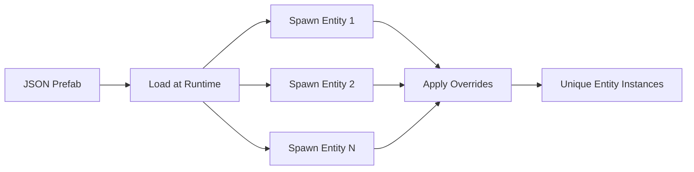
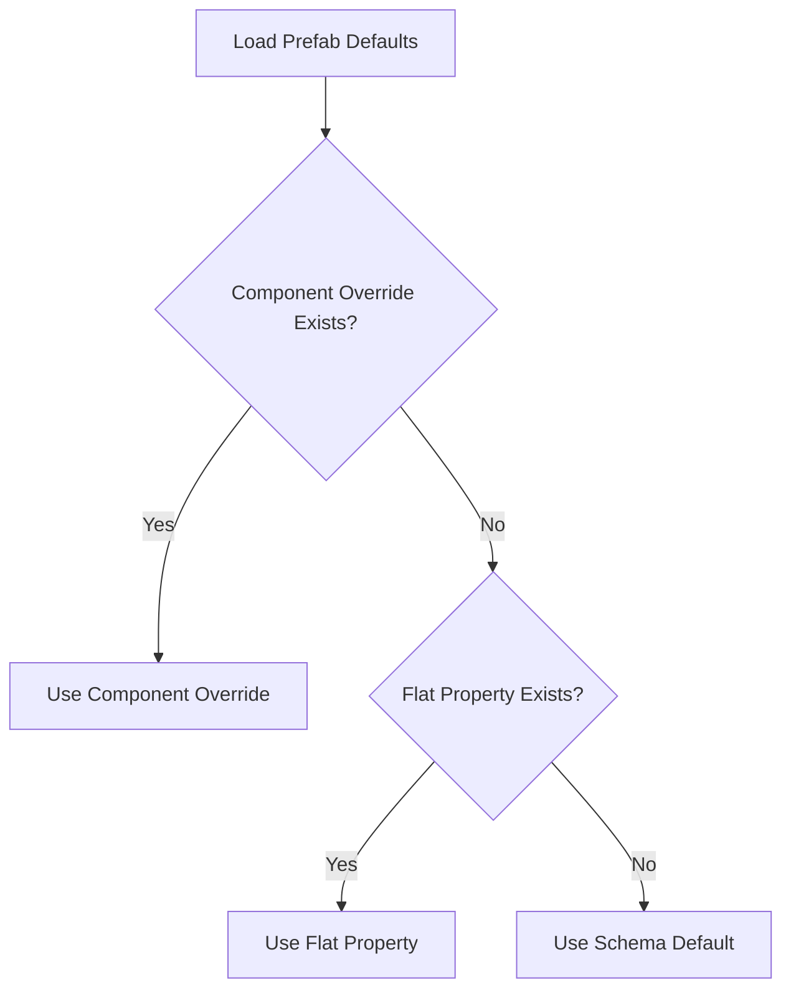

# Creating Prefabs - Complete Guide

**Audience:** Level designers and developers creating reusable entity templates  
**Prerequisites:** Basic JSON knowledge, understanding of ECS components  
**Related:** `_QuickRef_Prefabs.md`, `01_ECS_Components/_QuickRef_Components.md`

---

## Table of Contents

1. [Introduction to Prefabs](#introduction-to-prefabs)
2. [Prefab File Structure](#prefab-file-structure)
3. [JSON Schema Reference](#json-schema-reference)
4. [Component Parameters](#component-parameters)
5. [Creating Your First Prefab](#creating-your-first-prefab)
6. [Entity Type Registry](#entity-type-registry)
7. [Scoped Overrides System](#scoped-overrides-system)
8. [Advanced Prefab Patterns](#advanced-prefab-patterns)
9. [Testing Prefabs](#testing-prefabs)
10. [Common Prefab Examples](#common-prefab-examples)
11. [Troubleshooting](#troubleshooting)
12. [Best Practices](#best-practices)

---

## Introduction to Prefabs

### What is a Prefab?

A **prefab** (prefabricated entity) is a reusable entity template defined in JSON. Prefabs:
- Define which **components** an entity has
- Specify **default values** for component properties
- Can be **instantiated** multiple times with variations
- Support **per-instance overrides** via scoped properties
- Enable **data-driven** entity creation without C++ recompilation

### Why Use Prefabs?



**Benefits:**
- **Rapid Iteration:** Change entity properties without recompiling
- **Consistency:** All enemies of same type share base properties
- **Reusability:** Place same prefab across multiple levels
- **Overrides:** Customize instances (e.g., boss with 10x health)
- **Version Control:** JSON files are diff-friendly
- **Designer-Friendly:** No C++ knowledge required

---

## Prefab File Structure

### Schema Version 2 (Current)

```json
{
  "schema_version": 2,
  "type": "EntityTypeName",
  "blueprintType": "EntityPrefab",
  "name": "Human-Readable Name",
  "description": "Optional description",
  "metadata": {
    "author": "Your Name",
    "created": "2026-01-08T10:00:00Z",
    "lastModified": "2026-02-12T00:00:00Z",
    "tags": ["Category1", "Category2"]
  },
  "data": {
    "prefabName": "EntityTypeName",
    "components": [
      {
        "type": "ComponentName_data",
        "properties": {
          "property1": value1,
          "property2": value2
        }
      }
    ]
  }
}
```

### File Naming Convention

```
Gamedata/EntityPrefab/
├── player.json              # Player character
├── zombie.json              # Enemy NPC
├── npc_entity.json          # Generic NPC
├── key.json                 # Collectible item
├── trigger.json             # Trigger zone
├── waypoint.json            # Path waypoint
└── ParameterSchemas.json    # Component schemas (required)
```

**Naming Rules:**
- Use lowercase with underscores: `my_entity.json`
- Match entity type name (case-insensitive): `Zombie` → `zombie.json`
- Place in `Gamedata/EntityPrefab/` directory
- Keep names descriptive: `door_locked.json` vs `obj47.json`

---

## JSON Schema Reference

### Root Structure

| Field | Type | Required | Description |
|-------|------|----------|-------------|
| `schema_version` | int | ✅ Yes | Must be `2` for current format |
| `type` | string | ✅ Yes | Entity type name (used in synonym registry) |
| `blueprintType` | string | ✅ Yes | Must be `"EntityPrefab"` |
| `name` | string | ✅ Yes | Human-readable display name |
| `description` | string | ❌ No | Optional description for documentation |
| `metadata` | object | ❌ No | Author, timestamps, tags (optional) |
| `data` | object | ✅ Yes | Contains `prefabName` and `components` |

### Metadata Object (Optional)

```json
"metadata": {
  "author": "Atlasbruce",
  "created": "2026-01-08T10:00:00Z",
  "lastModified": "2026-02-12T00:00:00Z",
  "tags": ["NPC", "Enemy", "AI"],
  "version": "1.0",
  "notes": "Version notes or special instructions"
}
```

**Purpose:**
- Track authorship for team workflows
- Document modification history
- Categorize prefabs with tags for search/filtering
- Not used at runtime (documentation only)

### Data Object

```json
"data": {
  "prefabName": "Zombie",     // Must match entity type
  "components": [/* array */] // Component definitions
}
```

### Component Definition

```json
{
  "type": "Identity_data",
  "properties": {
    "name": "Zombie_{id}",
    "tag": "Enemy",
    "entityType": "Zombie"
  }
}
```

**Component Structure:**
- `type`: Component class name (must end with `_data`)
- `properties`: Key-value pairs of component fields

---

## Component Parameters

### Parameter Types

Olympe Engine supports these parameter types (defined in `ParameterSchemas.json`):

| Type | JSON Syntax | Example | Description |
|------|-------------|---------|-------------|
| **String** | `"text"` | `"name": "Player"` | Text values |
| **Float** | `0.0` | `"speed": 100.0` | Decimal numbers |
| **Int** | `0` | `"health": 100` | Integers (no decimals) |
| **Bool** | `true`/`false` | `"enabled": true` | Boolean flags |
| **Vector2** | `{"x": 0, "y": 0}` | `"position": {"x": 10, "y": 20}` | 2D coordinates |
| **Vector3** | `{"x": 0, "y": 0, "z": 0}` | `"position": {"x": 10, "y": 20, "z": 5}` | 3D coordinates |
| **Color** | `"#RRGGBB"` | `"tint": "#FF0000"` | Hex color (RGB) |
| **Array** | `[1, 2, 3]` | `"waypoints": [0, 1, 2]` | Lists of values |

### Parameter Schema Example

From `ParameterSchemas.json`:

```json
{
  "componentType": "Movement_data",
  "parameters": [
    { 
      "name": "speed", 
      "type": "Float", 
      "defaultValue": 100.0 
    },
    { 
      "name": "acceleration", 
      "type": "Float", 
      "defaultValue": 500.0 
    }
  ]
}
```

**Schema Purpose:**
- Defines valid parameters for each component
- Provides default values when properties omitted
- Used for validation and fallback behavior
- Required file: `Gamedata/EntityPrefab/ParameterSchemas.json`

### Special Variable Substitution

```json
{
  "type": "Identity_data",
  "properties": {
    "name": "Enemy_{id}",  // {id} replaced with EntityID at spawn
    "tag": "Enemy"
  }
}
```

**Supported Variables:**
- `{id}` → Entity ID (unique number)
- Future: `{level}`, `{spawn_index}`, custom variables

---

## Creating Your First Prefab

### Step-by-Step: Simple Enemy

#### 1. Create the JSON File

Create `Gamedata/EntityPrefab/skeleton.json`:

```json
{
  "schema_version": 2,
  "type": "Skeleton",
  "blueprintType": "EntityPrefab",
  "name": "Skeleton Enemy",
  "description": "Basic melee enemy with patrol behavior",
  "metadata": {
    "author": "YourName",
    "created": "2026-02-12T00:00:00Z",
    "tags": ["Enemy", "Melee", "Undead"]
  },
  "data": {
    "prefabName": "Skeleton",
    "components": []
  }
}
```

#### 2. Add Identity Component

```json
"components": [
  {
    "type": "Identity_data",
    "properties": {
      "name": "Skeleton_{id}",
      "tag": "Enemy",
      "entityType": "Skeleton"
    }
  }
]
```

**Purpose:** Identifies entity in logs, debugging, and systems

#### 3. Add Position Component

```json
{
  "type": "Position_data",
  "properties": {
    "position": { "x": 0, "y": 0, "z": 0 }
  }
}
```

**Purpose:** Entity's world position (overridden at spawn by Tiled map)

#### 4. Add Visual Sprite

```json
{
  "type": "VisualSprite_data",
  "properties": {
    "spritePath": "./Resources/Sprites/skeleton.png",
    "width": 32,
    "height": 32,
    "layer": 1
  }
}
```

**Purpose:** Defines how entity is rendered

#### 5. Add Movement & Physics

```json
{
  "type": "Movement_data",
  "properties": {
    "speed": 60.0,
    "acceleration": 300.0
  }
},
{
  "type": "BoundingBox_data",
  "properties": {
    "width": 28,
    "height": 28,
    "offsetX": 2,
    "offsetY": 2
  }
}
```

**Purpose:** Movement speed and collision bounds

#### 6. Add Health

```json
{
  "type": "Health_data",
  "properties": {
    "maxHealth": 50,
    "currentHealth": 50,
    "invulnerable": false
  }
}
```

#### 7. Add AI Components

```json
{
  "type": "AIBlackboard_data",
  "properties": {
    "initialized": true
  }
},
{
  "type": "AISenses_data",
  "properties": {
    "visionRange": 200.0,
    "hearingRange": 150.0,
    "perceptionHz": 5.0,
    "thinkHz": 10.0
  }
},
{
  "type": "BehaviorTreeRuntime_data",
  "properties": {
    "treePath": "Blueprints/AI/enemy_patrol.json",
    "active": true
  }
}
```

**Purpose:** AI perception and behavior tree execution

#### 8. Complete Prefab

See full example in `npc_entity.json` (lines 1-110)

---

## Entity Type Registry

### Synonym Registry (EntityPrefabSynonymsRegister.json)

Maps entity type names to prefab files with fuzzy matching:

```json
{
  "canonicalTypes": {
    "Skeleton": {
      "prefabFile": "skeleton.json",
      "synonyms": ["skeleton", "SKELETON", "skelly", "SkeletonEnemy"]
    },
    "Player": {
      "prefabFile": "player.json",
      "synonyms": ["player", "PLAYER", "PlayerEntity", "player_entity"]
    },
    "Zombie": {
      "prefabFile": "zombie.json",
      "synonyms": ["zombie", "ZOMBIE", "enemy", "walker"]
    }
  }
}
```

### Adding New Entity Types

#### Step 1: Create Prefab
Create `Gamedata/EntityPrefab/myentity.json`

#### Step 2: Register in Synonyms
Edit `EntityPrefabSynonymsRegister.json`:

```json
{
  "canonicalTypes": {
    "MyEntity": {
      "prefabFile": "myentity.json",
      "synonyms": ["myentity", "MYENTITY", "MyCustomEntity"]
    }
  }
}
```

#### Step 3: Use in Tiled
In Tiled Map Editor:
1. Create object on object layer
2. Set object **type** to `"MyEntity"` (or any synonym)
3. Add custom properties for overrides (see Scoped Overrides)

### Fuzzy Matching Behavior

```cpp
// Case-insensitive matching
"Player"  → loads player.json ✅
"player"  → loads player.json ✅
"PLAYER"  → loads player.json ✅

// Synonym matching
"zombie"       → loads zombie.json ✅
"enemy"        → loads zombie.json ✅ (synonym)
"UnknownType"  → ❌ Error: No prefab found
```

**Threshold:** 80% string similarity for fuzzy matching

---

## Scoped Overrides System

### The Problem

Multiple components may have properties with the same name:

```
Transform.width = 64       # Transform component's width
VisualSprite.width = 32    # Sprite component's width
BoundingBox.width = 28     # Collision box width
```

**Without scoping:** The last `width` value would overwrite all others!

### The Solution: Component-Scoped Overrides

Use **dot notation** in Tiled object properties:

```
Component.property = value
```

### In Tiled Map Editor

1. Select an object
2. Add custom properties with dot notation:

| Property Name | Type | Value |
|---------------|------|-------|
| `Transform.width` | float | 64 |
| `VisualSprite.width` | int | 32 |
| `BoundingBox.width` | int | 28 |
| `Health.maxHealth` | int | 200 |

### Priority System

When loading an entity, parameter resolution follows this priority:



**Priority Levels:**
1. **Highest:** Component-scoped overrides (`Transform.width`)
2. **Medium:** Flat properties (legacy `width`)
3. **Lowest:** Schema defaults (`ParameterSchemas.json`)

### Code Example

```cpp
// LevelInstanceParameters structure
struct LevelInstanceParameters {
    std::string objectType;                // e.g., "Zombie"
    
    // Component-scoped (Priority 1)
    std::map<std::string, std::map<std::string, ComponentParameter>> componentOverrides;
    // Example: componentOverrides["Transform"]["width"] = 64
    
    // Flat properties (Priority 2, legacy)
    std::map<std::string, ComponentParameter> properties;
    // Example: properties["width"] = 32
};
```

### Practical Example

**Prefab (zombie.json):**
```json
{
  "type": "VisualSprite_data",
  "properties": {
    "width": 32,        // Default
    "height": 32
  }
},
{
  "type": "BoundingBox_data",
  "properties": {
    "width": 28,        // Default
    "height": 28
  }
}
```

**Tiled Object Properties (Boss Zombie):**
```
VisualSprite.width = 64      # Override sprite width only
VisualSprite.height = 64
BoundingBox.width = 56       # Override collision width (keeps proportions)
BoundingBox.height = 56
Health.maxHealth = 500       # Boss has 10x health
```

**Result:**
- VisualSprite component: width=64, height=64
- BoundingBox component: width=56, height=56
- Health component: maxHealth=500
- No conflicts!

---

## Advanced Prefab Patterns

### 1. Layered Entities

```json
{
  "type": "VisualSprite_data",
  "properties": {
    "spritePath": "./Resources/Sprites/character_body.png",
    "layer": 0
  }
}
```

**Layer Values:**
- `0` = Ground/objects
- `1` = Characters
- `2` = Effects/UI
- Higher values render on top

### 2. Animated Sprites

```json
{
  "type": "VisualSprite_data",
  "properties": {
    "spritePath": "./Resources/Sprites/player_walk.png",
    "srcX": 0,
    "srcY": 0,
    "srcW": 32,
    "srcH": 32,
    "width": 32,
    "height": 32
  }
}
```

**Animation handled by:**
- AnimationSystem (see system documentation)
- Animation_data component (separate)

### 3. Entity References

For linking entities (e.g., guard → patrol path):

```json
{
  "type": "PatrolPath_data",
  "properties": {
    "pathName": "patrol_route_1",  // Reference by name
    "waypointCount": 4
  }
}
```

**Linking in Tiled:**
```
patrol_way = "patrol_route_1"  # Links guard to patrol path
```

### 4. Conditional Components

Some components should only exist under certain conditions:

```json
// Base NPC prefab
{
  "components": [
    "Identity_data",
    "Position_data",
    "VisualSprite_data",
    "AIBlackboard_data"
  ]
}

// Combat-enabled NPC (add Health + Combat components)
{
  "components": [
    /* ... base components ... */,
    {
      "type": "Health_data",
      "properties": { "maxHealth": 100 }
    },
    {
      "type": "AttackIntent_data",
      "properties": { "damage": 10 }
    }
  ]
}
```

**Pattern:** Create separate prefabs for variants rather than conditional logic

### 5. Template Prefabs

Create base templates for common patterns:

**base_character.json** (not directly spawned):
```json
{
  "components": [
    {
      "type": "Identity_data",
      "properties": { "name": "Character_{id}" }
    },
    {
      "type": "Position_data",
      "properties": { "position": {"x": 0, "y": 0, "z": 0} }
    },
    {
      "type": "VisualSprite_data",
      "properties": { "width": 32, "height": 32 }
    },
    {
      "type": "Movement_data",
      "properties": { "speed": 100.0 }
    }
  ]
}
```

Then **manually inherit** in specific prefabs (no automatic inheritance—copy base components).

### 6. Data-Driven Behavior Trees

```json
{
  "type": "BehaviorTreeRuntime_data",
  "properties": {
    "treePath": "Blueprints/AI/guard_patrol.json",
    "active": true
  }
}
```

**Override in Tiled:**
```
BehaviorTreeRuntime.treePath = "Blueprints/AI/boss_behavior.json"
```

Allows per-instance AI behavior without changing prefab.

---

## Testing Prefabs

### 1. Validation

```cpp
// Check if prefab loads without errors
PrefabFactory::ValidatePrefab("Gamedata/EntityPrefab/skeleton.json");
```

**Common Errors:**
- Missing required fields (`schema_version`, `type`, `data`)
- Invalid component types (typo in component name)
- Type mismatch (string where int expected)
- Missing schema entry in `ParameterSchemas.json`

### 2. Spawn Testing

```cpp
// Spawn in test level
EntityID entity = PrefabFactory::CreateEntityFromType("Skeleton", World::Get());

// Verify components
assert(World::Get().HasComponent<Identity_data>(entity));
assert(World::Get().HasComponent<Health_data>(entity));

// Check values
Health_data& health = World::Get().GetComponent<Health_data>(entity);
assert(health.maxHealth == 50);
```

### 3. Override Testing

Create test Tiled map with objects:

**Test Object 1:** Base skeleton
- Type: `Skeleton`
- No overrides

**Test Object 2:** Boss skeleton
- Type: `Skeleton`
- Properties:
  - `Health.maxHealth = 500`
  - `VisualSprite.width = 64`
  - `VisualSprite.height = 64`

Load map and verify:
```cpp
// Entity 1 (base)
Health_data& health1 = World::Get().GetComponent<Health_data>(entity1);
assert(health1.maxHealth == 50);  // Prefab default

// Entity 2 (boss)
Health_data& health2 = World::Get().GetComponent<Health_data>(entity2);
assert(health2.maxHealth == 500);  // Override applied
```

### 4. Performance Testing

```cpp
// Spawn 100 entities
auto start = std::chrono::high_resolution_clock::now();
for (int i = 0; i < 100; ++i)
{
    EntityID entity = PrefabFactory::CreateEntityFromType("Skeleton", World::Get());
}
auto end = std::chrono::high_resolution_clock::now();
auto duration = std::chrono::duration_cast<std::chrono::milliseconds>(end - start);

std::cout << "Spawned 100 entities in " << duration.count() << "ms" << std::endl;
```

**Expected:** <1ms per entity spawn (100 entities in ~50-100ms)

---

## Common Prefab Examples

### Player Character

```json
{
  "schema_version": 2,
  "type": "Player",
  "blueprintType": "EntityPrefab",
  "name": "Player",
  "data": {
    "prefabName": "Player",
    "components": [
      {
        "type": "Identity_data",
        "properties": {
          "name": "Player",
          "tag": "Player",
          "entityType": "Player",
          "isPersistent": true
        }
      },
      {
        "type": "Position_data",
        "properties": { "position": {"x": 0, "y": 0, "z": 0} }
      },
      {
        "type": "VisualSprite_data",
        "properties": {
          "spritePath": "./Resources/Sprites/player.png",
          "width": 32,
          "height": 32,
          "layer": 1
        }
      },
      {
        "type": "BoundingBox_data",
        "properties": {
          "width": 28,
          "height": 28,
          "offsetX": 2,
          "offsetY": 2
        }
      },
      {
        "type": "Movement_data",
        "properties": {
          "speed": 150.0,
          "acceleration": 800.0
        }
      },
      {
        "type": "Health_data",
        "properties": {
          "maxHealth": 100,
          "currentHealth": 100
        }
      },
      {
        "type": "PlayerBinding_data",
        "properties": {
          "playerIndex": 0,
          "controlScheme": "WASD"
        }
      },
      {
        "type": "Controller_data",
        "properties": {
          "controllerID": -1,
          "isConnected": false
        }
      }
    ]
  }
}
```

### Enemy NPC (See npc_entity.json lines 1-110)

Full example with AI, movement, and perception.

### Static Collectible

```json
{
  "schema_version": 2,
  "type": "Key",
  "blueprintType": "EntityPrefab",
  "name": "Key Item",
  "data": {
    "prefabName": "Key",
    "components": [
      {
        "type": "Identity_data",
        "properties": {
          "name": "Key_{id}",
          "tag": "Collectible",
          "entityType": "Key"
        }
      },
      {
        "type": "Position_data",
        "properties": { "position": {"x": 0, "y": 0, "z": 0} }
      },
      {
        "type": "VisualSprite_data",
        "properties": {
          "spritePath": "./Resources/Sprites/key.png",
          "width": 16,
          "height": 16,
          "layer": 0
        }
      },
      {
        "type": "BoundingBox_data",
        "properties": {
          "width": 16,
          "height": 16
        }
      },
      {
        "type": "Collectable_data",
        "properties": {
          "itemType": "Key",
          "value": 1
        }
      }
    ]
  }
}
```

### Trigger Zone

```json
{
  "schema_version": 2,
  "type": "Trigger",
  "blueprintType": "EntityPrefab",
  "name": "Trigger Zone",
  "data": {
    "prefabName": "Trigger",
    "components": [
      {
        "type": "Identity_data",
        "properties": {
          "name": "Trigger_{id}",
          "tag": "Trigger",
          "entityType": "Trigger"
        }
      },
      {
        "type": "Position_data",
        "properties": { "position": {"x": 0, "y": 0, "z": 0} }
      },
      {
        "type": "BoundingBox_data",
        "properties": {
          "width": 64,
          "height": 64
        }
      },
      {
        "type": "TriggerZone_data",
        "properties": {
          "active": true,
          "oneShot": false,
          "targetEntity": ""
        }
      }
    ]
  }
}
```

### Waypoint (Patrol Point)

```json
{
  "schema_version": 2,
  "type": "Waypoint",
  "blueprintType": "EntityPrefab",
  "name": "Patrol Waypoint",
  "data": {
    "prefabName": "Waypoint",
    "components": [
      {
        "type": "Identity_data",
        "properties": {
          "name": "Waypoint_{id}",
          "tag": "Waypoint",
          "entityType": "Waypoint"
        }
      },
      {
        "type": "Position_data",
        "properties": { "position": {"x": 0, "y": 0, "z": 0} }
      }
    ]
  }
}
```

---

## Troubleshooting

### Problem: Prefab Not Loading

**Symptoms:**
- Error: "Failed to load prefab"
- Entity not spawning in level

**Solutions:**

1. **Check File Path**
   ```
   Gamedata/EntityPrefab/myentity.json  ✅
   Gamedata/myentity.json               ❌ Wrong directory
   ```

2. **Validate JSON Syntax**
   - Use JSON validator (e.g., jsonlint.com)
   - Common errors: missing commas, trailing commas, unquoted keys

3. **Check Schema Version**
   ```json
   "schema_version": 2  ✅
   "schema_version": 1  ⚠️ Legacy format
   // Missing             ❌ Error
   ```

4. **Verify Component Names**
   ```json
   "type": "Identity_data"     ✅ Correct
   "type": "Identity"          ❌ Missing _data suffix
   "type": "IdentityData"      ❌ Wrong naming
   ```

### Problem: Component Properties Not Applied

**Symptoms:**
- Entity spawns but uses default values
- Overrides not working

**Solutions:**

1. **Check Property Names**
   - Match exact names from `ParameterSchemas.json`
   - Case-sensitive: `maxHealth` ≠ `MaxHealth`

2. **Verify Data Types**
   ```json
   "speed": 100.0     ✅ Float
   "speed": "100"     ❌ String (wrong type)
   "health": 100      ✅ Int
   "health": 100.5    ⚠️ Float to int (truncates)
   ```

3. **Check Override Scoping**
   ```
   Health.maxHealth = 200       ✅ Scoped
   maxHealth = 200              ✅ Flat (legacy)
   Health.health = 200          ❌ Wrong property name
   ```

### Problem: Entity Type Not Recognized

**Symptoms:**
- Error: "Unknown entity type"
- Prefab file exists but not loading

**Solutions:**

1. **Register in Synonyms**
   - Edit `EntityPrefabSynonymsRegister.json`
   - Add entry for your entity type

2. **Check Spelling**
   ```json
   // In synonyms registry
   "canonicalTypes": {
     "MyEntity": {  // Must match exactly
       "prefabFile": "myentity.json"
     }
   }
   ```

3. **Case Sensitivity**
   - Registry is case-insensitive for lookups
   - But prefab file must exist with correct name

### Problem: Performance Issues

**Symptoms:**
- Slow level loading
- Frame drops when spawning entities

**Solutions:**

1. **Reduce Component Count**
   - Only include necessary components
   - Remove debug/editor-only components

2. **Optimize Schemas**
   - Ensure `ParameterSchemas.json` is loaded once at startup
   - Cache prefab definitions

3. **Batch Spawning**
   ```cpp
   // Instead of spawning one-by-one:
   for (auto& descriptor : entityDescriptors)
   {
       SpawnEntity(descriptor);  // Multiple cache misses
   }
   
   // Batch spawn:
   BatchSpawnEntities(entityDescriptors);  // Better cache locality
   ```

---

## Best Practices

### 1. ✅ Use Descriptive Names

```json
// Good
{
  "type": "ZombieWarrior",
  "name": "Zombie Warrior - Melee Enemy",
  "description": "Fast melee zombie with patrol AI"
}

// Bad
{
  "type": "Entity47",
  "name": "E47"
}
```

### 2. ✅ Always Set Schema Version

```json
{
  "schema_version": 2,  // Always include!
  // ...
}
```

### 3. ✅ Document Complex Prefabs

```json
{
  "description": "Boss enemy: 10x health, uses ranged attacks, special death behavior",
  "metadata": {
    "tags": ["Boss", "Ranged", "SpecialDeath"],
    "notes": "Requires boss_death.json behavior tree"
  }
}
```

### 4. ✅ Use Metadata for Team Workflows

```json
{
  "metadata": {
    "author": "Alice",
    "lastModified": "2026-02-12T15:30:00Z",
    "version": "2.1",
    "changeLog": "Increased vision range from 200 to 300"
  }
}
```

### 5. ✅ Keep Prefabs Minimal

```json
// Only include non-default values
{
  "type": "Movement_data",
  "properties": {
    "speed": 120.0  // Only override speed, use default acceleration
  }
}
```

### 6. ✅ Use Component Scoping

```
// In Tiled
Transform.width = 64           ✅ Clear intent
VisualSprite.width = 32        ✅ No ambiguity
width = 32                     ⚠️ Ambiguous (legacy)
```

### 7. ✅ Test Overrides

Always test:
- Base prefab (no overrides)
- Overridden instance (with Tiled properties)
- Edge cases (extreme values, missing properties)

### 8. ✅ Version Control Friendly

```json
// Use consistent formatting
{
  "type": "Component",
  "properties": {
    "prop1": 1,
    "prop2": 2
  }
}

// Not:
{"type":"Component","properties":{"prop1":1,"prop2":2}}
```

### 9. ❌ Don't Hardcode Entity IDs

```json
// Wrong
{
  "type": "Trigger_data",
  "properties": {
    "targetEntityID": 42  // Entity IDs change between runs!
  }
}

// Right
{
  "type": "Trigger_data",
  "properties": {
    "targetEntityName": "Door_1"  // Use names for linking
  }
}
```

### 10. ❌ Don't Duplicate Components

```json
// Wrong
{
  "components": [
    { "type": "Position_data", "properties": {} },
    { "type": "Position_data", "properties": {} }  // Duplicate!
  ]
}

// Right
{
  "components": [
    { "type": "Position_data", "properties": {} }  // Once only
  ]
}
```

---

## Summary Checklist

When creating a prefab:

- [ ] **File created** in `Gamedata/EntityPrefab/`
- [ ] **Schema version** set to `2`
- [ ] **Entity type** matches file name (case-insensitive)
- [ ] **Registered** in `EntityPrefabSynonymsRegister.json`
- [ ] **Components** use correct `_data` suffix
- [ ] **Properties** match `ParameterSchemas.json` definitions
- [ ] **Types** are correct (float, int, string, etc.)
- [ ] **Metadata** added for documentation
- [ ] **Tested** by spawning in-game or editor
- [ ] **Overrides tested** in Tiled map
- [ ] **Performance profiled** if spawning many instances

---

## Next Steps

- **Quick Reference:** See `_QuickRef_Prefabs.md` for syntax reminders
- **Components:** Read `01_ECS_Components/_QuickRef_Components.md` for available components
- **Level Loading:** See `06_Level_Loading/Level_Loading_Pipeline_Guide.md` for how prefabs integrate with maps
- **Scoped Overrides:** Review `/COMPONENT_SCOPED_OVERRIDES.md` for advanced override techniques

**Need Help?**
- Check existing prefabs in `Gamedata/EntityPrefab/` for examples
- Validate JSON syntax at jsonlint.com
- Review `ParameterSchemas.json` for available component properties
