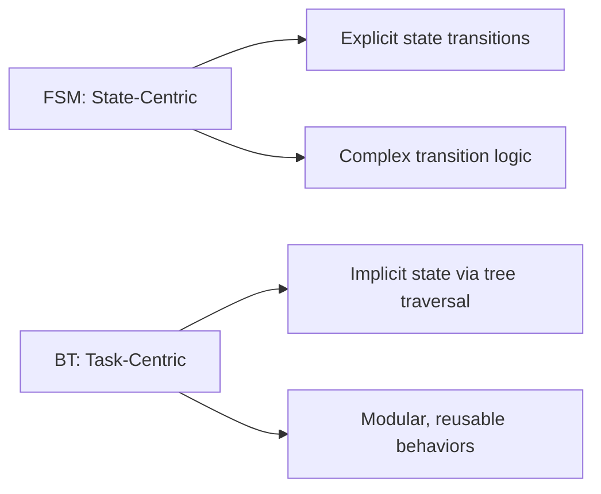
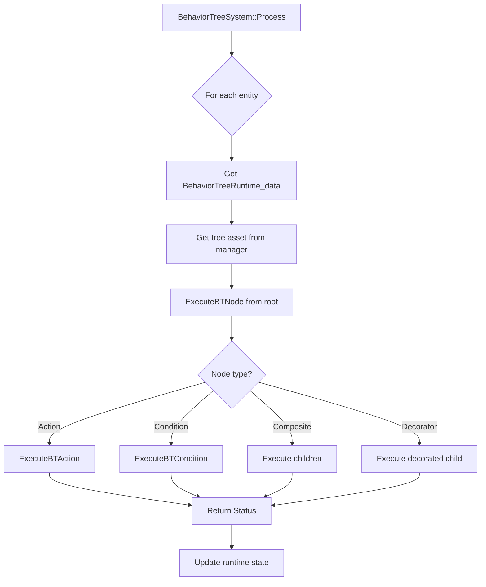

# Creating Behavior Tree Actions & Conditions - Complete Guide

**Audience:** AI programmers extending Olympe Engine's behavior tree system  
**Prerequisites:** Understanding of behavior trees, C++ knowledge, ECS architecture  
**Related:** `_QuickRef_BehaviorTrees.md`, `05_AI_Systems/AI_Blackboard_Guide.md`

---

## Table of Contents

1. [Introduction to Behavior Trees](#introduction-to-behavior-trees)
2. [BT System Architecture](#bt-system-architecture)
3. [Adding New Actions - Step by Step](#adding-new-actions---step-by-step)
4. [Adding New Conditions - Step by Step](#adding-new-conditions---step-by-step)
5. [Blackboard Usage Patterns](#blackboard-usage-patterns)
6. [Parameters and Configuration](#parameters-and-configuration)
7. [Testing BT Actions](#testing-bt-actions)
8. [Common Action Patterns](#common-action-patterns)
9. [Debugging Behavior Trees](#debugging-behavior-trees)
10. [Performance Optimization](#performance-optimization)
11. [Advanced Techniques](#advanced-techniques)
12. [Troubleshooting](#troubleshooting)

---

## Introduction to Behavior Trees

### What is a Behavior Tree?

A **Behavior Tree (BT)** is a hierarchical AI decision structure that:
- Defines **what** an NPC does (actions) and **when** (conditions)
- Executes **top-down, left-to-right**
- Returns **status** (Running, Success, Failure) after each tick
- Enables **data-driven** AI without C++ recompilation

### BT vs. Finite State Machines



**When to use BTs:**
- Complex decision trees with many conditions
- Reusable behavior patterns
- Designer-friendly AI authoring

**When to use FSMs:**
- Simple state machines (Idle/Patrol/Combat)
- High-level mode switching
- Clear state ownership requirements

### Olympe's Hybrid Approach

```
AIStateTransitionSystem (HFSM)
    ↓ Selects behavior tree by mode
BehaviorTreeSystem (BT)
    ↓ Writes intents
AIMotionSystem
    ↓ Executes movement
```

**Design:** HFSM for high-level modes + BT for detailed behavior logic

---

## BT System Architecture

### Core Components

```cpp
// Node types
enum class BTNodeType {
    Selector,    // OR composite (first success)
    Sequence,    // AND composite (all succeed)
    Action,      // Leaf node: executes game logic
    Condition,   // Leaf node: evaluates state
    Inverter,    // Decorator: flips result
    Repeater     // Decorator: repeats child
};

// Status return values
enum class BTStatus : uint8_t {
    Running = 0,   // Still executing (multi-frame)
    Success = 1,   // Completed successfully
    Failure = 2    // Failed to complete
};
```

### Action Types (Extensible Enum)

```cpp
enum class BTActionType : uint8_t {
    // Movement
    SetMoveGoalToTarget = 0,
    SetMoveGoalToLastKnownTargetPos = 1,
    SetMoveGoalToPatrolPoint = 2,
    MoveToGoal = 3,
    
    // Combat
    AttackIfClose = 4,
    
    // Patrol
    PatrolPickNextPoint = 5,
    
    // Utility
    ClearTarget = 6,
    Idle = 7,
    
    // Wander
    WaitRandomTime = 8,
    ChooseRandomNavigablePoint = 9,
    RequestPathfinding = 10,
    FollowPath = 11,
    
    // ADD NEW ACTIONS HERE
    CustomAction1 = 20,
    CustomAction2 = 21
    // ...
};
```

### Condition Types (Extensible Enum)

```cpp
enum class BTConditionType : uint8_t {
    // Perception
    TargetVisible = 0,
    HeardNoise = 1,
    TargetInRange = 2,
    
    // Status
    HealthBelow = 3,
    CanAttack = 4,
    HasMoveGoal = 5,
    
    // Wander
    IsWaitTimerExpired = 6,
    HasNavigableDestination = 7,
    HasValidPath = 8,
    HasReachedDestination = 9,
    
    // ADD NEW CONDITIONS HERE
    CustomCondition1 = 20,
    CustomCondition2 = 21
    // ...
};
```

### Execution Flow



---

## Adding New Actions - Step by Step

### Example: Create "PlaySound" Action

#### Step 1: Define Action Enum

**File:** `Source/AI/BehaviorTree.h`

```cpp
enum class BTActionType : uint8_t {
    // ... existing actions ...
    
    // Custom actions (start at 20+)
    PlaySound = 20,         // NEW: Plays audio at entity position
    TriggerAnimation = 21,  // Future expansion
};
```

**Guidelines:**
- Start custom actions at index 20+ (leaves 0-19 for engine defaults)
- Use descriptive names: `PlaySound`, not `Action1`
- Comment with brief description

#### Step 2: Add JSON String Mapping

**File:** `Source/AI/BehaviorTree.cpp` (in `LoadTreeFromFile` function)

Find the action type parsing section:

```cpp
if (node.type == BTNodeType::Action && nodeJson.contains("actionType"))
{
    std::string actStr = JsonHelper::GetString(nodeJson, "actionType", "");
    
    // Existing mappings...
    if (actStr == "SetMoveGoalToTarget")
        node.actionType = BTActionType::SetMoveGoalToTarget;
    else if (actStr == "AttackIfClose")
        node.actionType = BTActionType::AttackIfClose;
    
    // ADD YOUR ACTION HERE
    else if (actStr == "PlaySound")
        node.actionType = BTActionType::PlaySound;
    
    else
    {
        LOG_ERROR << "Unknown action type: " << actStr << std::endl;
    }
}
```

**Purpose:** Maps JSON string `"PlaySound"` to enum `BTActionType::PlaySound`

#### Step 3: Implement Execution Logic

**File:** `Source/AI/BehaviorTree.cpp` (in `ExecuteBTAction` function)

Add a case to the switch statement:

```cpp
BTStatus ExecuteBTAction(
    const BTNode& node,
    EntityID entity,
    AIBlackboard_data& blackboard,
    const BehaviorTreeAsset* tree
)
{
    switch (node.actionType)
    {
        // ... existing cases ...
        
        case BTActionType::PlaySound:
        {
            // 1. Extract parameters
            float volume = 1.0f;
            std::string soundName = "default_sound.wav";
            
            if (node.parameters.contains("param1"))
                volume = node.parameters.at("param1");
            if (node.parameters.contains("soundName"))
                soundName = node.parameters.at("soundName");
            
            // 2. Get entity position
            if (!World::Get().HasComponent<Position_data>(entity))
                return BTStatus::Failure;
            
            Position_data& pos = World::Get().GetComponent<Position_data>(entity);
            
            // 3. Play sound at entity position
            AudioManager::Get().PlaySoundAt(soundName, pos.position, volume);
            
            // 4. Return status (instant action)
            return BTStatus::Success;
        }
        
        default:
            return BTStatus::Failure;
    }
}
```

**Key Points:**
- **Parameters:** Extract from `node.parameters` map
- **Component Access:** Use `World::Get().GetComponent<T>(entity)`
- **Blackboard:** Read/write via `blackboard.field`
- **Return Status:**
  - `Success`: Action completed
  - `Failure`: Action failed (e.g., missing component)
  - `Running`: Action spans multiple frames (see Multi-Frame Actions)

#### Step 4: Update Catalogues (Optional)

**File:** `Blueprints/Catalogues/ActionTypes.json`

```json
{
  "types": [
    {
      "id": "PlaySound",
      "name": "Play Sound",
      "description": "Plays an audio clip at entity position",
      "category": "Audio",
      "parameters": [
        {"name": "soundName", "type": "string", "required": true},
        {"name": "param1", "type": "float", "default": 1.0, "description": "Volume (0.0-1.0)"}
      ],
      "tooltip": "Plays specified sound at entity location"
    }
  ]
}
```

**Purpose:** Documentation for Blueprint Editor (future feature)

#### Step 5: Use in Behavior Tree JSON

**File:** `Blueprints/AI/sound_test.json`

```json
{
  "schema_version": 2,
  "type": "BehaviorTree",
  "data": {
    "rootNodeId": 1,
    "nodes": [
      {
        "id": 1,
        "name": "Play Alert Sound",
        "type": "Action",
        "actionType": "PlaySound",
        "parameters": {
          "soundName": "alert.wav",
          "param1": 0.8
        }
      }
    ]
  }
}
```

#### Step 6: Test Your Action

```cpp
// Test code
EntityID testEntity = World::Get().CreateEntity();
World::Get().AddComponent<Position_data>(testEntity);
World::Get().AddComponent<AIBlackboard_data>(testEntity);

BehaviorTreeRuntime_data& bt = World::Get().AddComponent<BehaviorTreeRuntime_data>(testEntity);
bt.treePath = "Blueprints/AI/sound_test.json";
bt.active = true;

// Load tree
BehaviorTreeManager::Get().LoadTreeFromFile(bt.treePath, bt.treeAssetId);

// Execute one tick
World::Get().Process_ECS_Systems();  // BehaviorTreeSystem will execute

// Verify sound played (check AudioManager logs)
```

---

## Adding New Conditions - Step by Step

### Example: Create "IsNearWaypoint" Condition

#### Step 1: Define Condition Enum

**File:** `Source/AI/BehaviorTree.h`

```cpp
enum class BTConditionType : uint8_t {
    // ... existing conditions ...
    
    // Custom conditions (start at 20+)
    IsNearWaypoint = 20,     // NEW: Checks distance to waypoint
    IsInventoryFull = 21,    // Future expansion
};
```

#### Step 2: Add JSON String Mapping

**File:** `Source/AI/BehaviorTree.cpp` (in `LoadTreeFromFile`)

```cpp
if (node.type == BTNodeType::Condition && nodeJson.contains("conditionType"))
{
    std::string condStr = JsonHelper::GetString(nodeJson, "conditionType", "");
    
    // Existing mappings...
    if (condStr == "TargetVisible")
        node.conditionType = BTConditionType::TargetVisible;
    
    // ADD YOUR CONDITION HERE
    else if (condStr == "IsNearWaypoint")
        node.conditionType = BTConditionType::IsNearWaypoint;
    
    else
    {
        LOG_ERROR << "Unknown condition type: " << condStr << std::endl;
    }
}
```

#### Step 3: Implement Evaluation Logic

**File:** `Source/AI/BehaviorTree.cpp` (in `ExecuteBTCondition`)

```cpp
BTStatus ExecuteBTCondition(
    const BTNode& node,
    EntityID entity,
    AIBlackboard_data& blackboard,
    const BehaviorTreeAsset* tree
)
{
    switch (node.conditionType)
    {
        // ... existing cases ...
        
        case BTConditionType::IsNearWaypoint:
        {
            // 1. Extract parameters (threshold distance)
            float threshold = 10.0f;
            if (node.parameters.contains("param1"))
                threshold = node.parameters.at("param1");
            
            // 2. Get entity position
            if (!World::Get().HasComponent<Position_data>(entity))
                return BTStatus::Failure;
            
            Position_data& pos = World::Get().GetComponent<Position_data>(entity);
            
            // 3. Get waypoint position from blackboard
            if (!blackboard.hasPatrolPath || blackboard.patrolPointCount == 0)
                return BTStatus::Failure;
            
            Vector waypointPos = blackboard.patrolPoints[blackboard.currentPatrolPoint];
            
            // 4. Calculate distance
            float distance = Vector::Distance(pos.position, waypointPos);
            
            // 5. Return Success if near, Failure otherwise
            return (distance < threshold) ? BTStatus::Success : BTStatus::Failure;
        }
        
        default:
            return BTStatus::Failure;
    }
}
```

**Condition Guidelines:**
- **Never return Running:** Conditions evaluate instantly
- **Always return Success or Failure:** Binary true/false
- **Check prerequisites:** Verify components exist before accessing
- **Use blackboard:** Conditions should be stateless (read from blackboard)

#### Step 4: Update Catalogues

**File:** `Blueprints/Catalogues/ConditionTypes.json`

```json
{
  "id": "IsNearWaypoint",
  "name": "Is Near Waypoint",
  "description": "Checks if entity is within threshold distance of current waypoint",
  "category": "Navigation",
  "parameters": [
    {"name": "param1", "type": "float", "default": 10.0, "description": "Threshold distance"}
  ],
  "tooltip": "True if distance to waypoint < threshold"
}
```

#### Step 5: Use in BT JSON

```json
{
  "id": 1,
  "name": "Check Near Waypoint",
  "type": "Condition",
  "conditionType": "IsNearWaypoint",
  "parameters": {
    "param1": 15.0
  }
}
```

---

## Blackboard Usage Patterns

The **AIBlackboard_data** component is the central data hub for AI decision-making. It stores perception results, movement goals, combat state, and custom behavior data that flows between systems.

### Blackboard Structure Overview

**File:** `Source/ECS_Components_AI.h`

```cpp
struct AIBlackboard_data
{
    // Target tracking (written by AIPerceptionSystem)
    EntityID targetEntity = INVALID_ENTITY_ID;
    Vector lastKnownTargetPosition;
    float timeSinceTargetSeen = 0.0f;
    bool hasTarget = false;
    
    // Perception state (written by AIPerceptionSystem)
    float distanceToTarget = 0.0f;
    bool targetVisible = false;
    bool targetInRange = false;
    
    // Movement goals (read/write by BT Actions)
    Vector moveGoal;
    bool hasMoveGoal = false;
    
    // Patrol state (read/write by BT Actions)
    int currentPatrolPoint = 0;
    Vector patrolPoints[8];
    int patrolPointCount = 0;
    bool hasPatrolPath = false;
    
    // Combat state (read by BT, written by AIMotionSystem)
    float lastAttackTime = 0.0f;
    float attackCooldown = 1.0f;
    bool canAttack = true;
    
    // Stimulus tracking (written by external systems)
    float lastDamageTaken = 0.0f;
    float damageAmount = 0.0f;
    Vector lastNoisePosition;
    bool heardNoise = false;
    
    // Custom behavior state (wander example)
    float wanderWaitTimer = 0.0f;
    float wanderTargetWaitTime = 0.0f;
    Vector wanderDestination;
    bool hasWanderDestination = false;
    float wanderSearchRadius = 500.0f;
    int wanderMaxSearchAttempts = 10;
};
```

### Reading Blackboard Fields

**Pattern:** Always check flags before using associated data.

```cpp
case BTActionType::ChaseTarget:
{
    // ✅ CORRECT: Check flag first
    if (!blackboard.hasTarget)
        return BTStatus::Failure;
    
    // Safe to use target data now
    blackboard.moveGoal = blackboard.lastKnownTargetPosition;
    blackboard.hasMoveGoal = true;
    return BTStatus::Success;
}

case BTActionType::AttackTarget:
{
    // ❌ INCORRECT: Using data without checking flag
    blackboard.attackTarget = blackboard.targetEntity; // May be INVALID_ENTITY_ID!
    
    // ✅ CORRECT: Validate before use
    if (blackboard.hasTarget && blackboard.targetEntity != INVALID_ENTITY_ID)
    {
        if (World::Get().HasComponent<Position_data>(blackboard.targetEntity))
        {
            // Safe to access target entity components
            const Position_data& targetPos = 
                World::Get().GetComponent<Position_data>(blackboard.targetEntity);
            // ...
        }
    }
}
```

### Writing Blackboard Fields

**Pattern:** Always set both data and flag together.

```cpp
case BTActionType::SetPatrolDestination:
{
    if (blackboard.patrolPointCount == 0)
        return BTStatus::Failure;
    
    // ✅ CORRECT: Set data + flag atomically
    blackboard.moveGoal = blackboard.patrolPoints[blackboard.currentPatrolPoint];
    blackboard.hasMoveGoal = true;  // Flag must be set!
    
    return BTStatus::Success;
}

case BTActionType::ClearTarget:
{
    // ✅ CORRECT: Clear data + flag atomically
    blackboard.hasTarget = false;
    blackboard.targetEntity = INVALID_ENTITY_ID;
    blackboard.targetVisible = false;
    
    return BTStatus::Success;
}
```

### Blackboard Data Flow (Architecture)

```
┌─────────────────────────┐
│  AIPerceptionSystem     │ ← Runs at perceptionHz (e.g., 5 Hz)
│  (Writes perception)    │
└───────────┬─────────────┘
            │ Writes: hasTarget, targetVisible, distanceToTarget
            ↓
┌─────────────────────────┐
│  AIBlackboard_data      │ ← Central data hub
└───────────┬─────────────┘
            │ Reads: hasTarget, targetVisible, moveGoal
            ↓
┌─────────────────────────┐
│  BehaviorTreeSystem     │ ← Runs at thinkHz (e.g., 10 Hz)
│  (Reads perception,     │
│   Writes intents)       │
└───────────┬─────────────┘
            │ Writes: MoveIntent, AttackIntent
            ↓
┌─────────────────────────┐
│  AIMotionSystem         │ ← Runs every frame
│  (Executes movement)    │
└─────────────────────────┘
```

**Key Design Principles:**
1. **Perception → Blackboard:** AIPerceptionSystem writes sensor data
2. **Blackboard → BT:** BehaviorTreeSystem reads sensor data, writes decisions
3. **BT → Intents:** Actions set MoveIntent/AttackIntent components
4. **Intents → Motion:** AIMotionSystem/Combat systems execute

### Thread Safety Considerations

**Olympe's Approach:** Single-threaded ECS (no threading concerns)

```cpp
// ✅ SAFE: All systems run sequentially on main thread
void World::Process_ECS_Systems()
{
    AIPerceptionSystem();      // 1. Update perception
    BehaviorTreeSystem();      // 2. Make decisions
    AIMotionSystem();          // 3. Execute movement
    // No race conditions possible
}
```

**If Adding Multithreading (Future):**
- Use atomic flags for blackboard state
- Separate read-only perception data from writable decision data
- Consider lock-free ring buffers for inter-system communication

### Common Blackboard Fields Reference

| Field                      | Type     | Written By            | Read By              | Purpose                          |
|----------------------------|----------|-----------------------|----------------------|----------------------------------|
| `hasTarget`                | bool     | AIPerceptionSystem    | BT Conditions        | Target detected?                 |
| `targetEntity`             | EntityID | AIPerceptionSystem    | BT Actions           | Which entity is the target       |
| `targetVisible`            | bool     | AIPerceptionSystem    | BT Conditions        | Target in line of sight?         |
| `distanceToTarget`         | float    | AIPerceptionSystem    | BT Conditions        | Distance to target               |
| `lastKnownTargetPosition`  | Vector   | AIPerceptionSystem    | BT Actions           | Last seen position               |
| `moveGoal`                 | Vector   | BT Actions            | MoveIntent           | Where to move                    |
| `hasMoveGoal`              | bool     | BT Actions            | BT Conditions        | Movement goal set?               |
| `canAttack`                | bool     | AIMotionSystem        | BT Conditions        | Attack cooldown expired?         |
| `patrolPoints[8]`          | Vector[] | Initialization        | BT Actions           | Patrol waypoint array            |
| `currentPatrolPoint`       | int      | BT Actions            | BT Actions           | Current patrol waypoint index    |
| `heardNoise`               | bool     | AIPerceptionSystem    | BT Conditions        | Audio stimulus detected?         |

### Custom Blackboard Fields Example

**Add custom fields for your behavior:**

```cpp
// File: Source/ECS_Components_AI.h
struct AIBlackboard_data
{
    // ... existing fields ...
    
    // Custom: Scavenge behavior
    EntityID scavengeTarget = INVALID_ENTITY_ID;
    Vector scavengeLocation;
    bool hasScavengeTarget = false;
    float scavengeTimer = 0.0f;
};
```

**Use in BT Action:**

```cpp
case BTActionType::FindScavenge:
{
    // Search for nearby items
    // ... search logic ...
    
    if (foundItem)
    {
        blackboard.scavengeTarget = itemEntity;
        blackboard.scavengeLocation = itemPosition;
        blackboard.hasScavengeTarget = true;
        blackboard.scavengeTimer = 0.0f;
        return BTStatus::Success;
    }
    
    return BTStatus::Failure;
}
```

---

## Parameters and Configuration

BT nodes can be configured via JSON parameters. Actions and conditions extract these parameters to customize behavior without changing C++ code.

### Parameter Extraction from node.parameters

**Old API (deprecated):** `actionParam1`, `actionParam2`

```cpp
case BTActionType::MoveToGoal:
{
    float speed = (param1 > 0.0f) ? param1 : 1.0f;  // OLD: positional param
    // ...
}
```

**New API (preferred):** `node.parameters` map

The new loading system stores parameters in a `std::map<std::string, float>`:

```cpp
struct BTNode
{
    // ... other fields ...
    std::map<std::string, float> parameters;  // Named parameters from JSON
};
```

### Type Handling (float, int, string, bool)

**Current Implementation:** Parameters are stored as `float` values.

```cpp
case BTActionType::CustomAction:
{
    // Float parameter
    float range = 10.0f;
    if (node.parameters.contains("param1"))
        range = node.parameters.at("param1");
    
    // Int parameter (cast from float)
    int count = 5;
    if (node.parameters.contains("param2"))
        count = static_cast<int>(node.parameters.at("param2"));
    
    // Bool parameter (0.0 = false, non-zero = true)
    bool enabled = false;
    if (node.parameters.contains("param3"))
        enabled = (node.parameters.at("param3") != 0.0f);
    
    // String parameter (requires custom handling)
    std::string soundName = "default.wav";  // Default
    // Note: Current system doesn't support string params directly
    // Use enum IDs or separate JSON field instead
    
    // ...
}
```

**Future Enhancement:** Add `std::map<std::string, std::variant<float, int, bool, std::string>>` for full type support.

### Default Values Pattern

**Always provide defaults** to handle missing parameters gracefully:

```cpp
case BTActionType::WaitRandomTime:
{
    // ✅ CORRECT: Default values prevent undefined behavior
    float minWait = 2.0f;  // Default minimum
    float maxWait = 6.0f;  // Default maximum
    
    if (node.parameters.contains("param1"))
        minWait = node.parameters.at("param1");
    if (node.parameters.contains("param2"))
        maxWait = node.parameters.at("param2");
    
    // Clamp to valid range
    minWait = std::max(0.1f, minWait);
    maxWait = std::max(minWait, maxWait);
    
    // ...
}
```

**Validation Example:**

```cpp
case BTActionType::AttackIfClose:
{
    // Extract with validation
    float range = (param1 > 0.0f) ? param1 : 50.0f;  // Default 50
    float damage = (param2 > 0.0f) ? param2 : 10.0f; // Default 10
    
    // Clamp to reasonable values
    range = std::clamp(range, 1.0f, 500.0f);
    damage = std::clamp(damage, 1.0f, 100.0f);
    
    // ...
}
```

### Named vs Positional Parameters

**Positional Parameters (Legacy):**

```json
{
  "actionType": "AttackIfClose",
  "actionParam1": 50.0,
  "actionParam2": 10.0
}
```

```cpp
// Legacy: positional access
BTStatus ExecuteBTAction(BTActionType actionType, float param1, float param2, ...)
{
    float range = param1;   // What is param1? Need comments
    float damage = param2;  // What is param2?
}
```

**Named Parameters (New):**

```json
{
  "actionType": "AttackIfClose",
  "parameters": {
    "range": 50.0,
    "damage": 10.0
  }
}
```

```cpp
// New: named access (more readable)
case BTActionType::AttackIfClose:
{
    float range = 50.0f;
    float damage = 10.0f;
    
    if (node.parameters.contains("range"))
        range = node.parameters.at("range");
    if (node.parameters.contains("damage"))
        damage = node.parameters.at("damage");
    
    // Clear what each parameter means!
}
```

### JSON Parameter Mapping

**File:** `Source/AI/BehaviorTree.cpp` (in `LoadTreeFromFile`)

Parameters are loaded from the `"parameters"` JSON object:

```cpp
// Load parameters map
if (nodeJson.contains("parameters") && nodeJson["parameters"].is_object())
{
    for (auto& [key, value] : nodeJson["parameters"].items())
    {
        if (value.is_number())
        {
            node.parameters[key] = value.get<float>();
        }
    }
}

// Legacy support: actionParam1/actionParam2
node.actionParam1 = JsonHelper::GetFloat(nodeJson, "actionParam1", 0.0f);
node.actionParam2 = JsonHelper::GetFloat(nodeJson, "actionParam2", 0.0f);
```

### Complete Example: Configurable Jump Action

**Step 1: Define action enum**

```cpp
enum class BTActionType : uint8_t
{
    // ...
    Jump = 30,  // NEW: Jump with configurable height
};
```

**Step 2: Implement with parameters**

```cpp
case BTActionType::Jump:
{
    // Extract named parameters with defaults
    float jumpHeight = 100.0f;
    float jumpSpeed = 5.0f;
    bool playSound = true;
    
    if (node.parameters.contains("height"))
        jumpHeight = node.parameters.at("height");
    if (node.parameters.contains("speed"))
        jumpSpeed = node.parameters.at("speed");
    if (node.parameters.contains("playSound"))
        playSound = (node.parameters.at("playSound") != 0.0f);
    
    // Validate
    jumpHeight = std::clamp(jumpHeight, 10.0f, 500.0f);
    jumpSpeed = std::clamp(jumpSpeed, 1.0f, 10.0f);
    
    // Execute jump logic
    if (World::Get().HasComponent<Velocity_data>(entity))
    {
        Velocity_data& vel = World::Get().GetComponent<Velocity_data>(entity);
        vel.velocity.y = jumpSpeed;
        
        if (playSound)
            AudioManager::Get().PlaySound("jump.wav");
        
        return BTStatus::Success;
    }
    
    return BTStatus::Failure;
}
```

**Step 3: Use in JSON**

```json
{
  "id": 10,
  "name": "Jump Over Obstacle",
  "type": "Action",
  "actionType": "Jump",
  "parameters": {
    "height": 150.0,
    "speed": 7.0,
    "playSound": 1.0
  }
}
```

---

## Testing BT Actions

Thorough testing ensures BT actions work correctly in isolation and within full trees.

### Unit Testing BT Actions in Isolation

**Test Structure:**

```cpp
// File: Tests/BT_Actions_Test.cpp

#include "../Source/AI/BehaviorTree.h"
#include "../Source/World.h"
#include <cassert>

void TestAction_SetMoveGoalToTarget()
{
    // 1. Setup: Create test entity
    EntityID testEntity = World::Get().CreateEntity();
    World::Get().AddComponent<Position_data>(testEntity);
    AIBlackboard_data& blackboard = World::Get().AddComponent<AIBlackboard_data>(testEntity);
    
    // 2. Setup: Create target entity
    EntityID targetEntity = World::Get().CreateEntity();
    Position_data& targetPos = World::Get().AddComponent<Position_data>(targetEntity);
    targetPos.position = Vector(100, 200);
    
    // 3. Setup: Blackboard state
    blackboard.hasTarget = true;
    blackboard.targetEntity = targetEntity;
    
    // 4. Execute: Run action
    BTStatus result = ExecuteBTAction(
        BTActionType::SetMoveGoalToTarget,
        0.0f, 0.0f,
        testEntity,
        blackboard
    );
    
    // 5. Assert: Verify results
    assert(result == BTStatus::Success);
    assert(blackboard.hasMoveGoal == true);
    assert(blackboard.moveGoal.x == 100.0f);
    assert(blackboard.moveGoal.y == 200.0f);
    
    // 6. Cleanup
    World::Get().DestroyEntity(testEntity);
    World::Get().DestroyEntity(targetEntity);
    
    std::cout << "[TEST PASSED] SetMoveGoalToTarget" << std::endl;
}

void TestAction_SetMoveGoalToTarget_NoTarget()
{
    // Test failure case: no target
    EntityID testEntity = World::Get().CreateEntity();
    AIBlackboard_data& blackboard = World::Get().AddComponent<AIBlackboard_data>(testEntity);
    
    blackboard.hasTarget = false;  // No target!
    
    BTStatus result = ExecuteBTAction(
        BTActionType::SetMoveGoalToTarget,
        0.0f, 0.0f,
        testEntity,
        blackboard
    );
    
    assert(result == BTStatus::Failure);
    assert(blackboard.hasMoveGoal == false);
    
    World::Get().DestroyEntity(testEntity);
    std::cout << "[TEST PASSED] SetMoveGoalToTarget (No Target)" << std::endl;
}
```

### Integration Testing with Full Tree

**Test Full BT Execution:**

```cpp
void TestBehaviorTree_PatrolLoop()
{
    // 1. Create test entity with all components
    EntityID testEntity = World::Get().CreateEntity();
    World::Get().AddComponent<Position_data>(testEntity);
    World::Get().AddComponent<AIBlackboard_data>(testEntity);
    World::Get().AddComponent<MoveIntent_data>(testEntity);
    
    AIBlackboard_data& blackboard = World::Get().GetComponent<AIBlackboard_data>(testEntity);
    BehaviorTreeRuntime_data& bt = World::Get().AddComponent<BehaviorTreeRuntime_data>(testEntity);
    
    // 2. Setup patrol path
    blackboard.patrolPoints[0] = Vector(0, 0);
    blackboard.patrolPoints[1] = Vector(100, 0);
    blackboard.patrolPoints[2] = Vector(100, 100);
    blackboard.patrolPointCount = 3;
    blackboard.hasPatrolPath = true;
    blackboard.currentPatrolPoint = 0;
    
    // 3. Load patrol behavior tree
    bt.treePath = "Blueprints/AI/patrol_simple.json";
    bt.active = true;
    
    bool loaded = BehaviorTreeManager::Get().LoadTreeFromFile(bt.treePath, bt.treeAssetId);
    assert(loaded);
    
    // 4. Execute tree for one tick
    const BehaviorTreeAsset* tree = BehaviorTreeManager::Get().GetTree(bt.treeAssetId);
    assert(tree != nullptr);
    
    const BTNode* root = tree->GetNode(tree->rootNodeId);
    BTStatus status = ExecuteBTNode(*root, testEntity, blackboard, *tree);
    
    // 5. Verify: Movement goal should be set to first patrol point
    assert(blackboard.hasMoveGoal == true);
    assert(blackboard.moveGoal.x == 0.0f);
    assert(blackboard.moveGoal.y == 0.0f);
    
    // 6. Cleanup
    World::Get().DestroyEntity(testEntity);
    
    std::cout << "[TEST PASSED] BehaviorTree Patrol Loop" << std::endl;
}
```

### Mock Blackboard Setup

**Helper Function for Test Setup:**

```cpp
struct MockBlackboardConfig
{
    bool hasTarget = false;
    EntityID targetEntity = INVALID_ENTITY_ID;
    Vector targetPosition = Vector(0, 0);
    float distanceToTarget = 0.0f;
    bool targetVisible = false;
};

AIBlackboard_data CreateMockBlackboard(const MockBlackboardConfig& config)
{
    AIBlackboard_data blackboard;
    
    blackboard.hasTarget = config.hasTarget;
    blackboard.targetEntity = config.targetEntity;
    blackboard.lastKnownTargetPosition = config.targetPosition;
    blackboard.distanceToTarget = config.distanceToTarget;
    blackboard.targetVisible = config.targetVisible;
    
    return blackboard;
}

// Usage:
void TestCondition_TargetInRange()
{
    MockBlackboardConfig config;
    config.hasTarget = true;
    config.distanceToTarget = 50.0f;
    
    AIBlackboard_data blackboard = CreateMockBlackboard(config);
    
    // Test: Target at 50 units, range 100
    BTStatus result = ExecuteBTCondition(BTConditionType::TargetInRange, 100.0f, 0, blackboard);
    assert(result == BTStatus::Success);
    
    // Test: Target at 50 units, range 25
    result = ExecuteBTCondition(BTConditionType::TargetInRange, 25.0f, 0, blackboard);
    assert(result == BTStatus::Failure);
    
    std::cout << "[TEST PASSED] TargetInRange Condition" << std::endl;
}
```

### Test Case Examples

**Example 1: Instant Action Test**

```cpp
void TestAction_ClearTarget()
{
    EntityID entity = World::Get().CreateEntity();
    AIBlackboard_data& bb = World::Get().AddComponent<AIBlackboard_data>(entity);
    
    // Setup: Entity has target
    bb.hasTarget = true;
    bb.targetEntity = 123;
    bb.targetVisible = true;
    
    // Execute
    BTStatus status = ExecuteBTAction(BTActionType::ClearTarget, 0, 0, entity, bb);
    
    // Verify
    assert(status == BTStatus::Success);
    assert(bb.hasTarget == false);
    assert(bb.targetEntity == INVALID_ENTITY_ID);
    assert(bb.targetVisible == false);
    
    World::Get().DestroyEntity(entity);
    std::cout << "[TEST PASSED] ClearTarget Action" << std::endl;
}
```

**Example 2: Multi-Frame Action Test**

```cpp
void TestAction_WaitRandomTime()
{
    EntityID entity = World::Get().CreateEntity();
    AIBlackboard_data& bb = World::Get().AddComponent<AIBlackboard_data>(entity);
    
    // First execution: Initialize timer
    BTStatus status = ExecuteBTAction(BTActionType::WaitRandomTime, 1.0f, 2.0f, entity, bb);
    assert(status == BTStatus::Running);
    assert(bb.wanderTargetWaitTime > 0.0f);
    
    // Simulate time passing (not yet expired)
    bb.wanderWaitTimer = 0.5f;
    status = ExecuteBTAction(BTActionType::WaitRandomTime, 1.0f, 2.0f, entity, bb);
    assert(status == BTStatus::Running);
    
    // Simulate time passing (timer expired)
    bb.wanderWaitTimer = bb.wanderTargetWaitTime + 0.1f;
    status = ExecuteBTAction(BTActionType::WaitRandomTime, 1.0f, 2.0f, entity, bb);
    assert(status == BTStatus::Success);
    assert(bb.wanderTargetWaitTime == 0.0f);  // Reset for next cycle
    
    World::Get().DestroyEntity(entity);
    std::cout << "[TEST PASSED] WaitRandomTime Multi-Frame" << std::endl;
}
```

**Example 3: Condition Test**

```cpp
void TestCondition_HealthBelow()
{
    EntityID entity = World::Get().CreateEntity();
    AIBlackboard_data& bb = World::Get().AddComponent<AIBlackboard_data>(entity);
    Health_data& health = World::Get().AddComponent<Health_data>(entity);
    
    // Test: 50/100 health, threshold 0.75 (75%)
    health.currentHealth = 50;
    health.maxHealth = 100;
    
    BTStatus status = ExecuteBTCondition(BTConditionType::HealthBelow, 0.75f, entity, bb);
    assert(status == BTStatus::Success);  // 50% < 75%
    
    // Test: 80/100 health, threshold 0.75 (75%)
    health.currentHealth = 80;
    status = ExecuteBTCondition(BTConditionType::HealthBelow, 0.75f, entity, bb);
    assert(status == BTStatus::Failure);  // 80% > 75%
    
    World::Get().DestroyEntity(entity);
    std::cout << "[TEST PASSED] HealthBelow Condition" << std::endl;
}
```

---

## Common Action Patterns

Behavior tree actions follow several common patterns based on their execution characteristics.

### Instant Actions (return Success immediately)

**Pattern:** Execute logic in one frame, return Success/Failure.

```cpp
case BTActionType::PlaySound:
{
    // 1. Validate components exist
    if (!World::Get().HasComponent<Position_data>(entity))
        return BTStatus::Failure;
    
    // 2. Execute logic instantly
    Position_data& pos = World::Get().GetComponent<Position_data>(entity);
    AudioManager::Get().PlaySoundAt("alert.wav", pos.position, 1.0f);
    
    // 3. Return Success immediately
    return BTStatus::Success;
}
```

**Examples:**
- `ClearTarget`: Clears blackboard fields
- `SetMoveGoalToTarget`: Sets movement goal from target position
- `PatrolPickNextPoint`: Increments patrol index
- `PlaySound`: Triggers audio event

### Multi-Frame Actions (return Running, then Success/Failure)

**Pattern:** Initialize on first call, update on subsequent calls, complete when condition met.

```cpp
case BTActionType::WaitRandomTime:
{
    // First call: Initialize state
    if (blackboard.wanderTargetWaitTime == 0.0f)
    {
        float minWait = (param1 > 0.0f) ? param1 : 2.0f;
        float maxWait = (param2 > 0.0f) ? param2 : 6.0f;
        
        blackboard.wanderTargetWaitTime = minWait + 
            (rand() / (float)RAND_MAX) * (maxWait - minWait);
        blackboard.wanderWaitTimer = 0.0f;
    }
    
    // Subsequent calls: Update progress
    blackboard.wanderWaitTimer += GameEngine::fDt;
    
    // Check completion condition
    if (blackboard.wanderWaitTimer >= blackboard.wanderTargetWaitTime)
    {
        // Reset for next execution
        blackboard.wanderTargetWaitTime = 0.0f;
        blackboard.wanderWaitTimer = 0.0f;
        return BTStatus::Success;
    }
    
    // Still waiting
    return BTStatus::Running;
}
```

**Examples:**
- `WaitRandomTime`: Waits for timer to expire
- `MoveToGoal`: Moves until arrival threshold reached
- `FollowPath`: Follows path until destination reached
- `PlayAnimation`: Plays animation until complete

**Key Points:**
- Use blackboard fields to store per-entity state
- Check for initialization (e.g., `if (timer == 0)`)
- Update state each frame (e.g., `timer += dt`)
- Return `Running` while incomplete
- Return `Success`/`Failure` when done
- Reset state for next execution

### State Machine Actions

**Pattern:** Action maintains internal state across frames.

```cpp
enum class DoorState { Closed, Opening, Open, Closing };

case BTActionType::OpenDoor:
{
    // Get or initialize door state (stored in blackboard or custom component)
    DoorState& doorState = blackboard.doorState;  // Custom field
    
    switch (doorState)
    {
        case DoorState::Closed:
            // Start opening
            PlayAnimation(entity, "door_open");
            doorState = DoorState::Opening;
            return BTStatus::Running;
        
        case DoorState::Opening:
            // Check if animation complete
            if (IsAnimationComplete(entity, "door_open"))
            {
                doorState = DoorState::Open;
                return BTStatus::Success;
            }
            return BTStatus::Running;
        
        case DoorState::Open:
            // Already open
            return BTStatus::Success;
        
        case DoorState::Closing:
            // Wait for closing to finish first
            if (IsAnimationComplete(entity, "door_close"))
            {
                doorState = DoorState::Closed;
                return BTStatus::Failure;  // Not open yet
            }
            return BTStatus::Running;
    }
    
    return BTStatus::Failure;
}
```

### Blackboard-Driven Actions

**Pattern:** Action reads from blackboard, writes to blackboard, no direct world mutation.

```cpp
case BTActionType::SetMoveGoalToLastKnownTargetPos:
{
    // ✅ Pure blackboard manipulation
    blackboard.moveGoal = blackboard.lastKnownTargetPosition;
    blackboard.hasMoveGoal = true;
    return BTStatus::Success;
}

case BTActionType::PatrolPickNextPoint:
{
    if (blackboard.patrolPointCount > 0)
    {
        // ✅ Update blackboard state only
        blackboard.currentPatrolPoint = 
            (blackboard.currentPatrolPoint + 1) % blackboard.patrolPointCount;
        blackboard.moveGoal = blackboard.patrolPoints[blackboard.currentPatrolPoint];
        blackboard.hasMoveGoal = true;
        return BTStatus::Success;
    }
    return BTStatus::Failure;
}
```

**Advantages:**
- Fast (no component lookups)
- Safe (no entity access)
- Testable (mock blackboard easily)

### Intent-Based Actions (MoveIntent, AttackIntent)

**Pattern:** Action sets intent component; motion system executes later.

```cpp
case BTActionType::MoveToGoal:
{
    if (!blackboard.hasMoveGoal)
        return BTStatus::Failure;
    
    // ✅ Write intent (decision layer)
    if (World::Get().HasComponent<MoveIntent_data>(entity))
    {
        MoveIntent_data& intent = World::Get().GetComponent<MoveIntent_data>(entity);
        intent.targetPosition = blackboard.moveGoal;
        intent.desiredSpeed = (param1 > 0.0f) ? param1 : 1.0f;
        intent.hasIntent = true;
        
        // Check if arrived (read feedback from motion system)
        if (World::Get().HasComponent<Position_data>(entity))
        {
            Position_data& pos = World::Get().GetComponent<Position_data>(entity);
            float dist = (pos.position - blackboard.moveGoal).Magnitude();
            
            if (dist < intent.arrivalThreshold)
            {
                // Arrived! Clear intent and goal
                blackboard.hasMoveGoal = false;
                intent.hasIntent = false;
                return BTStatus::Success;
            }
        }
        
        return BTStatus::Running;
    }
    
    return BTStatus::Failure;
}
```

**Architecture:**

```
BT Action (Decision)
    ↓ Writes MoveIntent_data
AIMotionSystem (Execution)
    ↓ Reads MoveIntent_data
    ↓ Updates Position_data/Velocity_data
BT Action (Decision)
    ↓ Reads Position_data
    ↓ Checks arrival
    ↓ Returns Success
```

**Intent Components in Olympe:**
- `MoveIntent_data`: Movement commands (target position, speed, pathfinding)
- `AttackIntent_data`: Combat commands (target entity, damage, range)

**Example: AttackIntent**

```cpp
case BTActionType::AttackIfClose:
{
    float range = (param1 > 0.0f) ? param1 : 50.0f;
    
    if (blackboard.hasTarget && 
        blackboard.distanceToTarget <= range && 
        blackboard.canAttack)
    {
        // Set attack intent
        if (World::Get().HasComponent<AttackIntent_data>(entity))
        {
            AttackIntent_data& intent = World::Get().GetComponent<AttackIntent_data>(entity);
            intent.targetEntity = blackboard.targetEntity;
            intent.targetPosition = blackboard.lastKnownTargetPosition;
            intent.range = range;
            intent.damage = (param2 > 0.0f) ? param2 : 10.0f;
            intent.hasIntent = true;
            
            // Start cooldown
            blackboard.canAttack = false;
            return BTStatus::Success;
        }
    }
    
    return BTStatus::Failure;
}
```

---

## Debugging Behavior Trees

Effective debugging is critical for AI development. Olympe provides several debugging tools.

### Logging Action Execution

**Add Debug Logs to Actions:**

```cpp
case BTActionType::SetMoveGoalToTarget:
{
    LOG_DEBUG << "[BT] Entity " << entity << ": SetMoveGoalToTarget" << std::endl;
    
    if (blackboard.hasTarget && blackboard.targetEntity != INVALID_ENTITY_ID)
    {
        if (World::Get().HasComponent<Position_data>(blackboard.targetEntity))
        {
            const Position_data& targetPos = 
                World::Get().GetComponent<Position_data>(blackboard.targetEntity);
            
            blackboard.moveGoal = targetPos.position;
            blackboard.hasMoveGoal = true;
            
            LOG_DEBUG << "[BT]   → Move goal set to (" 
                      << targetPos.position.x << ", " 
                      << targetPos.position.y << ")" << std::endl;
            
            return BTStatus::Success;
        }
        else
        {
            LOG_WARNING << "[BT]   → Target entity has no Position_data!" << std::endl;
        }
    }
    else
    {
        LOG_WARNING << "[BT]   → No valid target" << std::endl;
    }
    
    return BTStatus::Failure;
}
```

**Conditional Logging (Performance):**

```cpp
#define BT_DEBUG_LOGGING 1  // Set to 0 to disable

case BTActionType::MoveToGoal:
{
    #if BT_DEBUG_LOGGING
        LOG_DEBUG << "[BT] MoveToGoal: dist=" << distance << std::endl;
    #endif
    
    // ...
}
```

### Visual Debugging with RenderDebug()

**Render Blackboard State:**

```cpp
void RenderDebug_BehaviorTree(EntityID entity, const AIBlackboard_data& blackboard)
{
    if (!World::Get().HasComponent<Position_data>(entity))
        return;
    
    Position_data& pos = World::Get().GetComponent<Position_data>(entity);
    
    // Draw current target
    if (blackboard.hasTarget)
    {
        DrawLine(pos.position, blackboard.lastKnownTargetPosition, COLOR_RED);
        DrawCircle(blackboard.lastKnownTargetPosition, 10.0f, COLOR_RED);
    }
    
    // Draw move goal
    if (blackboard.hasMoveGoal)
    {
        DrawLine(pos.position, blackboard.moveGoal, COLOR_GREEN);
        DrawCircle(blackboard.moveGoal, 5.0f, COLOR_GREEN);
    }
    
    // Draw patrol path
    if (blackboard.hasPatrolPath)
    {
        for (int i = 0; i < blackboard.patrolPointCount; i++)
        {
            DrawCircle(blackboard.patrolPoints[i], 8.0f, COLOR_BLUE);
            
            if (i == blackboard.currentPatrolPoint)
                DrawCircle(blackboard.patrolPoints[i], 12.0f, COLOR_YELLOW);
            
            // Draw connections
            int nextIdx = (i + 1) % blackboard.patrolPointCount;
            DrawLine(blackboard.patrolPoints[i], 
                     blackboard.patrolPoints[nextIdx], 
                     COLOR_BLUE);
        }
    }
    
    // Draw perception radius
    DrawCircle(pos.position, blackboard.visionRadius, COLOR_CYAN, false);
}
```

**Enable Debug Rendering:**

```cpp
// In BehaviorTreeSystem::Process()
if (g_DebugDrawBehaviorTrees)  // Global debug flag
{
    RenderDebug_BehaviorTree(entity, blackboard);
}
```

### Blackboard Inspection Tools

**ImGui Inspector:**

```cpp
void ImGui_InspectBlackboard(EntityID entity, AIBlackboard_data& blackboard)
{
    if (ImGui::TreeNode("AI Blackboard"))
    {
        ImGui::Text("Entity ID: %u", entity);
        ImGui::Separator();
        
        // Target info
        ImGui::Text("Target:");
        ImGui::Checkbox("Has Target", &blackboard.hasTarget);
        ImGui::Text("  Entity: %u", blackboard.targetEntity);
        ImGui::Text("  Distance: %.2f", blackboard.distanceToTarget);
        ImGui::Checkbox("  Visible", &blackboard.targetVisible);
        ImGui::Separator();
        
        // Movement info
        ImGui::Text("Movement:");
        ImGui::Checkbox("Has Move Goal", &blackboard.hasMoveGoal);
        ImGui::Text("  Goal: (%.1f, %.1f)", blackboard.moveGoal.x, blackboard.moveGoal.y);
        ImGui::Separator();
        
        // Combat info
        ImGui::Text("Combat:");
        ImGui::Checkbox("Can Attack", &blackboard.canAttack);
        ImGui::Text("  Last Attack: %.2fs ago", GameEngine::fTotalTime - blackboard.lastAttackTime);
        ImGui::Separator();
        
        // Patrol info
        if (blackboard.hasPatrolPath)
        {
            ImGui::Text("Patrol:");
            ImGui::Text("  Current Point: %d / %d", 
                        blackboard.currentPatrolPoint, 
                        blackboard.patrolPointCount);
        }
        
        ImGui::TreePop();
    }
}
```

### Common Debug Patterns

**Pattern 1: Status Logging**

```cpp
BTStatus ExecuteBTNode(const BTNode& node, EntityID entity, ...)
{
    LOG_DEBUG << "[BT] Executing node: " << node.name 
              << " (ID=" << node.id << ")" << std::endl;
    
    BTStatus result = /* ... execute node ... */;
    
    const char* statusStr = (result == BTStatus::Success) ? "SUCCESS" :
                            (result == BTStatus::Failure) ? "FAILURE" : "RUNNING";
    
    LOG_DEBUG << "[BT] Node " << node.name << " returned " << statusStr << std::endl;
    
    return result;
}
```

**Pattern 2: Breakpoint Conditions**

```cpp
case BTActionType::AttackIfClose:
{
    if (entity == g_DebugEntityId)  // Debug specific entity
    {
        // Set breakpoint here to debug attack logic
        int breakpoint_here = 0;
    }
    
    // ...
}
```

**Pattern 3: Assert Invariants**

```cpp
case BTActionType::SetMoveGoalToPatrolPoint:
{
    assert(blackboard.patrolPointCount > 0 && "Patrol point count must be > 0");
    assert(blackboard.currentPatrolPoint < blackboard.patrolPointCount && 
           "Current patrol point out of bounds");
    
    // ...
}
```

**Pattern 4: Tree Execution Trace**

```cpp
struct BTExecutionTrace
{
    std::vector<std::string> nodeNames;
    std::vector<BTStatus> nodeResults;
};

// Store in BehaviorTreeRuntime_data
BTExecutionTrace executionTrace;

// In ExecuteBTNode:
executionTrace.nodeNames.push_back(node.name);
executionTrace.nodeResults.push_back(result);

// Print trace after tree execution:
void PrintBTTrace(const BTExecutionTrace& trace)
{
    std::cout << "=== BT Execution Trace ===" << std::endl;
    for (size_t i = 0; i < trace.nodeNames.size(); i++)
    {
        const char* status = (trace.nodeResults[i] == BTStatus::Success) ? "✓" :
                             (trace.nodeResults[i] == BTStatus::Failure) ? "✗" : "→";
        std::cout << status << " " << trace.nodeNames[i] << std::endl;
    }
}
```

---

## Performance Optimization

Behavior trees can be optimized to reduce CPU cost without sacrificing functionality.

### Timeslicing (reduce thinkHz)

**Problem:** Running BT every frame is expensive for large AI counts.

**Solution:** Update BT at lower frequency (e.g., 10 Hz instead of 60 Hz).

```cpp
struct AISenses_data
{
    float thinkHz = 10.0f;  // BT updates per second (default: 10 Hz)
    float timeSinceLastThink = 0.0f;
};

void BehaviorTreeSystem::Process()
{
    for (auto& [entity, bt, blackboard, senses] : 
         World::Get().GetComponentSet<BehaviorTreeRuntime_data, 
                                       AIBlackboard_data, 
                                       AISenses_data>())
    {
        if (!bt.active) continue;
        
        // Timeslicing: Only update at thinkHz rate
        senses.timeSinceLastThink += GameEngine::fDt;
        
        float thinkInterval = 1.0f / senses.thinkHz;
        if (senses.timeSinceLastThink < thinkInterval)
            continue;  // Skip this frame
        
        senses.timeSinceLastThink = 0.0f;
        
        // Execute behavior tree
        const BehaviorTreeAsset* tree = BehaviorTreeManager::Get().GetTree(bt.treeAssetId);
        if (tree)
        {
            const BTNode* root = tree->GetNode(tree->rootNodeId);
            ExecuteBTNode(*root, entity, blackboard, *tree);
        }
    }
}
```

**Guideline:**
- **High priority AI** (player target): 20-30 Hz
- **Medium priority AI** (nearby): 10 Hz
- **Low priority AI** (far away): 5 Hz
- **Idle AI**: 1-2 Hz

### Avoiding Allocations in Hot Path

**❌ Bad: Allocations every frame**

```cpp
case BTActionType::FindNearbyEnemies:
{
    std::vector<EntityID> enemies;  // Heap allocation!
    
    for (auto& [e, pos] : World::Get().GetComponentSet<Position_data>())
    {
        if (IsEnemy(e))
            enemies.push_back(e);  // Reallocation!
    }
    
    // ...
}
```

**✅ Good: Pre-allocated buffer**

```cpp
// In blackboard or component
EntityID enemyBuffer[32];  // Fixed-size array
int enemyCount = 0;

case BTActionType::FindNearbyEnemies:
{
    enemyCount = 0;
    
    for (auto& [e, pos] : World::Get().GetComponentSet<Position_data>())
    {
        if (IsEnemy(e) && enemyCount < 32)
            enemyBuffer[enemyCount++] = e;  // No allocation
    }
    
    // ...
}
```

### Caching Component Access

**❌ Bad: Repeated lookups**

```cpp
case BTActionType::UpdateMovement:
{
    // Lookup 1
    if (World::Get().HasComponent<Position_data>(entity))
    {
        Position_data& pos = World::Get().GetComponent<Position_data>(entity);
        
        // ... later ...
        
        // Lookup 2 (redundant!)
        if (World::Get().HasComponent<Position_data>(entity))
        {
            Position_data& pos2 = World::Get().GetComponent<Position_data>(entity);
        }
    }
}
```

**✅ Good: Cache once**

```cpp
case BTActionType::UpdateMovement:
{
    // Cache component pointers at function entry
    Position_data* pos = World::Get().HasComponent<Position_data>(entity) ?
                         &World::Get().GetComponent<Position_data>(entity) : nullptr;
    
    Velocity_data* vel = World::Get().HasComponent<Velocity_data>(entity) ?
                         &World::Get().GetComponent<Velocity_data>(entity) : nullptr;
    
    if (!pos || !vel)
        return BTStatus::Failure;
    
    // Use cached pointers (no repeated lookups)
    pos->position += vel->velocity * GameEngine::fDt;
    
    // ...
}
```

### Early Exits

**❌ Bad: Check everything**

```cpp
case BTActionType::AttackIfClose:
{
    // Always does all checks, even if early failure possible
    float range = param1;
    bool hasTarget = blackboard.hasTarget;
    bool inRange = blackboard.distanceToTarget <= range;
    bool canAttack = blackboard.canAttack;
    
    if (hasTarget && inRange && canAttack)
    {
        // Attack logic
    }
    
    return BTStatus::Failure;
}
```

**✅ Good: Early exit**

```cpp
case BTActionType::AttackIfClose:
{
    // Exit immediately on first failure
    if (!blackboard.hasTarget)
        return BTStatus::Failure;  // Early exit 1
    
    float range = (param1 > 0.0f) ? param1 : 50.0f;
    if (blackboard.distanceToTarget > range)
        return BTStatus::Failure;  // Early exit 2
    
    if (!blackboard.canAttack)
        return BTStatus::Failure;  // Early exit 3
    
    // Only execute attack logic if all checks passed
    // ... attack logic ...
    
    return BTStatus::Success;
}
```

---

## Advanced Techniques

Advanced patterns for complex AI behaviors.

### Hierarchical Behavior Trees (Sub-Trees)

**Concept:** Reusable sub-behaviors as separate tree files.

**Sub-Tree: `Blueprints/AI/sub_tree_flee.json`**

```json
{
  "schema_version": 2,
  "type": "BehaviorTree",
  "name": "Flee Behavior",
  "data": {
    "rootNodeId": 1,
    "nodes": [
      {
        "id": 1,
        "type": "Sequence",
        "name": "Flee Sequence",
        "childIds": [2, 3]
      },
      {
        "id": 2,
        "type": "Action",
        "actionType": "FindFleePosition",
        "name": "Find Flee Position"
      },
      {
        "id": 3,
        "type": "Action",
        "actionType": "MoveToGoal",
        "name": "Move Away"
      }
    ]
  }
}
```

**Parent Tree:**

```json
{
  "id": 10,
  "type": "Action",
  "actionType": "ExecuteSubTree",
  "name": "Execute Flee Behavior",
  "parameters": {
    "subTreePath": "Blueprints/AI/sub_tree_flee.json"
  }
}
```

**Implementation:**

```cpp
case BTActionType::ExecuteSubTree:
{
    // Get sub-tree path from parameters (requires string support)
    std::string subTreePath = "Blueprints/AI/sub_tree_flee.json";  // From params
    
    // Load sub-tree
    uint32_t subTreeId = BehaviorTreeManager::Get().GetTreeIdFromPath(subTreePath);
    if (!BehaviorTreeManager::Get().IsTreeLoadedByPath(subTreePath))
    {
        BehaviorTreeManager::Get().LoadTreeFromFile(subTreePath, subTreeId);
    }
    
    // Execute sub-tree root node
    const BehaviorTreeAsset* subTree = BehaviorTreeManager::Get().GetTree(subTreeId);
    if (subTree)
    {
        const BTNode* subRoot = subTree->GetNode(subTree->rootNodeId);
        return ExecuteBTNode(*subRoot, entity, blackboard, *subTree);
    }
    
    return BTStatus::Failure;
}
```

### Dynamic Tree Switching

**Concept:** Switch behavior trees at runtime based on game state.

```cpp
void AIStateTransitionSystem::UpdateBehaviorTree(
    EntityID entity,
    AIMode newMode,
    BehaviorTreeRuntime_data& bt)
{
    const char* treePath = nullptr;
    
    switch (newMode)
    {
        case AIMode::Idle:
            treePath = "Blueprints/AI/bt_idle.json";
            break;
        case AIMode::Combat:
            treePath = "Blueprints/AI/bt_combat.json";
            break;
        case AIMode::Flee:
            treePath = "Blueprints/AI/bt_flee.json";
            break;
        case AIMode::Investigate:
            treePath = "Blueprints/AI/bt_investigate.json";
            break;
    }
    
    if (treePath && bt.treePath != treePath)
    {
        // Switch to new tree
        bt.treePath = treePath;
        
        // Load tree if not already loaded
        uint32_t treeId = BehaviorTreeManager::Get().GetTreeIdFromPath(treePath);
        if (!BehaviorTreeManager::Get().IsTreeLoadedByPath(treePath))
        {
            BehaviorTreeManager::Get().LoadTreeFromFile(treePath, treeId);
        }
        
        bt.treeAssetId = treeId;
        bt.active = true;
        
        LOG_INFO << "[AI] Entity " << entity << " switched to tree: " 
                 << treePath << std::endl;
    }
}
```

### Parameter Interpolation

**Concept:** Smoothly interpolate parameters over time.

```cpp
case BTActionType::AccelerateToSpeed:
{
    float targetSpeed = (param1 > 0.0f) ? param1 : 5.0f;
    float acceleration = (param2 > 0.0f) ? param2 : 2.0f;
    
    if (!World::Get().HasComponent<Velocity_data>(entity))
        return BTStatus::Failure;
    
    Velocity_data& vel = World::Get().GetComponent<Velocity_data>(entity);
    
    float currentSpeed = vel.velocity.Magnitude();
    float speedDiff = targetSpeed - currentSpeed;
    
    // Interpolate speed
    if (std::abs(speedDiff) > 0.1f)
    {
        float speedChange = acceleration * GameEngine::fDt;
        
        if (speedDiff > 0)
            currentSpeed += std::min(speedChange, speedDiff);
        else
            currentSpeed += std::max(-speedChange, speedDiff);
        
        // Maintain direction, update magnitude
        if (currentSpeed > 0.01f)
        {
            vel.velocity = vel.velocity.Normalize() * currentSpeed;
        }
        
        return BTStatus::Running;
    }
    
    return BTStatus::Success;
}
```

### Event-Driven Tree Interruption

**Concept:** External events can interrupt running behavior.

```cpp
struct AIBlackboard_data
{
    // ... existing fields ...
    
    // Event flags
    bool eventDamageTaken = false;
    bool eventAllySawEnemy = false;
    bool eventLowHealth = false;
};

// In BehaviorTreeSystem::Process():
void BehaviorTreeSystem::Process()
{
    for (auto& [entity, bt, blackboard] : 
         World::Get().GetComponentSet<BehaviorTreeRuntime_data, AIBlackboard_data>())
    {
        // Check interrupt conditions BEFORE executing tree
        if (blackboard.eventDamageTaken)
        {
            // Interrupt current tree, switch to combat
            SwitchToTree(entity, "Blueprints/AI/bt_combat.json");
            blackboard.eventDamageTaken = false;
        }
        else if (blackboard.eventLowHealth)
        {
            // Interrupt, switch to flee
            SwitchToTree(entity, "Blueprints/AI/bt_flee.json");
            blackboard.eventLowHealth = false;
        }
        
        // Execute current tree
        const BehaviorTreeAsset* tree = BehaviorTreeManager::Get().GetTree(bt.treeAssetId);
        if (tree)
        {
            const BTNode* root = tree->GetNode(tree->rootNodeId);
            ExecuteBTNode(*root, entity, blackboard, *tree);
        }
    }
}
```

---

## Troubleshooting

Common issues and solutions when developing BT actions.

### Action Not Executing

**Symptom:** Action never runs, tree seems to skip it.

**Possible Causes:**

1. **Parent selector/sequence failing before reaching action**

```cpp
// Debug: Add logs to parent nodes
case BTNodeType::Sequence:
    LOG_DEBUG << "[BT] Sequence executing child " << i << std::endl;
```

2. **Action enum not mapped in LoadTreeFromFile**

```cpp
// Check: Is your action in the string mapping?
else if (actStr == "YourActionName")  // Missing?
    node.actionType = BTActionType::YourActionName;
```

3. **Tree not loaded or rootNodeId incorrect**

```cpp
// Debug: Verify tree loaded
const BehaviorTreeAsset* tree = BehaviorTreeManager::Get().GetTree(bt.treeAssetId);
if (!tree)
{
    LOG_ERROR << "Tree not loaded!" << std::endl;
    return;
}
```

**Solution:** Add execution logging to track tree traversal.

### Always Returns Failure

**Symptom:** Action executes but always returns Failure.

**Possible Causes:**

1. **Missing component checks**

```cpp
// ❌ Crashes or returns Failure if component missing
Position_data& pos = World::Get().GetComponent<Position_data>(entity);

// ✅ Safe check
if (!World::Get().HasComponent<Position_data>(entity))
    return BTStatus::Failure;
```

2. **Incorrect parameter access**

```cpp
// ❌ param1 is 0 because JSON uses "parameters" map
float range = param1;  // Always 0!

// ✅ Use parameters map
float range = 50.0f;
if (node.parameters.contains("range"))
    range = node.parameters.at("range");
```

3. **Logic error in condition**

```cpp
// ❌ Inverted logic
return (health > threshold) ? BTStatus::Success : BTStatus::Failure;

// ✅ Correct
return (health < threshold) ? BTStatus::Success : BTStatus::Failure;
```

**Solution:** Add logging at success/failure points to trace execution path.

### Parameters Not Applied

**Symptom:** Action uses default values, ignoring JSON parameters.

**Possible Causes:**

1. **Using old param1/param2 instead of parameters map**

```json
// JSON:
"parameters": {
  "range": 100.0
}
```

```cpp
// ❌ Wrong: using positional parameters
float range = param1;  // Doesn't read "range"!

// ✅ Correct: using named parameters
float range = 50.0f;
if (node.parameters.contains("range"))
    range = node.parameters.at("range");
```

2. **Typo in parameter name**

```json
"parameters": {
  "rnage": 100.0  // Typo!
}
```

```cpp
if (node.parameters.contains("range"))  // Won't find "rnage"
    range = node.parameters.at("range");
```

3. **Parameters not loaded from JSON**

```cpp
// Check: Is LoadTreeFromFile loading parameters?
if (nodeJson.contains("parameters") && nodeJson["parameters"].is_object())
{
    // This code should exist in LoadTreeFromFile
}
```

**Solution:** Log parameter values to verify they're loaded correctly.

### Blackboard Fields Not Updating

**Symptom:** Blackboard values don't change despite actions running.

**Possible Causes:**

1. **Writing to local copy instead of reference**

```cpp
// ❌ Wrong: modifying local copy
AIBlackboard_data blackboard = World::Get().GetComponent<AIBlackboard_data>(entity);
blackboard.moveGoal = Vector(100, 100);  // Doesn't persist!

// ✅ Correct: modifying reference
AIBlackboard_data& blackboard = World::Get().GetComponent<AIBlackboard_data>(entity);
blackboard.moveGoal = Vector(100, 100);  // Persists
```

2. **Blackboard reset by another system**

```cpp
// Check: Is AIPerceptionSystem clearing flags?
void AIPerceptionSystem::Process()
{
    blackboard.hasMoveGoal = false;  // Overwriting BT's work!
}
```

3. **Pointer invalidation after ECS operation**

```cpp
// ❌ Dangerous: pointer invalidated if vector reallocates
AIBlackboard_data& bb = World::Get().GetComponent<AIBlackboard_data>(entity);
World::Get().AddComponent<OtherComponent>(otherEntity);  // May reallocate!
bb.moveGoal = Vector(0, 0);  // bb reference may be invalid!

// ✅ Safe: re-fetch after ECS modification
World::Get().AddComponent<OtherComponent>(otherEntity);
AIBlackboard_data& bb = World::Get().GetComponent<AIBlackboard_data>(entity);
bb.moveGoal = Vector(0, 0);
```

**Solution:** Use debugger watchpoints or ImGui inspector to monitor blackboard changes.

---

## Conclusion

This guide covered the complete lifecycle of creating, testing, and debugging behavior tree actions in Olympe Engine. Key takeaways:

1. **Actions** execute game logic and return Success/Running/Failure
2. **Conditions** evaluate state and return Success/Failure instantly
3. **Blackboard** is the central data hub for AI decision-making
4. **Intents** decouple decisions (BT) from execution (motion systems)
5. **Timeslicing** reduces CPU cost for large AI counts
6. **Debug tools** (logging, visual, ImGui) are essential for development

**Next Steps:**
- Read `_QuickRef_BehaviorTrees.md` for node type reference
- Explore `Blueprints/AI/` for example trees
- Study `Source/AI/BehaviorTree.cpp` for built-in action implementations
- Experiment with custom actions for your game's unique behaviors

**Resources:**
- [AI Systems Overview](../05_AI_Systems/AI_Overview.md)
- [Blackboard Guide](../05_AI_Systems/AI_Blackboard_Guide.md)
- [Perception System](../05_AI_Systems/AI_Perception.md)

---

**Document Version:** 2.0  
**Last Updated:** 2025  
**Olympe Engine Version:** V2

