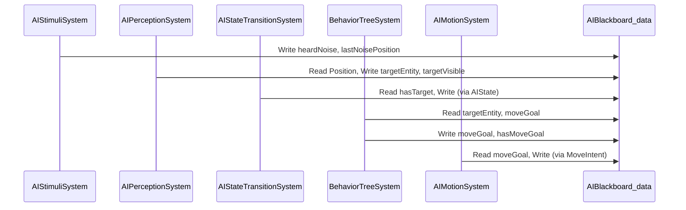

# 🧠 AI Blackboard - Complete Guide

**Comprehensive guide for using the AI blackboard pattern in Olympe Engine**

---

## 📖 Table of Contents
1. [What is the Blackboard?](#what-is-the-blackboard)
2. [Blackboard Structure](#blackboard-structure)
3. [System Integration](#system-integration)
4. [Common Patterns](#common-patterns)
5. [Performance Considerations](#performance-considerations)
6. [Debugging](#debugging)

---

## What is the Blackboard?

The **AIBlackboard_data** is a shared memory component that allows multiple AI systems to communicate without direct coupling.

### Why Use a Blackboard?

**Traditional Approach (Bad):**
```cpp
// ❌ Systems directly calling each other
class AIPerceptionSystem
{
    void NotifyBehaviorTree(EntityID entity, EntityID target)
    {
        BehaviorTreeSystem::SetTarget(entity, target);  // Tight coupling!
    }
};
```

**Blackboard Approach (Good):**
```cpp
// ✅ Systems communicate via shared data
class AIPerceptionSystem
{
    void Process()
    {
        AIBlackboard_data& bb = GetComponent<AIBlackboard_data>(entity);
        bb.targetEntity = detectedTarget;  // Write to blackboard
        bb.targetVisible = true;
    }
};

class BehaviorTreeSystem
{
    void Process()
    {
        AIBlackboard_data& bb = GetComponent<AIBlackboard_data>(entity);
        if (bb.targetVisible)  // Read from blackboard
        {
            AttackTarget(bb.targetEntity);
        }
    }
};
```

**Benefits:**
- **Decoupled:** Systems don't know about each other
- **Flexible:** Easy to add new systems
- **Debuggable:** Inspect blackboard state at any time
- **Performant:** No virtual calls, contiguous memory

---

## Blackboard Structure

### Full Component Definition

```cpp
struct AIBlackboard_data
{
    // ========== Target Tracking ==========
    EntityID targetEntity = INVALID_ENTITY_ID;  // Current target
    Vector lastKnownTargetPosition;             // Last seen position
    float timeSinceTargetSeen = 0.0f;           // Seconds since contact
    bool hasTarget = false;                     // Target exists?
    
    // ========== Perception State ==========
    float distanceToTarget = 0.0f;              // Distance to target
    bool targetVisible = false;                 // In line of sight?
    bool targetInRange = false;                 // Within attack range?
    
    // ========== Movement Goals ==========
    Vector moveGoal;                            // Where to move
    bool hasMoveGoal = false;                   // Goal set?
    
    // ========== Patrol State ==========
    int currentPatrolPoint = 0;                 // Current index
    int currentPatrolIndex = 0;                 // Alternative index
    Vector patrolPoints[8];                     // Patrol waypoints
    int patrolPointCount = 0;                   // Number of points
    bool hasPatrolPath = false;                 // Path defined?
    
    // ========== Combat State ==========
    float lastAttackTime = 0.0f;                // Last attack timestamp
    float attackCooldown = 1.0f;                // Time between attacks
    bool canAttack = true;                      // Ready to attack?
    
    // ========== Stimulus Tracking ==========
    float lastDamageTaken = 0.0f;               // Last damage timestamp
    float damageAmount = 0.0f;                  // Amount of damage
    Vector lastNoisePosition;                   // Noise source location
    bool heardNoise = false;                    // Noise detected?
    float noiseCooldown = 0.0f;                 // Noise detection cooldown
    
    // ========== Wander Behavior ==========
    float wanderWaitTimer = 0.0f;               // Current wait elapsed
    float wanderTargetWaitTime = 0.0f;          // Target wait duration
    Vector wanderDestination;                   // Random wander target
    bool hasWanderDestination = false;          // Destination chosen?
    float wanderSearchRadius = 500.0f;          // Search radius for wander
    int wanderMaxSearchAttempts = 10;           // Max attempts to find point
};
```

### Field Categories

| Category | Fields | Purpose |
|----------|--------|---------|
| **Target** | `targetEntity`, `lastKnownTargetPosition`, etc. | Track enemies |
| **Perception** | `distanceToTarget`, `targetVisible`, etc. | Sensory data |
| **Movement** | `moveGoal`, `hasMoveGoal` | Where to go |
| **Patrol** | `patrolPoints`, `currentPatrolPoint` | Patrol paths |
| **Combat** | `canAttack`, `lastAttackTime` | Attack cooldowns |
| **Stimulus** | `heardNoise`, `lastNoisePosition` | Environmental events |
| **Wander** | `wanderDestination`, `wanderWaitTimer` | Random movement |

---

## System Integration

### Data Flow Through Systems



### System 1: AIStimuliSystem

**Responsibility:** Detect environmental stimuli

```cpp
void AIStimuliSystem::Process()
{
    // Check for noise events
    for (const Event& evt : GetNoiseEvents())
    {
        for (EntityID entity : m_entities)
        {
            AIBlackboard_data& bb = GetComponent<AIBlackboard_data>(entity);
            AISenses_data& senses = GetComponent<AISenses_data>(entity);
            
            float distance = CalculateDistance(entity, evt.position);
            if (distance < senses.hearingRange)
            {
                // Write to blackboard
                bb.heardNoise = true;
                bb.lastNoisePosition = evt.position;
                bb.noiseCooldown = 2.0f;  // 2 second cooldown
            }
        }
    }
    
    // Decay noise cooldown
    for (EntityID entity : m_entities)
    {
        AIBlackboard_data& bb = GetComponent<AIBlackboard_data>(entity);
        if (bb.noiseCooldown > 0.0f)
        {
            bb.noiseCooldown -= GameEngine::fDt;
            if (bb.noiseCooldown <= 0.0f)
            {
                bb.heardNoise = false;
            }
        }
    }
}
```

### System 2: AIPerceptionSystem

**Responsibility:** Update vision and target tracking

```cpp
void AIPerceptionSystem::Process()
{
    for (EntityID entity : m_entities)
    {
        AIBlackboard_data& bb = GetComponent<AIBlackboard_data>(entity);
        AISenses_data& senses = GetComponent<AISenses_data>(entity);
        Position_data& pos = GetComponent<Position_data>(entity);
        
        // Find potential targets
        EntityID closestEnemy = FindClosestEnemy(entity, senses.sightRange);
        
        if (closestEnemy != INVALID_ENTITY_ID)
        {
            Position_data& targetPos = GetComponent<Position_data>(closestEnemy);
            
            // Check line of sight
            bool visible = HasLineOfSight(pos.position, targetPos.position);
            
            if (visible)
            {
                // Update blackboard with target info
                bb.targetEntity = closestEnemy;
                bb.lastKnownTargetPosition = targetPos.position;
                bb.targetVisible = true;
                bb.timeSinceTargetSeen = 0.0f;
                bb.hasTarget = true;
                
                // Calculate distance
                Vector delta = targetPos.position - pos.position;
                bb.distanceToTarget = delta.Magnitude();
                
                // Check if in attack range
                bb.targetInRange = (bb.distanceToTarget < senses.sightRange * 0.3f);
            }
            else
            {
                // Target exists but not visible
                bb.targetVisible = false;
                bb.timeSinceTargetSeen += GameEngine::fDt;
                
                // Forget target after 10 seconds
                if (bb.timeSinceTargetSeen > 10.0f)
                {
                    bb.hasTarget = false;
                    bb.targetEntity = INVALID_ENTITY_ID;
                }
            }
        }
        else
        {
            // No target found
            bb.targetVisible = false;
            bb.timeSinceTargetSeen += GameEngine::fDt;
            
            if (bb.timeSinceTargetSeen > 5.0f)
            {
                bb.hasTarget = false;
            }
        }
    }
}
```

### System 3: BehaviorTreeSystem

**Responsibility:** Make decisions based on blackboard state

```cpp
// Example BT action: Attack if target in range
BTStatus ExecuteAttackAction(EntityID entity, AIBlackboard_data& bb)
{
    if (!bb.hasTarget || !bb.targetInRange)
        return BTStatus::Failure;
    
    if (!bb.canAttack)
        return BTStatus::Failure;  // On cooldown
    
    // Set attack intent
    AttackIntent_data& intent = GetComponent<AttackIntent_data>(entity);
    intent.targetEntity = bb.targetEntity;
    intent.targetPosition = bb.lastKnownTargetPosition;
    intent.hasIntent = true;
    
    // Set cooldown
    bb.canAttack = false;
    bb.lastAttackTime = GameEngine::GetTime();
    
    return BTStatus::Success;
}

// Example BT condition: Has target?
BTStatus CheckHasTarget(const AIBlackboard_data& bb)
{
    return bb.hasTarget ? BTStatus::Success : BTStatus::Failure;
}
```

---

## Common Patterns

### Pattern 1: Target Acquisition & Tracking

```cpp
// Perception: Acquire target
void AcquireTarget(EntityID entity, AIBlackboard_data& bb)
{
    EntityID target = ScanForTargets(entity);
    
    if (target != INVALID_ENTITY_ID)
    {
        bb.targetEntity = target;
        bb.hasTarget = true;
        bb.targetVisible = true;
        bb.timeSinceTargetSeen = 0.0f;
        
        Position_data& targetPos = GetComponent<Position_data>(target);
        bb.lastKnownTargetPosition = targetPos.position;
    }
}

// BT: Use target
void AttackTarget(EntityID entity, AIBlackboard_data& bb)
{
    if (bb.hasTarget && bb.targetInRange)
    {
        // Attack logic
    }
}
```

### Pattern 2: Movement Goal Setting

```cpp
// AI System: Set movement goal
void SetMoveGoal(AIBlackboard_data& bb, const Vector& goal)
{
    bb.moveGoal = goal;
    bb.hasMoveGoal = true;
}

// Motion System: Execute movement
void ExecuteMovement(EntityID entity, AIBlackboard_data& bb)
{
    if (!bb.hasMoveGoal)
        return;
    
    MoveIntent_data& intent = GetComponent<MoveIntent_data>(entity);
    intent.targetPosition = bb.moveGoal;
    intent.hasIntent = true;
    
    // Check if arrived
    Position_data& pos = GetComponent<Position_data>(entity);
    float dist = (pos.position - bb.moveGoal).Magnitude();
    if (dist < 5.0f)
    {
        bb.hasMoveGoal = false;  // Clear goal
        intent.hasIntent = false;
    }
}
```

### Pattern 3: Patrol Behavior

```cpp
// Setup patrol (called once)
void SetupPatrol(AIBlackboard_data& bb, const std::vector<Vector>& points)
{
    bb.patrolPointCount = std::min((int)points.size(), 8);
    for (int i = 0; i < bb.patrolPointCount; ++i)
    {
        bb.patrolPoints[i] = points[i];
    }
    bb.hasPatrolPath = (bb.patrolPointCount > 0);
    bb.currentPatrolPoint = 0;
}

// Execute patrol (called each frame)
void ExecutePatrol(AIBlackboard_data& bb)
{
    if (!bb.hasPatrolPath)
        return;
    
    // Set current patrol point as move goal
    bb.moveGoal = bb.patrolPoints[bb.currentPatrolPoint];
    bb.hasMoveGoal = true;
    
    // Check if arrived at point
    Position_data& pos = GetComponent<Position_data>(entity);
    float dist = (pos.position - bb.moveGoal).Magnitude();
    if (dist < 10.0f)
    {
        // Move to next point
        bb.currentPatrolPoint = (bb.currentPatrolPoint + 1) % bb.patrolPointCount;
    }
}
```

### Pattern 4: Wander Behavior

```cpp
// Choose random wander destination
void ChooseWanderDestination(EntityID entity, AIBlackboard_data& bb)
{
    Position_data& pos = GetComponent<Position_data>(entity);
    
    // Use NavigationMap to find valid point
    float destX, destY;
    bool found = NavigationMap::Get().GetRandomNavigablePoint(
        pos.position.x, pos.position.y, 
        bb.wanderSearchRadius, 
        bb.wanderMaxSearchAttempts,
        destX, destY
    );
    
    if (found)
    {
        bb.wanderDestination = Vector(destX, destY);
        bb.hasWanderDestination = true;
        bb.moveGoal = bb.wanderDestination;
        bb.hasMoveGoal = true;
    }
}

// Wait random time
void WaitRandom(AIBlackboard_data& bb, float minTime, float maxTime)
{
    if (bb.wanderTargetWaitTime == 0.0f)
    {
        // Initialize random wait time
        float randomFactor = (float)rand() / RAND_MAX;
        bb.wanderTargetWaitTime = minTime + randomFactor * (maxTime - minTime);
        bb.wanderWaitTimer = 0.0f;
    }
    
    bb.wanderWaitTimer += GameEngine::fDt;
    
    if (bb.wanderWaitTimer >= bb.wanderTargetWaitTime)
    {
        // Wait complete, reset
        bb.wanderTargetWaitTime = 0.0f;
        bb.wanderWaitTimer = 0.0f;
    }
}
```

---

## Performance Considerations

### Memory Layout

**Good (cache-friendly):**
```cpp
// Frequently accessed fields at the top
struct AIBlackboard_data
{
    EntityID targetEntity;        // Hot
    bool hasTarget;               // Hot
    float distanceToTarget;       // Hot
    
    // ... other hot fields ...
    
    Vector patrolPoints[8];       // Cold (rarely accessed)
};
```

### Minimize Blackboard Size

Current size: ~300 bytes (good!)

**Guidelines:**
- Keep < 512 bytes for cache efficiency
- Use fixed-size arrays over std::vector
- Use bitfields for boolean groups if needed

```cpp
// Option: Bitfield for flags
struct AIBlackboard_data
{
    // ... existing fields ...
    
    // Bitfield (saves space)
    uint8_t flags;
    static constexpr uint8_t FLAG_HAS_TARGET = 1 << 0;
    static constexpr uint8_t FLAG_TARGET_VISIBLE = 1 << 1;
    static constexpr uint8_t FLAG_CAN_ATTACK = 1 << 2;
    
    bool HasTarget() const { return flags & FLAG_HAS_TARGET; }
    void SetHasTarget(bool val)
    {
        if (val) flags |= FLAG_HAS_TARGET;
        else flags &= ~FLAG_HAS_TARGET;
    }
};
```

---

## Debugging

### Debug Visualization

```cpp
void RenderBlackboardDebug(EntityID entity)
{
    AIBlackboard_data& bb = GetComponent<AIBlackboard_data>(entity);
    Position_data& pos = GetComponent<Position_data>(entity);
    
    // Draw target line
    if (bb.hasTarget && bb.targetVisible)
    {
        Position_data& targetPos = GetComponent<Position_data>(bb.targetEntity);
        DrawLine(pos.position, targetPos.position, COLOR_RED);
    }
    
    // Draw move goal
    if (bb.hasMoveGoal)
    {
        DrawCircle(bb.moveGoal, 10.0f, COLOR_GREEN);
        DrawLine(pos.position, bb.moveGoal, COLOR_GREEN);
    }
    
    // Draw patrol path
    if (bb.hasPatrolPath)
    {
        for (int i = 0; i < bb.patrolPointCount; ++i)
        {
            DrawCircle(bb.patrolPoints[i], 5.0f, COLOR_BLUE);
        }
    }
}
```

### Debug Logging

```cpp
void LogBlackboardState(EntityID entity, const AIBlackboard_data& bb)
{
    SYSTEM_LOG << "=== Blackboard State for Entity " << entity << " ===\n";
    SYSTEM_LOG << "  hasTarget: " << bb.hasTarget << "\n";
    SYSTEM_LOG << "  targetVisible: " << bb.targetVisible << "\n";
    SYSTEM_LOG << "  distanceToTarget: " << bb.distanceToTarget << "\n";
    SYSTEM_LOG << "  hasMoveGoal: " << bb.hasMoveGoal << "\n";
    SYSTEM_LOG << "  moveGoal: (" << bb.moveGoal.x << ", " << bb.moveGoal.y << ")\n";
    SYSTEM_LOG << "  canAttack: " << bb.canAttack << "\n";
    SYSTEM_LOG << "========================================\n";
}
```

---

## See Also

- [AI Pipeline Quick Ref](_QuickRef_AI_Pipeline.md)
- [Behavior Trees Guide](../04_Behavior_Trees/Creating_BT_Actions_Guide.md)
- [Systems Guide](../02_ECS_Systems/Adding_New_System_Guide.md)

---

*Questions? Open an issue on GitHub!*
