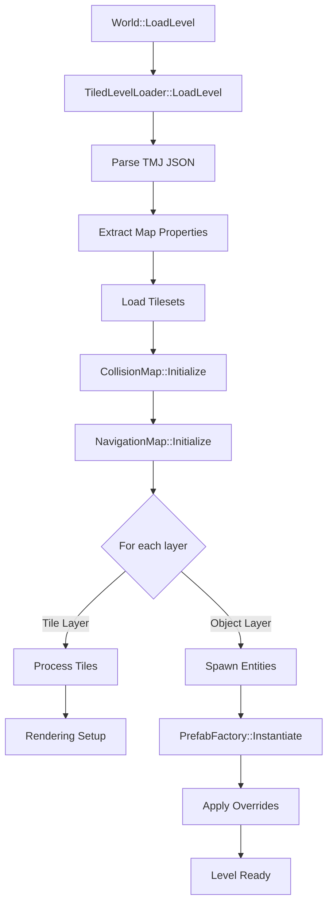

# 🗺️ Level Loading Pipeline - Complete Guide

**Comprehensive guide for loading and parsing Tiled levels in Olympe Engine**

---

## 📖 Table of Contents
1. [Overview](#overview)
2. [Loading Pipeline Phases](#loading-pipeline-phases)
3. [Tiled File Format](#tiled-file-format)
4. [Collision & Navigation](#collision--navigation)
5. [Entity Spawning](#entity-spawning)
6. [Custom Properties](#custom-properties)
7. [Coordinate Transformations](#coordinate-transformations)
8. [Troubleshooting](#troubleshooting)

---

## Overview

### What is Level Loading?

Level loading is the process of:
1. **Reading** Tiled map files (.tmj/.tmx)
2. **Parsing** layers, tilesets, and objects
3. **Initializing** collision and navigation maps
4. **Spawning** entities from object layers
5. **Rendering** tile layers

### Architecture



---

## Loading Pipeline Phases

### Phase 1: File Loading & Parsing

**Location:** `World::LoadLevel()` → `TiledLevelLoader::LoadLevel()`

```cpp
bool World::LoadLevel(const std::string& levelPath)
{
    SYSTEM_LOG << "Loading level: " << levelPath << "\n";
    
    // Phase 1: Load and parse TMJ file
    TiledMap tiledMap = TiledLevelLoader::LoadLevel(levelPath);
    
    if (tiledMap.width == 0 || tiledMap.height == 0)
    {
        SYSTEM_LOG << "Error: Invalid map dimensions\n";
        return false;
    }
    
    // Store map info
    m_currentLevelPath = levelPath;
    m_mapWidth = tiledMap.width;
    m_mapHeight = tiledMap.height;
    m_tileWidth = tiledMap.tilewidth;
    m_tileHeight = tiledMap.tileheight;
    m_orientation = tiledMap.orientation;  // "orthogonal", "isometric", etc.
    
    // ... continue to Phase 2 ...
}
```

**JSON Structure:**
```json
{
  "width": 20,
  "height": 15,
  "tilewidth": 64,
  "tileheight": 32,
  "orientation": "isometric",
  "renderorder": "right-down",
  "layers": [...],
  "tilesets": [...]
}
```

---

### Phase 2: Tileset Loading

**Purpose:** Load texture data and tile properties

```cpp
// Extract tileset information
for (const TiledTileset& tileset : tiledMap.tilesets)
{
    // Load tileset texture
    SDL_Texture* texture = LoadTexture(tileset.image);
    
    // Store tileset properties
    TilesetInfo info;
    info.firstGid = tileset.firstgid;  // Starting tile ID
    info.tileCount = tileset.tilecount;
    info.tileWidth = tileset.tilewidth;
    info.tileHeight = tileset.tileheight;
    info.texture = texture;
    
    // Extract tile offsets (for isometric)
    if (tileset.tileoffsetX != 0 || tileset.tileoffsetY != 0)
    {
        info.offsetX = tileset.tileoffsetX;
        info.offsetY = tileset.tileoffsetY;
    }
    
    m_tilesets.push_back(info);
}
```

**Tileset Properties:**
- `firstgid`: First global tile ID in this tileset
- `tilecount`: Number of tiles
- `columns`: Tiles per row in sprite sheet
- `tilewidth/tileheight`: Individual tile dimensions
- `image`: Path to tileset PNG
- `tiles`: Array of individual tile properties

---

### Phase 3: Collision Map Initialization

**Purpose:** Build collision and navigation data structures

```cpp
// Initialize collision map
CollisionMap::Get().Initialize(
    tiledMap.width,           // Map width in tiles
    tiledMap.height,          // Map height in tiles
    tiledMap.tilewidth,       // Tile width in pixels
    tiledMap.tileheight,      // Tile height in pixels
    m_orientation             // Map projection type
);

// Process collision layer
for (const TiledLayer& layer : tiledMap.layers)
{
    if (layer.name == "Collision" || layer.type == "tilelayer")
    {
        for (int y = 0; y < layer.height; ++y)
        {
            for (int x = 0; x < layer.width; ++x)
            {
                int tileIndex = y * layer.width + x;
                uint32_t gid = layer.data[tileIndex];
                
                if (gid == 0) continue;  // Empty tile
                
                // Get tile properties
                const TileProperties& props = GetTileProperties(gid);
                
                // Set collision type
                CollisionMap::Get().SetTileCollision(
                    x, y, props.collisionType
                );
                
                // Set navigability
                bool navigable = (props.collisionType == CollisionType::None);
                NavigationMap::Get().SetNavigable(x, y, navigable);
            }
        }
    }
}
```

**Collision Types:**
```cpp
enum class CollisionType
{
    None,      // Walkable
    Solid,     // Blocks movement
    Water,     // Special terrain
    Cliff,     // Height difference
    Trigger    // Event zones
};
```

---

### Phase 4: Navigation Map Setup

**Purpose:** Pre-calculate pathfinding data

```cpp
// Initialize navigation map (after collision)
NavigationMap::Get().Initialize(
    tiledMap.width,
    tiledMap.height,
    tiledMap.tilewidth,
    tiledMap.tileheight
);

// Mark navigable tiles
for (int y = 0; y < tiledMap.height; ++y)
{
    for (int x = 0; x < tiledMap.width; ++x)
    {
        bool isNavigable = !CollisionMap::Get().IsSolid(x, y);
        NavigationMap::Get().SetNavigable(x, y, isNavigable);
    }
}

// Pre-calculate connectivity (optional optimization)
NavigationMap::Get().CalculateConnectedRegions();
```

---

### Phase 5: Tile Layer Processing

**Purpose:** Prepare visual layers for rendering

```cpp
for (const TiledLayer& layer : tiledMap.layers)
{
    if (layer.type != "tilelayer") continue;
    
    TileLayer renderLayer;
    renderLayer.name = layer.name;
    renderLayer.visible = layer.visible;
    renderLayer.opacity = layer.opacity;
    renderLayer.width = layer.width;
    renderLayer.height = layer.height;
    
    // Process each tile
    for (int y = 0; y < layer.height; ++y)
    {
        for (int x = 0; x < layer.width; ++x)
        {
            int tileIndex = y * layer.width + x;
            uint32_t gid = layer.data[tileIndex];
            
            if (gid == 0) continue;  // Empty
            
            // Extract flip flags
            bool flipH = (gid & FLIPPED_HORIZONTALLY_FLAG);
            bool flipV = (gid & FLIPPED_VERTICALLY_FLAG);
            bool flipD = (gid & FLIPPED_DIAGONALLY_FLAG);
            
            // Clear flags to get real GID
            gid &= ~(FLIPPED_HORIZONTALLY_FLAG | FLIPPED_VERTICALLY_FLAG | FLIPPED_DIAGONALLY_FLAG);
            
            // Find tileset
            const TilesetInfo* tileset = FindTilesetForGid(gid);
            if (!tileset) continue;
            
            // Calculate source rect in tileset
            int localId = gid - tileset->firstGid;
            int columns = tileset->columns;
            SDL_Rect srcRect = {
                (localId % columns) * tileset->tileWidth,
                (localId / columns) * tileset->tileHeight,
                tileset->tileWidth,
                tileset->tileHeight
            };
            
            // Calculate world position
            Vector worldPos = GridToWorld(x, y);
            
            // Store tile data
            TileData tile;
            tile.gid = gid;
            tile.gridX = x;
            tile.gridY = y;
            tile.worldX = worldPos.x;
            tile.worldY = worldPos.y;
            tile.srcRect = srcRect;
            tile.texture = tileset->texture;
            tile.flipH = flipH;
            tile.flipV = flipV;
            tile.flipD = flipD;
            
            renderLayer.tiles.push_back(tile);
        }
    }
    
    m_tileLayers.push_back(renderLayer);
}
```

---

### Phase 6: Object Layer Processing (Entity Spawning)

**Purpose:** Instantiate entities from object placements

```cpp
for (const TiledLayer& layer : tiledMap.layers)
{
    if (layer.type != "objectgroup") continue;
    
    SYSTEM_LOG << "Processing object layer: " << layer.name << "\n";
    
    for (const TiledObject& obj : layer.objects)
    {
        // Determine prefab name
        std::string prefabName = obj.type;  // Primary method
        
        // Check custom property for override
        for (const TiledProperty& prop : obj.properties)
        {
            if (prop.name == "prefab")
            {
                prefabName = prop.value;
                break;
            }
        }
        
        if (prefabName.empty())
        {
            SYSTEM_LOG << "Warning: Object '" << obj.name 
                       << "' has no type or prefab property\n";
            continue;
        }
        
        // Build prefab path
        std::string prefabPath = "Gamedata/Prefabs/" + prefabName + ".json";
        
        // Convert Tiled position to world position
        Vector worldPos = TiledToWorld(obj.x, obj.y);
        
        // Create overrides from object properties
        json overrides;
        overrides["Position"] = {
            {"x", worldPos.x},
            {"y", worldPos.y}
        };
        
        // Add custom properties as overrides
        for (const TiledProperty& prop : obj.properties)
        {
            if (prop.name == "prefab") continue;  // Skip prefab property
            
            // Convert property to override
            if (prop.type == "int")
                overrides[prop.name] = std::stoi(prop.value);
            else if (prop.type == "float")
                overrides[prop.name] = std::stof(prop.value);
            else if (prop.type == "bool")
            {
                // Robust boolean parsing (case-insensitive, multiple formats)
                std::string lowerValue = prop.value;
                std::transform(lowerValue.begin(), lowerValue.end(), lowerValue.begin(), ::tolower);
                overrides[prop.name] = (lowerValue == "true" || lowerValue == "1" || lowerValue == "yes");
            }
            else
                overrides[prop.name] = prop.value;
        }
        
        // Instantiate entity
        EntityID entity = PrefabFactory::InstantiateEntity(prefabPath, overrides);
        
        if (entity != INVALID_ENTITY_ID)
        {
            SYSTEM_LOG << "Spawned " << prefabName << " at (" 
                       << worldPos.x << ", " << worldPos.y << ")\n";
        }
        else
        {
            SYSTEM_LOG << "Error: Failed to spawn " << prefabName << "\n";
        }
    }
}
```

---

## Tiled File Format

### Map Structure

```json
{
  "compressionlevel": -1,
  "height": 15,
  "width": 20,
  "tileheight": 32,
  "tilewidth": 64,
  "orientation": "isometric",
  "renderorder": "right-down",
  "tiledversion": "1.10.2",
  "type": "map",
  "version": "1.10",
  
  "layers": [
    {
      "id": 1,
      "name": "Ground",
      "type": "tilelayer",
      "visible": true,
      "opacity": 1,
      "data": [1, 2, 3, ...],  // Tile GIDs
      "width": 20,
      "height": 15
    },
    {
      "id": 2,
      "name": "Entities",
      "type": "objectgroup",
      "objects": [
        {
          "id": 1,
          "name": "Player",
          "type": "Player",
          "x": 320,
          "y": 240,
          "properties": [...]
        }
      ]
    }
  ],
  
  "tilesets": [
    {
      "firstgid": 1,
      "source": "../Tilesets/tiles.tsx"
    }
  ]
}
```

### Tileset Structure (.tsx)

```json
{
  "name": "tiles",
  "tilecount": 256,
  "tilewidth": 64,
  "tileheight": 32,
  "columns": 16,
  "image": "tiles.png",
  "imagewidth": 1024,
  "imageheight": 512,
  
  "tiles": [
    {
      "id": 42,
      "properties": [
        {"name": "collision", "type": "string", "value": "solid"},
        {"name": "navigable", "type": "bool", "value": false}
      ]
    }
  ]
}
```

---

## Collision & Navigation

### Setting Tile Properties in Tiled

**Step 1:** Open tileset in Tiled
**Step 2:** Select individual tile
**Step 3:** Open "Tile Properties" panel
**Step 4:** Add custom properties:

| Property | Type | Values |
|----------|------|--------|
| `collision` | string | `none`, `solid`, `water`, `cliff` |
| `navigable` | bool | `true`, `false` |
| `movementCost` | float | `1.0` (normal), `2.0` (slow), etc. |

### Collision Detection

```cpp
// Check if tile is solid
bool IsSolid(int gridX, int gridY)
{
    return CollisionMap::Get().GetCollisionType(gridX, gridY) == CollisionType::Solid;
}

// Check if entity can move to position
bool CanMoveTo(const Vector& worldPos)
{
    // Convert to grid coordinates
    int gridX, gridY;
    CollisionMap::Get().WorldToGrid(worldPos.x, worldPos.y, gridX, gridY);
    
    // Check navigability
    return NavigationMap::Get().IsNavigable(gridX, gridY);
}
```

### Pathfinding Integration

```cpp
// Request path from NavigationSystem
void RequestPath(EntityID entity, const Vector& destination)
{
    if (!World::Get().HasComponent<NavigationAgent_data>(entity))
        return;
    
    NavigationAgent_data& agent = World::Get().GetComponent<NavigationAgent_data>(entity);
    agent.targetPosition = destination;
    agent.pathRequested = true;
    agent.needsRepath = true;
}

// NavigationSystem will calculate A* path
// Path stored in agent.currentPath
```

---

## Entity Spawning

### Prefab Linking Methods

#### Method 1: Object Type
```json
{
  "type": "Guard",  // Loads Gamedata/Prefabs/Characters/Guard.json
  "x": 320,
  "y": 240
}
```

#### Method 2: Custom Property
```json
{
  "type": "",  // Empty type
  "properties": [
    {"name": "prefab", "type": "string", "value": "Guard"}
  ]
}
```

### Property Overrides

**Prefab (Guard.json):**
```json
{
  "name": "Guard",
  "components": {
    "Health": {
      "maxHealth": 100,
      "currentHealth": 100
    },
    "Sprite": {
      "textureId": "guard",
      "width": 32,
      "height": 48
    }
  }
}
```

**Tiled Object:**
```json
{
  "type": "Guard",
  "properties": [
    {"name": "maxHealth", "type": "int", "value": 50},  // Override!
    {"name": "textureId", "type": "string", "value": "elite_guard"}
  ]
}
```

**Result:** Guard spawned with 50 HP and elite_guard texture

---

## Custom Properties

### Supported Property Types

| Tiled Type | C++ Type | Example |
|------------|----------|---------|
| `string` | `std::string` | `"hello"` |
| `int` | `int` | `42` |
| `float` | `float` | `3.14f` |
| `bool` | `bool` | `true` |
| `color` | `SDL_Color` | `#FF0000` (not yet supported) |
| `file` | `std::string` | `"path/to/file"` |
| `object` | `EntityID` | (reference to another object) |

### Reading Properties in Code

```cpp
// Get property from Tiled object
template<typename T>
T GetProperty(const TiledObject& obj, const std::string& name, T defaultValue)
{
    for (const TiledProperty& prop : obj.properties)
    {
        if (prop.name == name)
        {
            if constexpr (std::is_same_v<T, int>)
                return std::stoi(prop.value);
            else if constexpr (std::is_same_v<T, float>)
                return std::stof(prop.value);
            else if constexpr (std::is_same_v<T, bool>)
                return (prop.value == "true" || prop.value == "1");
            else
                return prop.value;
        }
    }
    return defaultValue;
}

// Usage
int health = GetProperty<int>(obj, "health", 100);
float speed = GetProperty<float>(obj, "speed", 1.0f);
bool hostile = GetProperty<bool>(obj, "hostile", false);
```

---

## Coordinate Transformations

### Grid to World

**Orthogonal:**
```cpp
Vector GridToWorld(int gridX, int gridY)
{
    return Vector(
        gridX * m_tileWidth,
        gridY * m_tileHeight
    );
}
```

**Isometric:**
```cpp
Vector GridToWorld(int gridX, int gridY)
{
    float worldX = (gridX - gridY) * (m_tileWidth / 2.0f);
    float worldY = (gridX + gridY) * (m_tileHeight / 2.0f);
    return Vector(worldX, worldY);
}
```

**Hexagonal (Flat-Top):**
```cpp
Vector GridToWorld(int gridX, int gridY)
{
    float worldX = gridX * m_tileWidth * 0.75f;
    float worldY = gridY * m_tileHeight + (gridX % 2) * (m_tileHeight / 2.0f);
    return Vector(worldX, worldY);
}
```

### World to Grid

**Orthogonal:**
```cpp
void WorldToGrid(float worldX, float worldY, int& gridX, int& gridY)
{
    gridX = (int)(worldX / m_tileWidth);
    gridY = (int)(worldY / m_tileHeight);
}
```

**Isometric:**
```cpp
void WorldToGrid(float worldX, float worldY, int& gridX, int& gridY)
{
    float tileW = m_tileWidth / 2.0f;
    float tileH = m_tileHeight / 2.0f;
    
    gridX = (int)((worldX / tileW + worldY / tileH) / 2.0f);
    gridY = (int)((worldY / tileH - worldX / tileW) / 2.0f);
}
```

---

## Troubleshooting

### Issue: Map Doesn't Load

**Symptoms:** Black screen, no tiles visible

**Debug Steps:**
1. Check file path:
```cpp
SYSTEM_LOG << "Loading: " << levelPath << "\n";
// Verify path exists
```

2. Verify TMJ validity:
```bash
# Test parse with jq
jq . Gamedata/Levels/iso-test.tmj
```

3. Check console for errors:
```
Error: Failed to load tileset: tiles.tsx
Error: Invalid map dimensions: 0x0
```

---

### Issue: Entities Not Spawning

**Symptoms:** Object layer processed but no entities created

**Debug Steps:**
1. Verify object has type or prefab property
2. Check prefab path exists
3. Enable debug logging:
```cpp
SYSTEM_LOG << "Object: " << obj.name << " Type: " << obj.type << "\n";
SYSTEM_LOG << "Prefab path: " << prefabPath << "\n";
```

---

### Issue: Wrong Coordinates

**Symptoms:** Entities spawn in wrong positions

**Solution:** Verify coordinate transformation for map type:
```cpp
// Tiled coordinates are in PIXELS, not grid units
Vector worldPos = TiledToWorld(obj.x, obj.y);

// For isometric, apply proper conversion
if (m_orientation == "isometric")
{
    worldPos = IsometricTiledToWorld(obj.x, obj.y);
}
```

---

### Issue: Collision Not Working

**Symptoms:** Entities walk through walls

**Debug Steps:**
1. Verify collision layer name matches
2. Check tile properties set in tileset
3. Enable collision overlay:
```cpp
World::Get().ToggleCollisionOverlay();  // Press F3 in-game
```

4. Verify NavigationMap initialized:
```cpp
if (!NavigationMap::Get().IsInitialized())
{
    SYSTEM_LOG << "Error: NavigationMap not initialized\n";
}
```

---

## Performance Tips

### Lazy Loading
```cpp
// Don't load all levels at startup
// Load on demand
void SwitchLevel(const std::string& levelName)
{
    UnloadCurrentLevel();
    LoadLevel("Gamedata/Levels/" + levelName + ".tmj");
}
```

### Tile Batching
```cpp
// Batch tiles by texture for efficient rendering
std::map<SDL_Texture*, std::vector<TileData>> tileBatches;

for (const TileData& tile : layer.tiles)
{
    tileBatches[tile.texture].push_back(tile);
}

// Render each batch
for (auto& [texture, tiles] : tileBatches)
{
    RenderBatch(texture, tiles);
}
```

---

## See Also

- [Level Format Quick Ref](_QuickRef_Level_Format.md)
- [Prefabs Guide](../03_Prefabs/Creating_Prefabs_Guide.md)
- [Tiled Quick Start](../../TILED_QUICK_START.md)
- [Navigation System Reference](../../Navigation_System_Reference.md)

---

*Questions? Check the Tiled documentation or open a GitHub issue!*
