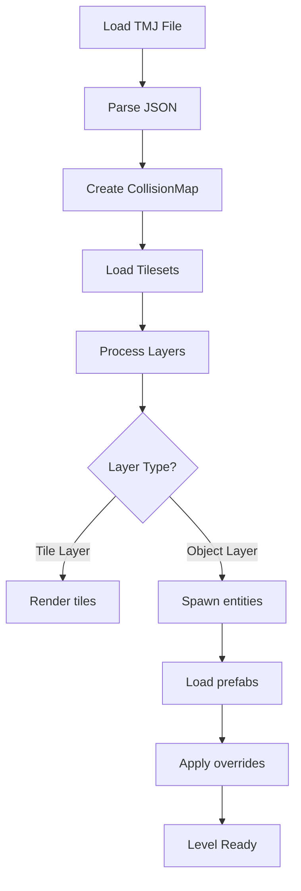

# ⚡ Level Loading - Quick Reference

**One-page reference for Tiled level loading** | [📖 Full Guide](Level_Loading_Pipeline_Guide.md)

---

## 📁 File Structure

```
Gamedata/
├── Levels/
│   ├── iso-test.tmj          # Main level file (JSON)
│   └── dungeon.tmj
│
└── Tilesets/
    ├── tiles.tsx             # Tileset definition
    └── tiles.png             # Tileset image
```

**Format:** Olympe uses **Tiled Map Editor** (.tmj/.tmx files)

---

## 🗺️ Supported Map Types

| Type | Supported | Notes |
|------|-----------|-------|
| **Orthogonal** | ✅ | Standard top-down grid |
| **Isometric** | ✅ | Diamond/rhombus tiles |
| **Hexagonal** | ✅ | Hex grid (flat-top/pointy-top) |
| **Staggered** | ⚠️ | Limited support |

---

## 📋 Level Loading Pipeline



**Steps:**
1. Load TMJ file from `Gamedata/Levels/`
2. Parse Tiled JSON structure
3. Initialize collision/navigation maps
4. Load tileset graphics
5. Process tile layers (render)
6. Process object layers (spawn entities)

---

## 🎯 Key Level Properties

### Map-Level
```json
{
  "width": 20,              // Map width in tiles
  "height": 15,             // Map height in tiles
  "tilewidth": 64,          // Tile width in pixels
  "tileheight": 32,         // Tile height in pixels (isometric)
  "orientation": "isometric", // Map type
  "renderorder": "right-down"
}
```

### Tileset Properties
```json
{
  "name": "tiles",
  "tilecount": 256,
  "tilewidth": 64,
  "tileheight": 32,
  "properties": [
    {"name": "walkable", "type": "bool", "value": true}
  ]
}
```

### Custom Tile Properties
```json
{
  "id": 42,
  "properties": [
    {"name": "collision", "type": "string", "value": "solid"},
    {"name": "navigable", "type": "bool", "value": false}
  ]
}
```

---

## 🚧 Collision & Navigation

### Collision Types
- `none` - No collision
- `solid` - Blocks movement
- `water` - Special terrain
- `cliff` - Height difference

### Setting Collision in Tiled

1. Select tileset
2. Open "Tileset Editor"
3. Select tile
4. Add custom property: `collision` (string)
5. Set value: `solid`, `none`, etc.

### Navigation Map

Automatically generated from collision data:
- `navigable` tiles → pathfinding allowed
- `solid` tiles → pathfinding blocked

---

## 👾 Object Layers - Entity Spawning

### Object Layer Structure
```json
{
  "name": "Entities",
  "type": "objectgroup",
  "objects": [
    {
      "id": 1,
      "name": "Player",
      "type": "Player",      // Links to prefab
      "x": 320,
      "y": 240,
      "properties": [
        {"name": "health", "type": "int", "value": 100}
      ]
    }
  ]
}
```

### Prefab Linking

**Option 1: By Type**
```json
{
  "type": "Guard"  // Loads Gamedata/Prefabs/Characters/Guard.json
}
```

**Option 2: By Property**
```json
{
  "properties": [
    {"name": "prefab", "type": "string", "value": "Guard"}
  ]
}
```

### Property Overrides

Object properties override prefab defaults:
```json
{
  "type": "Guard",
  "properties": [
    {"name": "health", "type": "int", "value": 50},  // Override default
    {"name": "speed", "type": "float", "value": 2.5}
  ]
}
```

---

## 📐 Coordinate Systems

### Tiled Coordinates (Grid)
```
(0,0) ─────────→ X
  │
  │
  │
  ↓
  Y
```

### World Coordinates (Pixels)
```
Orthogonal: worldX = gridX * tileWidth
            worldY = gridY * tileHeight

Isometric:  worldX = (gridX - gridY) * (tileWidth / 2)
            worldY = (gridX + gridY) * (tileHeight / 2)
```

---

## 🎨 Layer Types & Usage

| Layer Type | Purpose | Example |
|------------|---------|---------|
| **Tile Layer** | Visual tiles | Ground, walls, decorations |
| **Object Layer** | Entity spawns | Player start, enemies, items |
| **Image Layer** | Background | Parallax backgrounds, sky |
| **Group** | Organization | Logical grouping of layers |

### Layer Ordering (Bottom to Top)
```
1. Background (Image Layer)
2. Ground Tiles (Tile Layer)
3. Decorations (Tile Layer)
4. Entities (Object Layer)  ← Spawned here
5. Foreground (Tile Layer)
```

---

## 🔧 Common Patterns

### Pattern 1: Spawn Player at Start
```json
{
  "name": "PlayerSpawn",
  "type": "Player",
  "x": 320,
  "y": 240,
  "properties": [
    {"name": "isPlayerControlled", "type": "bool", "value": true}
  ]
}
```

### Pattern 2: Patrol Path
```json
{
  "name": "Guard1",
  "type": "Guard",
  "properties": [
    {"name": "patrolPath", "type": "string", "value": "Path1"}
  ]
}
```

### Pattern 3: Trigger Zone
```json
{
  "name": "DoorTrigger",
  "type": "Trigger",
  "width": 64,
  "height": 64,
  "properties": [
    {"name": "action", "type": "string", "value": "OpenDoor"}
  ]
}
```

---

## ⚠️ Common Pitfalls

### ❌ Wrong Map Type
```json
{"orientation": "orthagonal"}  // Typo! Should be "orthogonal"
```

### ❌ Missing Tileset
```json
{"source": "missing.tsx"}  // File doesn't exist
```

**Fix:** Ensure tileset files are in `Gamedata/Tilesets/`

### ❌ Invalid Object Type
```json
{"type": "InvalidPrefab"}  // No matching prefab
```

**Fix:** Check prefab exists in `Gamedata/Prefabs/`

### ❌ Coordinate Mismatch
```cpp
// BAD: Using grid coordinates as world coordinates
pos.position = Vector(objectData.x, objectData.y);  // Wrong for isometric!
```

**Fix:** Use `CollisionMap::GridToWorld()` for conversion

---

## 🧪 Testing Levels

```cpp
// Load test level
World::Get().LoadLevel("Gamedata/Levels/test.tmj");

// Verify collision map
CollisionMap& colMap = CollisionMap::Get();
ASSERT_TRUE(colMap.IsNavigable(10, 10));
ASSERT_FALSE(colMap.IsNavigable(5, 5));  // Solid tile

// Verify entities spawned
auto entities = World::Get().GetAllEntities();
ASSERT_GT(entities.size(), 0);
```

---

## 📚 See Also

- [Full Loading Guide](Level_Loading_Pipeline_Guide.md) - Detailed pipeline
- [Prefabs Quick Ref](../03_Prefabs/_QuickRef_Prefabs.md) - Entity spawning
- [Tiled Quick Start](../../TILED_QUICK_START.md) - Tiled editor basics

---

**💡 Pro Tip:** Use Tiled's "View → Show Tile Collision Shapes" to visualize collision!
