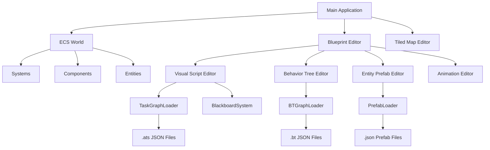

# Olympe Engine – Architecture Overview

## System Map



## Core Principles

1. **JSON as Single Source of Truth** – All game data lives in JSON files
2. **ECS Architecture** – Entities are data, Systems are logic
3. **Visual Scripting** – Game behavior defined without C++ code
4. **Component-Based Prefabs** – Entities assembled from reusable components

## Module Breakdown

### Source/ Layout
```
Source/
├── ECS/                 # ECS core (Entity, Component, System)
├── AI/                  # AI systems and editors
├── Animation/           # Animation system
├── BlueprintEditor/     # All visual editors
│   ├── EntityPrefabEditor/   # Phase 27-31
│   ├── Utilities/            # Canvas, Grid, Minimap
│   └── VisualScript*         # Visual scripting panels
├── Core/                # Engine core utilities
├── Editor/              # Condition presets, panels, modals
├── NodeGraphCore/       # Blackboard, graph templates
└── OlympeTilemapEditor/ # Tiled map integration
```

## Data Flow

```
JSON File → Loader → In-Memory Model → Editor Panel → Serializer → JSON File
                                     ↓
                              Runtime Executor
                                     ↓
                              ECS World (entities + components)
```

## Key Design Decisions

See [08-Development/Architecture-Decisions.md](08-Development/Architecture-Decisions.md) for the full ADR log.
