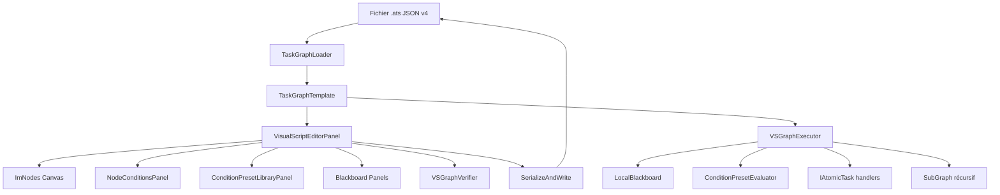

# Blueprint Editor & Task Graph System — Pipeline Complet

> **Olympe Engine — Documentation de référence développeur**
> Version : Phase 24+ / Schéma JSON v4
> Langue : Français

---

## Table des matières

1. [Vocabulaire et concepts fondamentaux](#1-vocabulaire-et-concepts-fondamentaux)
2. [Architecture générale](#2-architecture-générale)
3. [Flux de chargement — JSON v2 / v3 / v4](#3-flux-de-chargement--json-v2--v3--v4)
4. [Flux d'édition dans l'UI](#4-flux-dédition-dans-lui)
5. [Gestion des Presets de condition (Phase 24)](#5-gestion-des-presets-de-condition-phase-24)
6. [Système d'exécution — VSGraphExecutor](#6-système-dexécution--vsgraphexecutor)
7. [Sérialisation — retour vers le JSON v4](#7-sérialisation--retour-vers-le-json-v4)
8. [Cas avancés](#8-cas-avancés)
9. [Tableaux récapitulatifs](#9-tableaux-récapitulatifs)
10. [Fichiers source de référence](#10-fichiers-source-de-référence)
11. [FAQ](#11-faq)

---

## 1. Vocabulaire et concepts fondamentaux

| Terme | Définition |
|-------|------------|
| **Blueprint** | Graphe visuel de comportement d'une entité, stocké en fichier `.ats` (JSON v4) |
| **Task Graph** | Représentation interne d'un Blueprint ; peut être un Behavior Tree (BT) ou un Visual Script (VS) |
| **Nœud (Node)** | Unité d'action ou de contrôle dans le graphe (ex. `Branch`, `Delay`, `AtomicTask`) |
| **Exec Pin** | Connecteur de flux d'exécution (flèche blanche) ; détermine l'ordre d'exécution |
| **Data Pin** | Connecteur de données (flèche colorée) ; transfère des valeurs entre nœuds (`float`, `bool`, etc.) |
| **Blackboard** | Mémoire clé/valeur partagée par les nœuds d'un graphe ; peut être local ou global |
| **Preset de condition** | Expression booléenne réutilisable (`[Opérande] [Op] [Opérande]`) stockée dans le graphe (Phase 24) |
| **SubGraph** | Graphe imbriqué appelé depuis un nœud `SubGraph` (max 4 niveaux) |
| **ImNodes** | Bibliothèque ImGui pour dessiner des graphes de nœuds interactifs |
| **TaskGraphTemplate** | Structure C++ représentant l'intégralité d'un Blueprint chargé en mémoire |
| **VSGraphExecutor** | Moteur d'exécution runtime qui fait avancer le graphe image par image |
| **Phase 24** | Jalon architectural : presets embarqués dans le JSON, validation de graphe, dynamic data pins |
| **Phase 26** | Jalon UI : panneau droit à onglets (Presets / Variables locales / Variables globales) |

### Schéma de la connexion Exec vs Data

```
┌─────────────────────────────────────────────────────────┐
│  EXEC PIN (contrôle le flux d'exécution)                │
│                                                         │
│  [Nœud A] ──────────────────────► [Nœud B]             │
│            flèche blanche (Exec)                        │
│                                                         │
│  DATA PIN (transporte une valeur)                       │
│                                                         │
│  [GetBBValue] ──float──► [MathOp] ──float──► [Branch]  │
│               flèche colorée (Data)                     │
└─────────────────────────────────────────────────────────┘
```

---

## 2. Architecture générale

### 2.1 Vue d'ensemble des composants

```
┌──────────────────────────────────────────────────────────────────────────┐
│                         OLYMPE ENGINE                                     │
│                                                                           │
│  ┌─────────────────────────────────┐   ┌──────────────────────────────┐  │
│  │       ÉDITEUR (Compile-time)    │   │     RUNTIME (Play-time)      │  │
│  │                                 │   │                              │  │
│  │  VisualScriptEditorPanel        │   │  VSGraphExecutor             │  │
│  │  ├── ImNodes (canvas)           │   │  ├── HandleBranch()          │  │
│  │  ├── NodeSearchPalette          │   │  ├── HandleWhile()           │  │
│  │  ├── ConditionPresetLibrary     │   │  ├── HandleAtomicTask()      │  │
│  │  ├── NodeConditionsPanel        │   │  ├── HandleSubGraph()        │  │
│  │  ├── UndoRedoStack              │   │  └── ConditionPresetEvaluat. │  │
│  │  ├── VSGraphVerifier            │   │                              │  │
│  │  └── RenderRightPanelTabs()     │   │  LocalBlackboard             │  │
│  │                                 │   │  RuntimeEnvironment          │  │
│  │  TaskGraphLoader                │   │  GraphRuntimeInstance        │  │
│  │  ├── ParseSchemaV4()            │   │                              │  │
│  │  ├── MigratorV3→V4             │   │                              │  │
│  │  └── MigratorBT→VS             │   │                              │  │
│  │                                 │   │                              │  │
│  │  TaskGraphTemplate              │   │                              │  │
│  │  ├── Nodes[]                    │   │                              │  │
│  │  ├── ExecConnections[]          │   │                              │  │
│  │  ├── DataConnections[]          │   │                              │  │
│  │  ├── Blackboard[]               │   │                              │  │
│  │  └── Presets[] (Phase 24)       │   │                              │  │
│  └─────────────────────────────────┘   └──────────────────────────────┘  │
│                   ▲                               ▲                       │
│                   │  Fichier .ats (JSON v4)       │                       │
│                   └───────────────────────────────┘                       │
└──────────────────────────────────────────────────────────────────────────┘
```

### 2.2 Interactions entre composants



### 2.3 Structure des fichiers sources principaux

```
Source/
├── BlueprintEditor/                    ← Éditeur visuel (39 000+ lignes)
│   ├── VisualScriptEditorPanel.h/.cpp  ← Classe principale (850+ lignes header)
│   ├── VisualScriptEditorPanel_FileOperations.cpp   ← Save / Load
│   ├── VisualScriptEditorPanel_RenderingCore.cpp    ← Rendu ImGui
│   ├── VisualScriptNodeRenderer.h/.cpp ← Rendu des nœuds
│   ├── VSGraphVerifier.h/.cpp          ← Validation du graphe
│   ├── VSConnectionValidator.h/.cpp    ← Validation des connexions
│   ├── UndoRedoStack.h/.cpp            ← Undo/Redo
│   ├── VisualScriptEditorPanel_RenderingCore.cpp  ← Onglets Phase 26 (RenderRightPanelTabs / RenderRightPanelTabContent)
│   ├── NodeSearchPalette.h/.cpp        ← Palette de nœuds
│   └── Clipboard.h/.cpp               ← Copier/Coller
│
├── TaskSystem/                        ← Backend (4 700+ lignes)
│   ├── TaskGraphTemplate.h/.cpp       ← Modèle de données
│   ├── TaskGraphLoader.h/.cpp         ← Chargement JSON
│   ├── TaskGraphMigrator_v3_to_v4.*   ← Migration v3→v4
│   ├── TaskGraphTypes.h/.cpp          ← Enums et structs
│   └── VSGraphExecutor.h/.cpp         ← Exécution runtime
│
├── Editor/                            ← Panneaux Phase 24
│   ├── ConditionPreset/               ← Système de presets
│   │   ├── ConditionPreset.h/.cpp
│   │   ├── ConditionPresetRegistry.h/.cpp
│   │   ├── Operand.h/.cpp
│   │   ├── NodeConditionRef.h/.cpp
│   │   ├── DynamicDataPin.h/.cpp
│   │   └── DynamicDataPinManager.h/.cpp
│   ├── Panels/                        ← Panneaux d'édition
│   │   ├── NodeConditionsPanel.h/.cpp
│   │   ├── ConditionPresetLibraryPanel.h/.cpp
│   │   ├── MathOpPropertyPanel.h/.cpp
│   │   ├── GetBBValuePropertyPanel.h/.cpp
│   │   └── SetBBValuePropertyPanel.h/.cpp
│   └── Modals/                        ← Dialogues modaux
│       ├── NodeConditionsEditModal.h/.cpp
│       └── SubGraphFilePickerModal.h/.cpp
│
└── Runtime/                           ← Évaluation runtime
    ├── ConditionPresetEvaluator.h/.cpp
    ├── RuntimeEnvironment.h/.cpp
    └── GraphRuntimeInstance.h/.cpp
```

---

## 3. Flux de chargement — JSON v2 / v3 / v4

### 3.1 Diagramme de séquence du chargement

```
Utilisateur / Engine
     │
     │  LoadFromFile("patrol.ats")
     ▼
TaskGraphLoader::LoadFromFile()
     │
     ├─ Lit le fichier → json root
     │
     ├─ Lit "schema_version"
     │
     ├─ version == 4 ──────────────► ParseSchemaV4(root)
     │                                    │
     │                                    ├── ParseBlackboardV4()
     │                                    ├── Pour chaque nœud: ParseNodeV4()
     │                                    ├── ParseExecConnectionsV4()
     │                                    ├── ParseDataConnectionsV4()
     │                                    └── ParsePresetsV4()  ← Phase 24
     │
     ├─ version == 3 ──────────────► TaskGraphMigrator_v3_to_v4::MigrateJson()
     │                                    └──► ParseSchemaV4()
     │
     └─ version <= 2 (BT legacy) ──► BTtoVSMigrator::Convert()  (si BT v2)
                                          └──► TaskGraphTemplate directement
                                     OU ParseSchemaV4() compatible legacy
     │
     ▼
TaskGraphTemplate* (en mémoire)
     │
     ├── BuildLookupCache()  ← Index nodeID → node*
     └── Validate()          ← Vérification structurelle
```

### 3.2 Format JSON v4 annoté

```json
{
  "schema_version": 4,
  "id": "550e8400-e29b-41d4-a716-446655440000",
  "name": "PatrolBehaviour",
  "graphType": "VisualScript",

  "blackboard": [
    { "key": "local:health",  "type": "Int",   "value": 100 },
    { "key": "local:speed",   "type": "Float", "value": 3.5 },
    { "key": "global:target", "type": "String","value": "" }
  ],

  "nodes": [
    {
      "id": 0,
      "type": "EntryPoint",
      "label": "Entrée",
      "position": { "x": 0.0, "y": 0.0 }
    },
    {
      "id": 1,
      "type": "Branch",
      "label": "Santé suffisante ?",
      "position": { "x": 200.0, "y": 0.0 },
      "conditionRefs": [
        {
          "presetID": "preset_001",
          "logicalOp": "Start",
          "leftPinID": "",
          "rightPinID": ""
        }
      ]
    },
    {
      "id": 2,
      "type": "AtomicTask",
      "label": "Patrouiller",
      "position": { "x": 400.0, "y": -80.0 },
      "taskType": "Task_Patrol",
      "parameters": {
        "speed": { "bindingType": "LocalVariable", "variableName": "local:speed" }
      }
    },
    {
      "id": 3,
      "type": "Delay",
      "label": "Attente",
      "position": { "x": 400.0, "y": 80.0 },
      "delaySeconds": 2.0
    },
    {
      "id": 4,
      "type": "MathOp",
      "label": "Calcul vitesse",
      "position": { "x": 150.0, "y": 150.0 },
      "mathOperator": "+"
    },
    {
      "id": 5,
      "type": "GetBBValue",
      "label": "Lire santé",
      "position": { "x": -50.0, "y": 150.0 },
      "bbKey": "local:health"
    }
  ],

  "execConnections": [
    { "fromNode": 0, "fromPin": "Out",       "toNode": 1 },
    { "fromNode": 1, "fromPin": "Then",      "toNode": 2 },
    { "fromNode": 1, "fromPin": "Else",      "toNode": 3 },
    { "fromNode": 3, "fromPin": "Completed", "toNode": 1 }
  ],

  "dataConnections": [
    { "fromNode": 5, "fromPin": "Value", "toNode": 4, "toPin": "Left" },
    { "fromNode": 4, "fromPin": "Result","toNode": 2, "toPin": "speed" }
  ],

  "presets": [
    {
      "id": "preset_001",
      "name": "Santé > 0",
      "left":  { "mode": "Variable", "stringValue": "local:health" },
      "op":    "Greater",
      // Note : "operator" est aussi accepté en lecture (rétrocompatibilité legacy)
      "right": { "mode": "Const",    "constValue": 0 }
    }
  ]
}
```

### 3.3 Correspondances schema_version

| schema_version | Format | Chemin de traitement |
|----------------|--------|----------------------|
| **4** | JSON v4 plat (ATS Visual Scripting) | `ParseSchemaV4()` directement |
| **3** | JSON v3 imbriqué legacy (`"data.nodes"`) | `MigrateJson()` v3→v4 puis `ParseSchemaV4()` |
| **2** | Behavior Tree imbriqué | `BTtoVSMigrator::Convert()` ou `ParseSchemaV4()` compat. |
| **≤1** | Très ancien format BT | Parsing minimal backward-compatible |

### 3.4 Parsing d'un nœud v4 — exemple C++

```cpp
// Source/TaskSystem/TaskGraphLoader.cpp
TaskNodeDefinition TaskGraphLoader::ParseNodeV4(
    const json& nodeJson,
    const std::string& graphType,
    std::vector<std::string>& outErrors)
{
    TaskNodeDefinition def;
    def.NodeID   = nodeJson.value("id", NODE_INDEX_NONE);
    def.NodeName = nodeJson.value("label", "");

    bool typeOk = false;
    def.Type = StringToNodeType(nodeJson.value("type",""), graphType, typeOk);
    if (!typeOk)
        outErrors.push_back("Type de nœud inconnu : " + nodeJson.value("type",""));

    // Position éditeur (espace grille ImNodes)
    if (nodeJson.contains("position")) {
        def.EditorPosX = nodeJson["position"].value("x", 0.0f);
        def.EditorPosY = nodeJson["position"].value("y", 0.0f);
        def.HasEditorPos = true;
    }

    // Champs spécifiques selon le type
    def.BBKey        = nodeJson.value("bbKey", "");
    def.SubGraphPath = nodeJson.value("subGraphPath", "");
    def.DelaySeconds = nodeJson.value("delaySeconds", 0.0f);
    def.MathOperator = nodeJson.value("mathOperator", "+");
    def.ConditionID  = nodeJson.value("conditionKey", "");

    // Phase 24 : conditionRefs
    if (nodeJson.contains("conditionRefs")) {
        for (const auto& refJson : nodeJson["conditionRefs"])
            def.conditionRefs.push_back(NodeConditionRef::FromJson(refJson));
    }

    // Paramètres génériques
    if (nodeJson.contains("parameters"))
        ParseParameters(nodeJson["parameters"], def.Parameters);

    return def;
}
```

---

## 4. Flux d'édition dans l'UI

### 4.1 Architecture du panneau éditeur (Phase 26)

```
VisualScriptEditorPanel::RenderContent()
│
├─── RenderToolbar()          ← Barre d'outils (Fichier, Édition, Simulation)
│
├─── RenderCanvas()           ← Canvas ImNodes (partie centrale)
│    ├── ImNodes::BeginNodeEditor()
│    ├── Pour chaque nœud → RenderNode()
│    │    ├── ImNodes::BeginNode(id)
│    │    ├── RenderExecPins()   ← Pins d'exécution (blanc)
│    │    ├── RenderDataPins()   ← Pins de données (colorés)
│    │    └── ImNodes::EndNode()
│    ├── Pour chaque lien → ImNodes::Link()
│    ├── GérerNouvellesConnexions()
│    ├── GérerSuppression()
│    └── ImNodes::EndNodeEditor()
│
├─── RenderProperties()       ← Panneau gauche : propriétés du nœud sélectionné
│    ├── RenderBranchNodeProperties()
│    ├── RenderMathOpNodeProperties()
│    ├── RenderSwitchNodeProperties()
│    └── (autres types de nœuds)
│
└─── RenderRightPanelTabs()   ← Panneau droit à onglets (Phase 26)
     ├── Onglet 0 : RenderPresetBankPanel()       ← Presets de condition
     ├── Onglet 1 : RenderBlackboard()            ← Variables locales
     └── Onglet 2 : RenderGlobalVariablesPanel()  ← Variables globales
```

### 4.2 Rendu d'un nœud avec ImNodes — exemple C++

```cpp
// Source/BlueprintEditor/VisualScriptNodeRenderer.cpp
void RenderNode(const VSEditorNode& editorNode, ImNodesEditorContext* ctx)
{
    const TaskNodeDefinition& def = editorNode.def;
    const int id = editorNode.nodeID;

    // Couleur selon le type
    ImNodes::PushColorStyle(ImNodesCol_NodeBackground,
                            GetNodeColor(def.Type));

    ImNodes::BeginNode(id);

    // En-tête : titre du nœud
    ImNodes::BeginNodeTitleBar();
    ImGui::TextUnformatted(def.NodeName.c_str());
    ImNodes::EndNodeTitleBar();

    // Pin Exec entrant
    ImNodes::BeginInputAttribute(MakeExecInAttrID(id));
    ImGui::Text("▶ In");
    ImNodes::EndInputAttribute();

    // Pins spécifiques selon le type
    switch (def.Type)
    {
        case TaskNodeType::Branch:
            // Exec sortants : Then / Else
            ImNodes::BeginOutputAttribute(MakeExecOutAttrID(id, "Then"));
            ImGui::Text("Then ▶");
            ImNodes::EndOutputAttribute();

            ImNodes::BeginOutputAttribute(MakeExecOutAttrID(id, "Else"));
            ImGui::Text("Else ▶");
            ImNodes::EndOutputAttribute();

            // Data pins dynamiques (Phase 24 : conditionRefs avec Pin-mode)
            for (const auto& pin : def.dynamicPins) {
                ImNodes::BeginInputAttribute(MakeDataInAttrID(id, pin.id));
                ImGui::Text("%s", pin.GetShortLabel().c_str());
                ImNodes::EndInputAttribute();
            }
            break;

        case TaskNodeType::MathOp:
            ImNodes::BeginInputAttribute(MakeDataInAttrID(id, "Left"));
            ImGui::Text("Gauche");
            ImNodes::EndInputAttribute();

            ImNodes::BeginInputAttribute(MakeDataInAttrID(id, "Right"));
            ImGui::Text("Droite");
            ImNodes::EndInputAttribute();

            ImNodes::BeginOutputAttribute(MakeDataOutAttrID(id, "Result"));
            ImGui::Text("Résultat");
            ImNodes::EndOutputAttribute();

            ImNodes::BeginOutputAttribute(MakeExecOutAttrID(id, "Out"));
            ImGui::Text("Out ▶");
            ImNodes::EndOutputAttribute();
            break;

        // ... autres types ...
    }

    ImNodes::EndNode();
    ImNodes::PopColorStyle();
}
```

### 4.3 Gestion des événements utilisateur

```
Événement utilisateur
         │
         ├─ Clic sur canvas → Désélection
         │
         ├─ Clic sur nœud → Sélection → RenderProperties()
         │
         ├─ Drag nœud → ImNodes gère la position
         │    └── SyncNodePositionsFromImNodes() à chaque frame
         │         └── SetNodeGridSpacePos() ← IMPORTANT: espace grille, pas écran
         │
         ├─ Connexion Exec → ImNodes::IsLinkCreated()
         │    └── ValidateExecConnection()
         │         ├── OK  → AddExecLink()  → PushUndo()
         │         └── NOK → Afficher erreur
         │
         ├─ Connexion Data → ImNodes::IsLinkCreated()
         │    └── ValidateDataConnection()
         │         ├── OK  → AddDataLink()  → PushUndo()
         │         └── NOK → Afficher erreur
         │
         ├─ Clic droit canvas → NodeSearchPalette (picker)
         │    └── Sélection type → AddNode(type, x, y) → PushUndo()
         │
         ├─ Suppr → RemoveSelectedNodes() / RemoveSelectedLinks()
         │    └── PushUndo()
         │
         ├─ Ctrl+Z → UndoRedoStack::Undo()
         ├─ Ctrl+Y → UndoRedoStack::Redo()
         ├─ Ctrl+S → Save() → SerializeAndWrite(m_currentPath)
         └─ Ctrl+C / Ctrl+V → Clipboard::Copy() / Clipboard::Paste()
```

### 4.4 Système Undo/Redo

Le système utilise une pile de commandes (`UndoRedoStack`). Chaque action modifiant le graphe crée un snapshot :

```cpp
// Chaque commande est un delta (avant/après)
struct UndoCommand {
    std::string description;
    TaskGraphTemplate stateBefore;  // Snapshot complet avant
    TaskGraphTemplate stateAfter;   // Snapshot complet après
};

// Usage typique
m_undoStack.PushCommand(
    UndoCommand {
        "Ajout nœud Branch",
        snapshotBefore,
        snapshotAfter
    }
);
```

> **⚠️ Note sur les positions de nœuds** : Les positions doivent être stockées en espace **grille ImNodes** (`GetNodeGridSpacePos` / `SetNodeGridSpacePos`), et **non** en espace éditeur (`GetNodeEditorSpacePos`). L'espace éditeur inclut le décalage de pan du viewport, ce qui causent une corruption des positions lors de la sauvegarde/chargement.

### 4.5 Système de validation (VSGraphVerifier)

```cpp
// Source/BlueprintEditor/VSGraphVerifier.h
class VSGraphVerifier {
public:
    struct VerificationResult {
        bool isValid;
        std::vector<std::string> errors;    // Problèmes bloquants
        std::vector<std::string> warnings;  // Avertissements non-bloquants
        std::vector<std::string> infos;     // Informations de diagnostic
    };

    static VerificationResult Verify(const TaskGraphTemplate& tmpl);

private:
    // Vérifications :
    // - Un et un seul EntryPoint
    // - Pas de cycles dans les exec connections
    // - Toutes les connexions pointent vers des nœuds existants
    // - Les data pins typés sont compatibles
    // - Les SubGraph paths existent sur disque
    // - Les presetIDs référencés existent dans tmpl.Presets
};
```

---

## 5. Gestion des Presets de condition (Phase 24)

### 5.1 Concept et structure

Un **preset de condition** est une expression booléenne réutilisable de la forme :

```
[Opérande gauche]  [Opérateur]  [Opérande droit]
  ex: [local:health]    >            [0]
```

**Structure C++ d'un preset :**

```cpp
// Source/Editor/ConditionPreset/ConditionPreset.h
struct ConditionPreset {
    std::string  id;    // UUID global (ex: "preset_001")
    std::string  name;  // Nom d'affichage (ex: "Santé > 0")
    Operand      left;
    ComparisonOp op;    // ==, !=, <, <=, >, >=
    Operand      right;
};

// Modes d'un opérande
enum class OperandMode { Variable, Const, Pin };

struct Operand {
    OperandMode mode;
    std::string stringValue;  // Nom de variable BB ou label du pin
    double      constValue;   // Valeur constante littérale
};

enum class ComparisonOp {
    Equal, NotEqual, Less, LessEqual, Greater, GreaterEqual
};
```

### 5.2 Les 3 modes d'opérande

| Mode | Description | Exemple JSON |
|------|-------------|--------------|
| `Variable` | Lit une clé du Blackboard | `{"mode":"Variable","stringValue":"local:health"}` |
| `Const` | Valeur littérale | `{"mode":"Const","constValue":0.0}` |
| `Pin` | Valeur injectée par un Data Pin dynamique | `{"mode":"Pin","stringValue":"Pin-in #1"}` |

### 5.3 Référence de preset sur un nœud (NodeConditionRef)

Quand un nœud `Branch` ou `While` utilise un preset, il stocke une **référence** :

```cpp
// Source/Editor/ConditionPreset/NodeConditionRef.h
struct NodeConditionRef {
    std::string presetID;    // UUID du ConditionPreset
    LogicalOp   logicalOp;   // Start | And | Or
    std::string leftPinID;   // UUID du DynamicDataPin gauche (si mode Pin)
    std::string rightPinID;  // UUID du DynamicDataPin droit (si mode Pin)
};

enum class LogicalOp { Start, And, Or };
```

**Exemple d'une condition composée :**

```
conditionRefs = [
    { presetID: "preset_001", logicalOp: Start },  // health > 0
    { presetID: "preset_002", logicalOp: And   },  // AND speed < 10
    { presetID: "preset_003", logicalOp: Or    },  // OR target != ""
]
```

Évaluation : `(health > 0 AND speed < 10) OR (target != "")`

### 5.4 Dynamic Data Pins (mode Pin)

Quand un opérande est en mode `Pin`, un **DynamicDataPin** est créé pour permettre la connexion :

```cpp
// Source/Editor/ConditionPreset/DynamicDataPin.h
struct DynamicDataPin {
    std::string      id;               // UUID global
    int              conditionIndex;   // Index dans node.conditionRefs
    OperandPosition  position;         // Left ou Right
    std::string      label;            // Label d'affichage
    float            dataValue;        // Valeur runtime
    int              sequenceNumber;   // Numéro pour "Pin-in #N"
};
```

### 5.5 Flux complet d'un preset embarqué (Phase 24)

```
ÉDITEUR                             FICHIER JSON
   │                                    │
   ├── Créer preset dans UI             │
   │   └── ConditionPresetRegistry      │
   │        ::CreatePreset()            │
   │                                    │
   ├── Assigner à un nœud Branch        │
   │   └── node.conditionRefs.push_back │
   │                                    │
   ├── Sauvegarder (Ctrl+S)             │
   │   └── SerializeAndWrite()          │
   │        ├── SyncPresetsFromRegistryToTemplate() │ → "presets": [...]
   │        └── Sérialise tmpl.Presets  │
   │                                    │
CHARGEMENT                              │
   │                                    │
   ├── TaskGraphLoader                  │
   │   ::ParseSchemaV4()                │
   │   ├── Parse "presets" array        │
   │   └── tmpl.Presets = [...]         │
   │                                    │
   ├── LoadTemplate() dans l'éditeur    │
   │   └── ConditionPresetRegistry      │
   │        ::LoadFromPresetList(        │
   │           tmpl.Presets)            │
   │                                    │
RUNTIME                                 │
   │                                    │
   └── VSGraphExecutor::HandleBranch()  │
       └── ConditionPresetEvaluator     │
            ::Evaluate(conditionRefs,   │
               tmpl.Presets, localBB)   │
```

### 5.6 ConditionPresetRegistry — API complète

```cpp
// Source/Editor/ConditionPreset/ConditionPresetRegistry.h
class ConditionPresetRegistry {
public:
    // CRUD
    std::string      CreatePreset(const ConditionPreset& preset);
    ConditionPreset* GetPreset(const std::string& id);
    void             UpdatePreset(const std::string& id, const ConditionPreset& p);
    void             DeletePreset(const std::string& id);
    std::string      DuplicatePreset(const std::string& id);

    // Requêtes
    std::vector<std::string>    GetAllPresetIDs() const;
    size_t                      GetPresetCount() const;
    std::vector<ConditionPreset> GetFilteredPresets(const std::string& filter) const;

    // Persistance Phase 24 : chargement depuis la liste embarquée dans le graphe
    void LoadFromPresetList(const std::vector<ConditionPreset>& presets);

    // Persistance legacy : fichier externe
    bool Load(const std::string& filepath);
    bool Save(const std::string& filepath) const;
    void Clear();
};
```

---

## 6. Système d'exécution — VSGraphExecutor

### 6.1 Modèle d'exécution

L'exécution est **image par image** (*per-frame*). À chaque frame, `ExecuteFrame()` est appelé :

```
World::Update(dt)
     │
     └── Pour chaque entité avec TaskRunnerComponent
          └── VSGraphExecutor::ExecuteFrame(entity, runner, tmpl, localBB, world, dt)
               │
               ├── step = 0
               ├── TANT QUE runner.CurrentNodeID != NONE && step < 64:
               │    ├── node = tmpl.GetNode(runner.CurrentNodeID)
               │    ├── ResolveDataPins(node, ...)    ← Résolution récursive des data pins
               │    ├── nextID = Dispatch(node)       ← Appel du handler approprié
               │    ├── runner.CurrentNodeID = nextID
               │    └── step++
               │
               └── Si step == 64 → log warning "Boucle infinie suspectée"
```

**Structure du TaskRunnerComponent :**

```cpp
struct TaskRunnerComponent {
    int32_t  CurrentNodeID = NODE_INDEX_NONE;
    float    StateTimer    = 0.0f;           // Pour Delay
    int32_t  SequenceChildIndex = 0;         // Pour VSSequence
    std::unordered_map<int32_t, bool>  DoOnceFlags;     // Pour DoOnce
    std::unordered_map<std::string, TaskValue> DataPinCache; // Cache data pins
};
```

### 6.2 Handlers par type de nœud

#### EntryPoint

```cpp
// Avance simplement vers le premier successeur exec
int32_t HandleEntryPoint(int32_t nodeID, const TaskGraphTemplate& tmpl) {
    return FindExecTarget(nodeID, "Out", tmpl);
}
```

#### Branch (avec Phase 24)

```cpp
int32_t HandleBranch(int32_t nodeID, TaskRunnerComponent& runner,
                     const TaskGraphTemplate& tmpl, LocalBlackboard& localBB)
{
    const TaskNodeDefinition* node = tmpl.GetNode(nodeID);
    bool condition = false;

    // Priorité 1 : Presets Phase 24 (conditionRefs)
    if (!node->conditionRefs.empty()) {
        condition = ConditionPresetEvaluator::Evaluate(
            node->conditionRefs, tmpl.Presets,
            localBB, runner.DataPinCache);
    }
    // Priorité 2 : Conditions Phase 23 (conditions legacy)
    else if (!node->conditions.empty()) {
        condition = EvaluateLegacyConditions(node->conditions, localBB);
    }
    // Priorité 3 : Data pin "Condition"
    else {
        auto it = runner.DataPinCache.find(
            std::to_string(nodeID) + ":Condition");
        if (it != runner.DataPinCache.end())
            condition = it->second.AsBool();
    }

    return FindExecTarget(nodeID,
                         condition ? "Then" : "Else",
                         tmpl);
}
```

#### While (boucle conditionnelle)

```cpp
int32_t HandleWhile(int32_t nodeID, TaskRunnerComponent& runner,
                    const TaskGraphTemplate& tmpl, LocalBlackboard& localBB)
{
    bool condition = false;

    // Lire depuis le cache data pin "Condition"
    auto it = runner.DataPinCache.find(
        std::to_string(nodeID) + ":Condition");
    if (it != runner.DataPinCache.end())
        condition = it->second.AsBool();

    if (condition)
        return FindExecTarget(nodeID, "Loop", tmpl);      // Corps de la boucle
    else
        return FindExecTarget(nodeID, "Completed", tmpl); // Sortie de la boucle
}
```

#### Delay (temporisateur)

```cpp
int32_t HandleDelay(int32_t nodeID, TaskRunnerComponent& runner,
                    const TaskGraphTemplate& tmpl, float dt)
{
    const TaskNodeDefinition* node = tmpl.GetNode(nodeID);
    runner.StateTimer += dt;

    if (runner.StateTimer >= node->DelaySeconds) {
        runner.StateTimer = 0.0f;
        return FindExecTarget(nodeID, "Completed", tmpl);
    }

    return nodeID; // Reste sur ce nœud (attend)
}
```

#### AtomicTask

```cpp
int32_t HandleAtomicTask(EntityID entity, int32_t nodeID,
                         TaskRunnerComponent& runner,
                         const TaskGraphTemplate& tmpl,
                         LocalBlackboard& localBB, World* world, float dt)
{
    const TaskNodeDefinition* node = tmpl.GetNode(nodeID);
    // Délègue à l'implémentation concrète de la tâche
    IAtomicTask* task = TaskRegistry::Get(node->TaskType);
    if (!task) return FindExecTarget(nodeID, "Out", tmpl);

    TaskContext ctx { entity, localBB, *world, dt, runner.DataPinCache };
    TaskResult result = task->ExecuteWithContext(ctx);

    switch (result) {
        case TaskResult::Success: return FindExecTarget(nodeID, "Out",     tmpl);
        case TaskResult::Running: return nodeID;  // Continue sur ce nœud
        case TaskResult::Failure: return FindExecTarget(nodeID, "Failure", tmpl);
    }
}
```

#### MathOp (nœud de données)

```cpp
int32_t HandleMathOp(int32_t nodeID, TaskRunnerComponent& runner,
                     const TaskGraphTemplate& tmpl)
{
    const TaskNodeDefinition* node = tmpl.GetNode(nodeID);
    const std::string& op = node->MathOperator; // "+", "-", "*", "/"

    float left  = GetDataPinFloat(runner, nodeID, "Left",  0.0f);
    float right = GetDataPinFloat(runner, nodeID, "Right", 0.0f);
    float result = 0.0f;

    if      (op == "+") result = left + right;
    else if (op == "-") result = left - right;
    else if (op == "*") result = left * right;
    else if (op == "/" && right != 0.0f) result = left / right;

    // Stocke le résultat dans le cache pour les consommateurs aval
    runner.DataPinCache[std::to_string(nodeID) + ":Result"] =
        TaskValue::FromFloat(result);

    return FindExecTarget(nodeID, "Out", tmpl);
}
```

### 6.3 Résolution des Data Pins

Avant d'exécuter un nœud, tous ses data pins entrants sont résolus :

```
ResolveDataPins(nodeID)
     │
     ├── Pour chaque DataPinConnection dont toNode == nodeID :
     │    │
     │    ├── fromNode = connexion source
     │    ├── Si fromNode non encore résolu → ResolveDataPins(fromNode) [récursif]
     │    ├── Lire valeur depuis DataPinCache[fromNode:fromPin]
     │    └── Écrire dans DataPinCache[nodeID:toPin]
     │
     └── Cycle detection : si nodeID déjà dans la pile → log warning + stop
```

### 6.4 Évaluation des Presets à runtime

```cpp
// Source/Runtime/ConditionPresetEvaluator.cpp
bool ConditionPresetEvaluator::Evaluate(
    const std::vector<NodeConditionRef>& refs,
    const std::vector<ConditionPreset>& presets,
    LocalBlackboard& localBB,
    const std::unordered_map<std::string, TaskValue>& pinCache)
{
    bool result = false;
    bool isFirst = true;

    for (const auto& ref : refs)
    {
        // Trouver le preset correspondant
        const ConditionPreset* preset = FindPreset(presets, ref.presetID);
        if (!preset) continue;

        // Résoudre les opérandes
        TaskValue leftVal  = ResolveOperand(preset->left,  ref.leftPinID,  localBB, pinCache);
        TaskValue rightVal = ResolveOperand(preset->right, ref.rightPinID, localBB, pinCache);

        // Évaluer la comparaison
        bool evalResult = Compare(leftVal, preset->op, rightVal);

        // Combiner avec opérateur logique
        if (isFirst || ref.logicalOp == LogicalOp::Start) {
            result  = evalResult;
            isFirst = false;
        } else if (ref.logicalOp == LogicalOp::And) {
            result = result && evalResult; // Court-circuit possible
        } else if (ref.logicalOp == LogicalOp::Or) {
            result = result || evalResult; // Court-circuit possible
        }
    }
    return result;
}
```

---

## 7. Sérialisation — retour vers le JSON v4

### 7.1 Diagramme de séquence de la sauvegarde

```
Utilisateur : Ctrl+S
     │
     ▼
VisualScriptEditorPanel::Save()
     │
     ├── Si path vide → SaveAs() → dialogue fichier
     │
     └── SerializeAndWrite(m_currentPath)
          │
          ├── SyncNodePositionsFromImNodes()
          │   └── Pour chaque nœud :
          │        node.EditorPosX/Y = ImNodes::GetNodeGridSpacePos(id)
          │
          ├── SyncTemplateFromCanvas()
          │   └── Met à jour m_template depuis les structures d'édition
          │
          ├── SyncPresetsFromRegistryToTemplate()  ← Phase 24
          │   └── m_template.Presets = registry.GetAll()
          │
          ├── Construire json root { schema_version: 4, name, graphType }
          │
          ├── Sérialiser blackboard → root["blackboard"]
          │   └── Skip entrées invalides (BUG-001 fix)
          │
          ├── Sérialiser nœuds → root["nodes"]
          │   └── Pour chaque node :
          │        ├── id, label, type, position
          │        ├── Champs spécifiques (bbKey, subGraphPath, etc.)
          │        ├── conditionRefs (Phase 24)
          │        ├── dynamicPins (Phase 24)
          │        └── parameters
          │
          ├── Sérialiser execConnections → root["execConnections"]
          ├── Sérialiser dataConnections → root["dataConnections"]
          ├── Sérialiser presets → root["presets"]  ← Phase 24
          │
          └── Écriture sur disque : std::ofstream << root.dump(2)
```

### 7.2 Sérialisation d'un nœud Branch avec presets

```cpp
// Extrait de SerializeAndWrite()
case TaskNodeType::Branch: {
    n["type"] = "Branch";

    // Sérialiser les conditionRefs Phase 24
    if (!def.conditionRefs.empty()) {
        json refsArray = json::array();
        for (const auto& ref : def.conditionRefs)
            refsArray.push_back(ref.ToJson());
        n["conditionRefs"] = refsArray;
    }

    // Sérialiser les dynamic data pins Phase 24
    if (!def.dynamicPins.empty()) {
        json pinsArray = json::array();
        for (const auto& pin : def.dynamicPins)
            pinsArray.push_back(pin.ToJson());
        n["dynamicPins"] = pinsArray;
    }

    // Compat. legacy : conditionKey
    if (!def.ConditionID.empty())
        n["conditionKey"] = def.ConditionID;
    break;
}
```

### 7.3 Sérialisation des presets embarqués

```cpp
// Phase 24 : presets embarqués dans le graphe
json presetsArray = json::array();
for (const auto& preset : m_template.Presets) {
    presetsArray.push_back(preset.ToJson());
    // Exemple de sortie :
    // {
    //   "id": "preset_001",
    //   "name": "Santé > 0",
    //   "left":  { "mode": "Variable", "stringValue": "local:health" },
    //   "op":    "Greater",
    //   "right": { "mode": "Const", "constValue": 0.0 }
    // }
}
root["presets"] = presetsArray;
```

> **Note sur la clé "op" / "operator"** : La sérialisation utilise la clé `"op"` (écriture). La désérialisation accepte aussi `"operator"` pour la compatibilité avec d'anciens fichiers (rétrocompatibilité lecture).

---

## 8. Cas avancés

### 8.1 SubGraphes — appel imbriqué

```
Graphe principal
  └── Nœud SubGraph (id=10, subGraphPath="patrol_sub.ats")
       │
       ├── Charge patrol_sub.ats via AssetManager
       │
       ├── Vérifie la pile d'appels (cycle detection)
       │   SubGraphCallStack = ["main.ats"]
       │   Ajoute "patrol_sub.ats" → Stack = ["main.ats", "patrol_sub.ats"]
       │
       ├── Limite de profondeur : MAX_SUBGRAPH_DEPTH = 4
       │
       ├── Mappe les paramètres d'entrée :
       │   node.Parameters["speed"] → subTmpl.Blackboard["local:speed"]
       │
       ├── VSGraphExecutor::ExecuteFrame(entity, runner, *subTmpl, ...)
       │   (Exécution récursive du sous-graphe)
       │
       ├── Mappe les paramètres de sortie (après complétion)
       │
       └── Pop de la pile → Stack = ["main.ats"]
           Avance vers "Out" du nœud SubGraph
```

**Protection contre les cycles et la récursion infinie :**

```cpp
struct SubGraphCallStack {
    std::vector<std::string> PathStack;
    int32_t Depth = 0;

    bool Contains(const std::string& path) const {
        return std::find(PathStack.begin(), PathStack.end(), path)
               != PathStack.end();
    }
    void Push(const std::string& path) {
        PathStack.push_back(path);
        ++Depth;
    }
    void Pop() {
        if (!PathStack.empty()) PathStack.pop_back();
        --Depth;
    }
};
```

### 8.2 Boucles — While et ForEach

#### Graphe d'une boucle While

```
┌─────────────────────────────────────────────────────┐
│                                                     │
│  [EntryPoint] ──Out──► [SetBBValue: compteur=0]     │
│                               │ Out                 │
│                               ▼                     │
│              ┌──────── [While]  ◄──────────────┐   │
│              │         │  Loop                 │   │
│              │         ▼                       │   │
│              │    [AtomicTask: Traiter]         │   │
│              │         │ Out                   │   │
│              │         ▼                       │   │
│              │    [MathOp: compteur + 1] ──────┘   │
│              │                                     │
│              │ Completed                           │
│              ▼                                     │
│         [AtomicTask: Fin]                          │
└─────────────────────────────────────────────────────┘

Connexion data : [GetBBValue: compteur] ──float──► [While: Condition]
Connexion data : [GetBBValue: MAX] ──float──► [MathOp: Right]
```

**Évaluation de la condition While à chaque itération :**
- Le nœud `GetBBValue` relit la valeur du Blackboard à chaque appel de `ResolveDataPins()`
- La comparaison se fait via un preset ou un data pin `bool`

#### ForEach — itération sur une liste

```cpp
// ForEach maintient un index interne dans TaskRunnerComponent
int32_t HandleForEach(int32_t nodeID, TaskRunnerComponent& runner,
                      const TaskGraphTemplate& tmpl, LocalBlackboard& localBB)
{
    // Lire la liste depuis le BB
    TaskValue list = ReadBBValue(node->BBKey, localBB);
    int  count = list.AsArray().size();
    int& index = runner.ForEachIndices[nodeID]; // Index par nœud

    if (index < count) {
        // Écrire l'élément courant dans le BB
        WriteBBValue(node->BBKey + "_current", list.AsArray()[index], localBB);
        ++index;
        return FindExecTarget(nodeID, "Loop", tmpl);
    } else {
        index = 0; // Reset pour réutilisation
        return FindExecTarget(nodeID, "Completed", tmpl);
    }
}
```

### 8.3 Blackboard — variables locales et globales

**Portée des variables :**

| Préfixe clé | Portée | Durée de vie |
|-------------|--------|--------------|
| `local:` | Instance du graphe courant | Durée de l'exécution du graphe |
| `global:` | Partagé entre graphes | Durée de vie de l'entité |

**Accès en C++ (ReadBBValue / WriteBBValue) :**

```cpp
// Lecture avec support de portée
TaskValue VSGraphExecutor::ReadBBValue(const std::string& scopedKey,
                                       LocalBlackboard& localBB)
{
    // Format : "local:nomVariable" ou "global:nomVariable"
    size_t sep = scopedKey.find(':');
    if (sep == std::string::npos)
        return localBB.Get(scopedKey); // Compat. legacy sans préfixe

    const std::string scope = scopedKey.substr(0, sep);
    const std::string key   = scopedKey.substr(sep + 1);

    if (scope == "local")
        return localBB.Get(key);
    else if (scope == "global")
        return GlobalBlackboard::Get(key); // Accès global
    
    return TaskValue{};
}
```

**Déclaration dans le JSON v4 :**

```json
"blackboard": [
    { "key": "local:health",   "type": "Int",   "value": 100   },
    { "key": "local:speed",    "type": "Float", "value": 3.5   },
    { "key": "local:isAlive",  "type": "Bool",  "value": true  },
    { "key": "local:name",     "type": "String","value": "Bob" },
    { "key": "global:score",   "type": "Int",   "value": 0     }
]
```

**Types supportés :**

| Type | Enum | JSON | C++ |
|------|------|------|-----|
| Entier | `VariableType::Int` | `"Int"` | `int32_t` |
| Flottant | `VariableType::Float` | `"Float"` | `float` |
| Booléen | `VariableType::Bool` | `"Bool"` | `bool` |
| Chaîne | `VariableType::String` | `"String"` | `std::string` |
| Vecteur | `VariableType::Vector` | `"Vector"` | `glm::vec3` |

### 8.4 Nœuds mathématiques (MathOp)

**Graphe : calculer la distance normalisée**

```
[GetBBValue: pos_x] ──float──┐
                              ├──► [MathOp: -] ──float──► [MathOp: *] ──► résultat
[GetBBValue: target_x] ──────┘    (dist_x)              (dist_x²)
```

**Opérateurs supportés :**

| Opérateur | JSON `mathOperator` | Formule |
|-----------|---------------------|---------|
| Addition | `"+"` | `left + right` |
| Soustraction | `"-"` | `left - right` |
| Multiplication | `"*"` | `left * right` |
| Division | `"/"` | `left / right` (0 si diviseur nul) |

**Chaînage de MathOp :**
Les nœuds MathOp peuvent être chaînés via leurs data pins `Result` → `Left`/`Right` d'un autre MathOp. La résolution récursive des data pins garantit que les calculs s'effectuent dans le bon ordre.

### 8.5 Nœud Switch — branchement multiple

```cpp
// Source/TaskSystem/TaskGraphTypes.h
struct SwitchCaseDefinition {
    std::string caseValue;  // Valeur de la case (string ou int)
    std::string pinName;    // Nom du pin exec correspondant
};

// Exemple JSON :
// {
//   "type": "Switch",
//   "switchVariable": "local:state",
//   "switchCases": [
//     { "caseValue": "patrol",  "pinName": "Case_0" },
//     { "caseValue": "attack",  "pinName": "Case_1" },
//     { "caseValue": "retreat", "pinName": "Case_2" }
//   ]
// }
```

**Exécution :**

```
HandleSwitch()
  │
  ├── Lire valeur de switchVariable dans le BB
  ├── Comparer avec chaque SwitchCaseDefinition
  ├── Si match → FindExecTarget(nodeID, case.pinName, tmpl)
  └── Si aucun match → FindExecTarget(nodeID, "Default", tmpl)
```

### 8.6 DoOnce — exécution unique

```cpp
int32_t HandleDoOnce(int32_t nodeID, TaskRunnerComponent& runner,
                     const TaskGraphTemplate& tmpl)
{
    // Vérifie si déjà exécuté
    if (runner.DoOnceFlags[nodeID]) {
        return FindExecTarget(nodeID, "Completed", tmpl); // Skip
    }

    // Marque comme exécuté
    runner.DoOnceFlags[nodeID] = true;

    // Exécute le corps
    return FindExecTarget(nodeID, "Out", tmpl);
}
// Reset via pin "Reset" : runner.DoOnceFlags[nodeID] = false
```

---

## 9. Tableaux récapitulatifs

### 9.1 Tous les types de nœuds

| Type | Valeur enum | Exec In | Exec Out | Data Out | Rôle |
|------|-------------|---------|----------|----------|------|
| `AtomicTask` | 0 | `In` | `Out`, `Failure` | — | Exécute une tâche atomique |
| `Sequence` (BT) | 1 | `In` | `Out`, `Failure` | — | Sequence Behavior Tree |
| `Selector` (BT) | 2 | `In` | `Out`, `Failure` | — | Selector Behavior Tree |
| `Parallel` (BT) | 3 | `In` | `Out` | — | Parallel Behavior Tree |
| `Decorator` (BT) | 4 | `In` | `Out` | — | Décorateur Behavior Tree |
| `Root` (BT) | 5 | — | `Out` | — | Racine Behavior Tree |
| `EntryPoint` | 6 | — | `Out` | — | Point d'entrée VS |
| `Branch` | 7 | `In` | `Then`, `Else` | — | If/Else conditionnel |
| `Switch` | 8 | `In` | `Case_0..N`, `Default` | — | Multi-branchement |
| `VSSequence` | 9 | `In` | `Out_0..N` | — | Séquence VS (N sorties) |
| `While` | 10 | `In` | `Loop`, `Completed` | — | Boucle conditionnelle |
| `ForEach` | 11 | `In` | `Loop`, `Completed` | `CurrentItem` | Itération sur liste |
| `DoOnce` | 12 | `In`, `Reset` | `Out`, `Completed` | — | Exécution unique |
| `Delay` | 13 | `In` | `Completed` | — | Temporisateur |
| `GetBBValue` | 14 | — | — | `Value` | Lecture Blackboard |
| `SetBBValue` | 15 | `In` | `Out` | — | Écriture Blackboard |
| `MathOp` | 16 | `In` | `Out` | `Result` | Opération arithmétique |
| `SubGraph` | 17 | `In` | `Out` | — | Appel sous-graphe |

### 9.2 Types de connexions

| Type | Couleur (convention) | Struct | Usage |
|------|---------------------|--------|-------|
| **Exec** | Blanc | `ExecPinConnection` | Contrôle le flux d'exécution |
| **Data** | Variable (float=bleu, bool=vert, etc.) | `DataPinConnection` | Transporte des valeurs |

### 9.3 Rôles des Exec Pins

| `ExecPinRole` | Description | Nœuds concernés |
|---------------|-------------|-----------------|
| `In` | Déclenche l'exécution | Tous |
| `Out` | Sortie normale / Then | EntryPoint, AtomicTask, MathOp, etc. |
| `OutElse` | Sortie Else | Branch |
| `OutLoop` | Corps de la boucle | While, ForEach |
| `OutCompleted` | Fin de boucle / timer | While, ForEach, Delay, DoOnce |
| `OutCase` | Case dynamique | Switch |

### 9.4 Modes d'un ParameterBinding

| `ParameterBindingType` | Description |
|------------------------|-------------|
| `Literal` | Valeur littérale constante |
| `LocalVariable` | Clé du Blackboard local |
| `AtomicTaskID` | Référence à une autre tâche |

### 9.5 Phases de développement

| Phase | Fonctionnalité principale |
|-------|--------------------------|
| Phase 18 | Refonte Blackboard |
| Phase 22 | SubGraphes, Switch |
| Phase 23 | Condition system unifié (conditions legacy) |
| **Phase 24** | **Presets de condition embarqués, Dynamic Data Pins, Validation graphe** |
| Phase 25 | Dynamic exec pins |
| **Phase 26** | **Panneau droit à onglets (Presets / Local / Global)** |

---

## 10. Fichiers source de référence

| Fichier | Responsabilité |
|---------|----------------|
| `Source/TaskSystem/TaskGraphTypes.h` | Tous les enums et structs fondamentaux (`TaskNodeType`, `ExecPinRole`, etc.) |
| `Source/TaskSystem/TaskGraphTemplate.h/.cpp` | Modèle de données complet d'un graphe |
| `Source/TaskSystem/TaskGraphLoader.h/.cpp` | Chargement et parsing JSON (v2/v3/v4) |
| `Source/TaskSystem/TaskGraphMigrator_v3_to_v4.*` | Migration automatique v3→v4 |
| `Source/TaskSystem/VSGraphExecutor.h/.cpp` | Moteur d'exécution runtime (par frame) |
| `Source/BlueprintEditor/VisualScriptEditorPanel.h` | Header principal de l'éditeur (850+ lignes) |
| `Source/BlueprintEditor/VisualScriptEditorPanel_FileOperations.cpp` | Save/Load, `SerializeAndWrite()` |
| `Source/BlueprintEditor/VisualScriptEditorPanel_RenderingCore.cpp` | Boucle de rendu ImGui/ImNodes |
| `Source/BlueprintEditor/VisualScriptNodeRenderer.h/.cpp` | Rendu individuel des nœuds |
| `Source/BlueprintEditor/VSGraphVerifier.h/.cpp` | Validation structurelle du graphe |
| `Source/BlueprintEditor/UndoRedoStack.h/.cpp` | Système Undo/Redo |
| `Source/Editor/ConditionPreset/ConditionPreset.h/.cpp` | Struct preset + sérialisation |
| `Source/Editor/ConditionPreset/ConditionPresetRegistry.h/.cpp` | CRUD + persistance des presets |
| `Source/Editor/ConditionPreset/Operand.h/.cpp` | Modes d'opérande (Variable/Const/Pin) |
| `Source/Editor/ConditionPreset/NodeConditionRef.h/.cpp` | Référence preset avec opérateur logique |
| `Source/Editor/ConditionPreset/DynamicDataPin.h/.cpp` | Pins de données dynamiques Phase 24 |
| `Source/Editor/Panels/NodeConditionsPanel.h/.cpp` | Panneau conditions (lecture seule, Phase 24) |
| `Source/Editor/Modals/NodeConditionsEditModal.h/.cpp` | Modal d'édition des conditions (Phase 24) |
| `Source/Runtime/ConditionPresetEvaluator.h/.cpp` | Évaluation runtime des presets |
| `Source/Runtime/RuntimeEnvironment.h/.cpp` | Environnement d'exécution (variables + pins) |
| `Source/third_party/imnodes/imnodes.h` | Bibliothèque ImNodes (graphe interactif) |
| `Tests/TaskSystem/VSGraphExecutorTest.cpp` | Tests unitaires de l'exécuteur |

---

## 11. FAQ

### Pourquoi "Phase 24" ?

Olympe Engine utilise un cycle de développement modulaire numéroté. Chaque **Phase** correspond à un jalon architectural majeur. La "Phase 24" désigne le jalon d'introduction des presets de condition embarqués dans le JSON du graphe, remplaçant le fichier externe `condition_presets.json`. Cela rend chaque fichier `.ats` **auto-contenu**.

### Pourquoi les presets sont-ils embarqués dans le graphe (Phase 24) ?

**Avant (Phase 23)** : Les presets étaient stockés dans un fichier externe `Blueprints/Presets/condition_presets.json`, ce qui posait des problèmes de partage et de versioning des graphes.

**Après (Phase 24)** : Chaque graphe `.ats` contient ses propres presets dans la section `"presets"` du JSON. Cela garantit :
- L'autonomie du fichier (self-contained)
- La portabilité (pas de dépendance externe)
- La versioning cohérente (presets et graphe évoluent ensemble)

### Quelle est la différence entre Exec Pin et Data Pin ?

- Un **Exec Pin** (blanc) contrôle **quand** un nœud s'exécute. C'est le flux de contrôle, comme les flèches d'un organigramme.
- Un **Data Pin** (coloré) transporte **une valeur** entre nœuds. Les nœuds `GetBBValue`, `MathOp` n'ont pas d'Exec In : ils sont évalués à la demande lors de la résolution récursive des data pins.

### Pourquoi MAX_STEPS_PER_FRAME = 64 ?

Pour éviter les boucles infinies dans le graphe. Si plus de 64 nœuds s'exécutent en une seule frame, c'est probablement un bug dans la logique du graphe. Un warning est logué et l'exécution est stoppée proprement.

### Que se passe-t-il si un SubGraph dépasse la profondeur maximale ?

`VSGraphExecutor::HandleSubGraph()` vérifie `callStack.Depth >= MAX_SUBGRAPH_DEPTH` (4 niveaux max). Si la limite est atteinte, un message d'erreur est loggué (`[VSGraphExecutor][ERROR]`) et l'exécution avance vers le pin `Out` du nœud SubGraph sans exécuter le sous-graphe.

### Comment ajouter un nouveau type de nœud ?

Voir [Issue #517 — Guide complet de création de nœuds](https://github.com/Atlasbruce/Olympe-Engine/issues/517) pour la checklist complète. En résumé :

1. Ajouter la valeur dans `TaskNodeType` enum (`Source/TaskSystem/TaskGraphTypes.h`)
2. Ajouter la conversion string↔enum dans `TaskGraphLoader::StringToNodeType()` et `GetNodeTypeLabel()`
3. Ajouter les champs spécifiques dans `TaskNodeDefinition` si nécessaire
4. Implémenter le rendu dans `VisualScriptNodeRenderer`
5. Ajouter le panneau de propriétés dans `VisualScriptEditorPanel`
6. Implémenter la sérialisation/désérialisation dans `SerializeAndWrite()` et `ParseNodeV4()`
7. Implémenter le handler runtime dans `VSGraphExecutor`
8. Ajouter les vérifications dans `VSGraphVerifier`
9. Écrire les tests unitaires dans `Tests/`

### Comment débuguer l'exécution d'un graphe ?

L'éditeur propose un **simulateur** accessible depuis la barre d'outils :
- `RunGraphSimulation()` trace l'exécution nœud par nœud avec `ExecutionToken`
- `RenderVerificationLogsPanel()` affiche les erreurs, warnings et infos de validation
- Les logs runtime sont accessibles via `SYSTEM_LOG` (préfixe `[VSGraphExecutor]`)

---

*Document généré depuis l'analyse du dépôt Olympe-Engine, issues #516 et #517.*
*Référence interne : Phase 24+ / Schéma JSON v4 / 2026-04-02*
