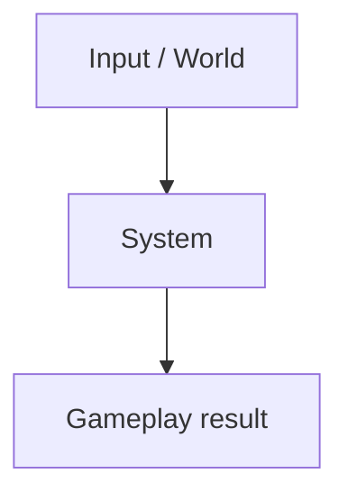

# GP-AREA-NNN — Pattern title

> **Maturity:** Candidate / Planned / Implemented / Documented  
> **Jira:** KAN-XXX  
> **Applies to:** Olympe Engine / EXIT  
> **Last review:** YYYY-MM-DD

## Problem

Describe the concrete gameplay or architecture problem.

## Context

When this pattern is useful, and when it is not.

## Principle

State the design principle in a few sentences.

## Architecture



## Data model

Describe components, messages, blackboards, resources or states.

## C++ implementation sketch

```cpp
// Minimal illustrative code only.
```

## Gameplay example

Provide one concrete in-game scenario.

## Failure modes / pitfalls

- Pitfall 1
- Pitfall 2
- Pitfall 3

## Performance considerations

Describe cost, update frequency, caching and scaling concerns.

## Integration in Olympe

List affected systems/components and expected dependencies.

## Validation

- [ ] Minimal scenario tested
- [ ] Failure cases tested
- [ ] Performance measured when relevant
- [ ] Coupling reviewed
- [ ] Jira decision recorded

## Related patterns

- GP-XXX-NNN
