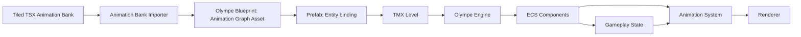
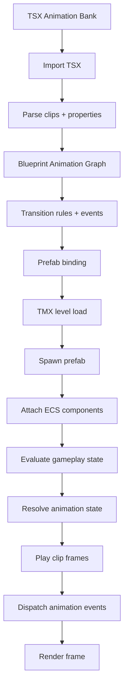
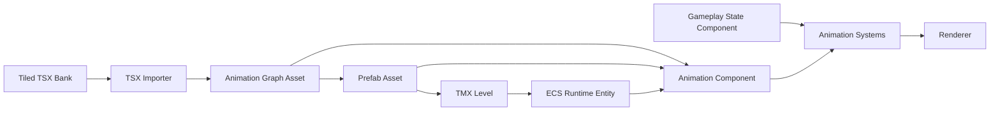

# Plan d’intégration des Animation Banks Tiled dans Olympe Engine

## Objectif

Utiliser un **TSX Tiled** comme banque de clips d’animation, puis construire dans Olympe :

1. un **graphe d’animation** éditable dans Blueprint Editor,
2. un **système de liaison** entre prefab et animation graph,
3. un **runtime ECS** capable de charger, résoudre et jouer les transitions.

Le principe central est :

- **Tiled** décrit les **frames et clips**.
- **Blueprint** décrit les **états, transitions, événements et règles gameplay**.
- **Prefab** relie une entité à une définition d’animation.
- **Engine** exécute le tout au runtime.
- le menu `File` du Blueprint Editor expose `New Animation Graph`.

---

## Vision d’ensemble du pipeline

---

## Rôle des modules Olympe

### 1. Blueprint Editor

Le Blueprint Editor devient l’outil principal d’authoring pour :

- importer une **animation bank TSX**,
- visualiser les **clips** disponibles,
- construire un **graph d’animation**,
- définir les **transitions**,
- attacher des **événements** de frame,
- référencer le graph depuis un **prefab**.

#### Modules impliqués

- **File/Asset Import**
  - charge le TSX
  - valide le XML
  - extrait les animations et propriétés
- **New Graph Type**
  - `AnimationTransitionGraph`
- **Graph Renderer**
  - rendu des nœuds et arcs
  - affichage des paramètres de transition
- **Property Inspector**
  - édition des propriétés du state/transition/event
- **Prefab Binding Panel**
  - association prefab ↔ animation graph ↔ bank TSX

---

### 2. Engine

Le moteur exécute le graphe au runtime.

#### Modules impliqués

- **Asset Manager**
  - charge TSX, graph d’animation, prefab
- **Prefab Instancer**
  - instancie l’entité et ses composants
- **Animation Resolver**
  - choisit le bon state à partir du gameplay
- **Animation Playback System**
  - avance les frames
- **Animation Transition System**
  - gère les changements d’état
- **Animation Event System**
  - déclenche footstep / attack hit / spawn / etc.
- **Render System**
  - dessine la frame courante

---

## Schéma de données proposé

## 1. Tiled TSX : Animation Bank

Le TSX ne doit contenir que les données visuelles et de découpage.

### Données globales du tileset

| Champ | Type | Rôle |
|---|---|---|
| `name` | string | nom de la banque |
| `tilewidth` | int | largeur d’un frame |
| `tileheight` | int | hauteur d’un frame |
| `image source` | string | spritesheet source |
| `objectalignment` | string | alignement de dessin |
| `custom:asset_type` | string | ex: `animation_bank` |
| `custom:character_id` | string | ex: `zombie` |
| `custom:default_fps` | int | vitesse par défaut |

### Données par tile animée

Chaque `tile` représente un **clip**.

| Champ | Type | Rôle |
|---|---|---|
| `type` | string | identifiant du clip |
| `custom:anim_group` | string | `idle`, `walk`, `attack`, etc. |
| `custom:direction` | string | `n`, `ne`, `e`, `se`, `s`, `sw`, `w`, `nw` |
| `custom:loop` | bool | boucle ou non |
| `custom:fps` | int | rythme du clip |
| `custom:priority` | int | arbitrage des états |
| `custom:interruptible` | bool | transition autorisée |
| `custom:blend_in_ms` | int | fondu d’entrée |
| `custom:blend_out_ms` | int | fondu de sortie |
| `custom:root_motion` | bool | déplacement porté par l’anim |

### Données de frame

Les frames restent standard Tiled :

| Champ | Type | Rôle |
|---|---|---|
| `tileid` | int | frame source |
| `duration` | int | durée en ms |

---

## 2. Blueprint : Animation Transition Graph

Le graphe est l’endroit où l’on définit la logique d’animation.

### Nœuds de base

#### `Entry`
- point d’entrée du graphe

#### `AnimationState`
- référence à un clip du TSX
- ex: `idle_s`, `walk_ne`, `attack_e`

#### `Transition`
- relie deux états
- porte les conditions de passage

#### `AnyState`
- transitions globales, prioritaires

#### `Event`
- nœud d’événement lié à une frame ou à un moment du clip

### Propriétés d’un `AnimationState`

| Champ | Type | Rôle |
|---|---|---|
| `state_id` | string | identifiant unique |
| `clip_id` | string | référence au TSX |
| `loop` | bool | boucle |
| `speed_multiplier` | float | vitesse de lecture |
| `can_interrupt` | bool | interruption possible |
| `exit_time` | float | seuil avant transition |
| `direction_mode` | enum | 1, 4 ou 8 directions |

### Propriétés d’une `Transition`

| Champ | Type | Rôle |
|---|---|---|
| `from_state` | string | état source |
| `to_state` | string | état cible |
| `condition_expr` | string | expression logique |
| `priority` | int | ordre de résolution |
| `blend_in_ms` | int | transition visuelle |
| `can_interrupt` | bool | priorité absolue |
| `cooldown_ms` | int | anti-spam |

### Propriétés d’un `Event`

| Champ | Type | Rôle |
|---|---|---|
| `event_id` | string | identifiant |
| `state_id` | string | état porteur |
| `frame_index` | int | frame ciblée |
| `event_name` | string | ex: `footstep` |
| `payload_json` | string | données optionnelles |

---

## 3. Prefab : liaison entité ↔ animation

Le prefab ne doit pas porter la logique de transition, seulement la liaison.

### Données prefab

| Champ | Type | Rôle |
|---|---|---|
| `prefab_id` | string | identifiant du prefab |
| `animation_bank_ref` | string | chemin TSX |
| `animation_graph_ref` | string | chemin graphe blueprint |
| `default_animation_state` | string | état initial |
| `direction_source` | string | ex: facing/movement |
| `animation_profile` | string | ex: `zombie_8dir` |

---

## 4. Engine ECS : runtime

### Composants recommandés

#### `AnimationComponent`

| Champ | Type | Rôle |
|---|---|---|
| `current_state` | string | état actif |
| `current_clip` | string | clip courant |
| `current_frame` | int | frame affichée |
| `time_in_state` | float | temps passé |
| `loop` | bool | lecture en boucle |
| `playback_speed` | float | vitesse |

#### `AnimationGraphComponent`

| Champ | Type | Rôle |
|---|---|---|
| `graph_ref` | string | asset du graphe |
| `bank_ref` | string | TSX associé |
| `runtime_state` | blob/json | état interne |

#### `CharacterStateComponent`

| Champ | Type | Rôle |
|---|---|---|
| `velocity_x` | float | vitesse horizontale |
| `velocity_y` | float | vitesse verticale |
| `is_grounded` | bool | au sol |
| `is_attacking` | bool | attaque active |
| `is_dead` | bool | mort |
| `facing_dir` | int | direction 0..7 |

#### `SpriteRendererComponent`

| Champ | Type | Rôle |
|---|---|---|
| `atlas_ref` | string | image source |
| `source_rect` | rect | frame courante |
| `pivot_x` | float | origine |
| `pivot_y` | float | origine |

### Systèmes ECS

#### `AnimationTransitionSystem`
- lit `CharacterStateComponent`
- évalue les conditions du graphe
- choisit le prochain état

#### `AnimationPlaybackSystem`
- avance les frames
- applique les durations Tiled

#### `AnimationEventSystem`
- déclenche les événements frame-based

#### `AnimationRenderSystem`
- prend la frame courante
- alimente le renderer

---

## 5. Intention UI issue du mockup

Le mockup cible précise une ergonomie qu’il faut conserver dans la spec :

- **colonne gauche** : asset browser + verification output
- **centre haut** : canvas du graphe + barre d’actions
- **centre bas** : timeline / scrub bar / events / preview viewer
- **colonne droite** : properties + events + palette contextuelle

### Barre d’actions attendue

La barre d’actions du renderer Animation doit exposer :

- `Save`
- `Save As`
- `Browse`
- `Verify`
- `Run`
- fichier courant
- `Minimap`
- taille du minimap
- position du minimap

### Principes visuels

- thème sombre compact
- grille visible
- nodes à en-tête coloré
- transitions courbes avec labels
- sélection fortement visible
- preview intégré dans la zone basse
- séparation nette entre graph editing et timeline editing

---

## Graphe fonctionnel du pipeline

---

## Graphe de dépendances

### Lecture du graphe de dépendances

1. Le **TSX** doit exister avant l’import.
2. L’**importer** produit un asset lisible par Blueprint.
3. Le **graph d’animation** est nécessaire avant le prefab.
4. Le **prefab** est référencé dans le TMX.
5. Le **runtime ECS** instancie le prefab.
6. Les **systèmes d’animation** consomment l’état gameplay.
7. Le **renderer** affiche la frame courante.

---

## 7. Menu File du Blueprint Editor

Le menu `File` doit être mis à jour pour inclure :

- `New Animation Graph`

### Comportement attendu

- crée un document Animation vierge
- ouvre un nouvel onglet géré par `TabManager`
- initialise les paramètres par défaut
- positionne l’utilisateur sur le canvas Animation

### Cohérence attendue

- même logique que les autres créations de graphe
- même routage par `TabManager`
- même style de validation / confirmation si le flux existant le requiert

---

## 8. Checklist UX de bout en bout

Cette section verrouille le parcours utilisateur complet, de la banque TSX jusqu’au runtime.

### 8.1 Obligatoire

L’utilisateur doit pouvoir :

- créer un `Animation Graph` depuis `File > New Animation Graph`
- charger ou attacher une banque TSX depuis l’éditeur
- voir immédiatement les clips importés dans une palette dédiée
- créer un `AnimationState` depuis un clip en un geste simple
- éditer les propriétés du state, de la transition et de l’event sans quitter le graphe
- créer, déplacer et supprimer des transitions visuellement
- créer, déplacer et supprimer des events dans la timeline
- lancer `Verify` et lire les erreurs/warnings dans l’output panel
- lancer `Run` et observer la simulation dans le preview viewer
- sauvegarder et rouvrir un `.ani.json`
- lier le graphe au prefab avant usage runtime
- voir les références manquantes ou invalides avant export/runtime

### 8.2 Souhaitable

Fonctionnalités fortement recommandées pour éviter les frictions :

- recherche dans la palette de clips
- filtrage par groupe, direction et type
- duplication rapide d’un state
- duplication rapide d’une transition
- auto-nommage des nodes générés
- bouton de reload de la banque TSX
- feedback visuel quand le graphe n’est pas encore lié au prefab
- raccourcis clavier pour les actions courantes
- sauvegarde automatique cohérente avec l’éditeur

### 8.3 Hors scope initial

À ne pas exiger pour le premier lot :

- blend avancé temps réel type engine final
- machine d’état hiérarchique complexe
- layers multiples d’animation
- montage/combo system complet
- root motion runtime avancé

---

## 9. Manques fonctionnels à combler dans le design

Les points suivants doivent être explicitement dessinés dans l’UI/spec, sinon le parcours sera incomplet :

### Import / liaison

- bouton clair pour **attacher / remplacer** la banque TSX
- indication visible de la banque courante
- action de **reload** après modification du TSX

### Création de states

- action directe **Create State from Clip**
- drag-and-drop clip → state
- duplication d’un state existant

### Transitions

- création/suppression de transition sans friction
- labels lisibles sur les arcs
- support visuel d’`AnyState`
- panneau conditionnel assez expressif pour les règles simples

### Events / timeline

- CRUD des markers
- scrubbing temporel
- frame stepping
- visibilité du state actif pendant l’édition temporelle

### Prefab / runtime handoff

- panneau explicite de binding prefab ↔ animation graph
- affichage des chemins liés
- warning si graph sans prefab ou prefab sans graph
- warning si bank TSX manquante au runtime

---

## 10. Parcours utilisateur validé

### Étape A — Authoring de la banque

1. créer le TSX dans Tiled
2. définir les clips 8 directions
3. renseigner les propriétés d’animation
4. vérifier les frames et durations

### Étape B — Démarrage dans Blueprint

1. créer un nouveau graphe via `New Animation Graph`
2. attacher le TSX
3. voir la palette se remplir
4. créer les états initiaux

### Étape C — Construction de la logique

1. relier les states
2. configurer les transitions
3. ajouter les events
4. régler les propriétés de preview

### Étape D — Vérification et preview

1. lancer `Verify`
2. corriger les erreurs
3. lancer `Run`
4. scruber la timeline
5. valider la lecture

### Étape E — Intégration prefab / runtime

1. binder le graphe au prefab
2. sauvegarder le `.ani.json`
3. charger le TMX
4. instancier le prefab
5. exécuter le runtime ECS

---

## Workflow recommandé côté auteur

### Étape 1 — Banque Tiled
- créer le TSX
- définir les clips 8 directions
- ajouter les propriétés minimales

### Étape 2 — Import Blueprint
- importer le TSX
- générer automatiquement les états de base
- vérifier les directions et les noms

### Étape 3 — Édition du graphe
- relier les états
- définir les transitions
- ajouter les événements de frame

### Étape 4 — Prefab
- lier prefab ↔ animation bank ↔ graph
- définir l’état initial

### Étape 5 — Runtime
- charger le TMX
- instancier le prefab
- exécuter l’animation ECS

---

## Contraintes et limites

### Contraintes Tiled
- pas de machine d’état native
- pas de transition conditionnelle
- pas de blend runtime
- pas d’événements gameplay natifs

### Contraintes Blueprint
- le graph doit rester simple et lisible
- les conditions doivent être serialisables
- les assets référencés doivent être stables

### Contraintes Engine
- l’animation doit être déterministe
- les transitions doivent être prioritaires et ordonnées
- les événements doivent être idempotents
- le runtime doit pouvoir recharger les assets proprement

---

## Recommandation d’implémentation par phase

### Phase 1 — Import TSX
- parser XML
- extraire clips, frames, durations, properties
- produire un asset interne

### Phase 2 — Nouveau type de graphe
- créer `AnimationTransitionGraph`
- ajouter les nœuds et les propriétés

### Phase 3 — Prefab binding
- ajouter les références animation dans le prefab
- intégrer la sélection dans le Blueprint Editor

### Phase 4 — Runtime ECS
- composants animation
- système de transition
- système de playback
- système d’événements

### Phase 5 — Validation
- test sur zombie 8 directions
- test de transitions `idle -> walk -> run -> attack -> death`
- test de fallback et d’absence d’asset

---

## Conclusion

Le meilleur découpage est :

- **Tiled** pour la banque de clips,
- **Blueprint** pour la logique de transitions,
- **Prefab** pour la liaison entité/animation,
- **Engine ECS** pour l’exécution.

Cela garde :

- l’authoring visuel simple,
- la logique gameplay au bon endroit,
- le runtime propre et extensible.
