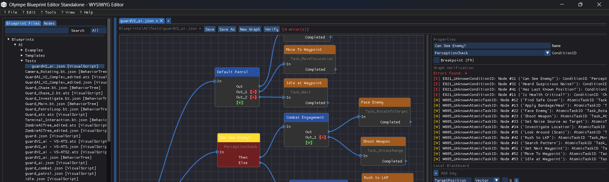
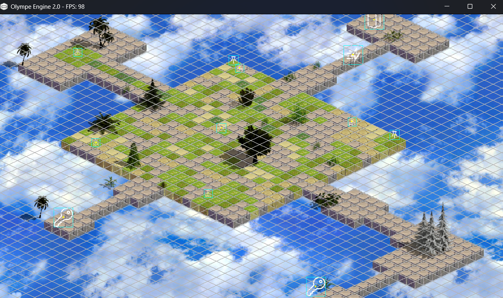

<div align="center">


# Olympe Engine

**A professional 2D game engine with a powerful WYSIWYG Blueprint Editor,  
Tiled integration, windowed multiplayer workflow, and flexible 2D rendering targets.**

[](#status)
[](#status)
[](#tech-highlights)

</div>

---

## Why Olympe?

Olympe Engine is built for developers who want **full control** over their tools and data pipeline — without sacrificing iteration speed. It combines a mature node-based Blueprint Editor, a proven Tiled Editor level pipeline, a windowed multiplayer dev workflow, and flexible 2D rendering (isometric, orthographic, hex-grid).

---

## Blueprint Editor — WYSIWYG Node-Based Scripting

<div align="center">

</div>

### Full CRUD, Undo/Redo, and Graph Validation

- **WYSIWYG node canvas** — add, move, duplicate, delete nodes and links with immediate visual feedback
- **Complete Undo/Redo** — every operation (node add/delete/move, link add/remove, property edit) is undoable
- **Multi-tab editing** — work on multiple graphs simultaneously with isolated ImNodes contexts
- **Persistent node positions** — save/load round-trip with exact canvas layout preserved

### Dynamic Pins (Sequence & Switch Nodes)

- Add or remove exec-output pins directly on the canvas with `[+]` / `[-]` buttons
- Base pins are protected (non-deletable); added pins are fully undoable
- Links are automatically cleaned up when a pin is removed

### Guided Dropdown Authoring — Phase 22-C *(active)*

The newest feature set replaces error-prone free-text fields with **smart, registry-driven dropdowns**:

| Dropdown | Drives |
|---|---|
| **Blackboard Key selector** | Local variable key picker (no typos) |
| **Condition Type selector** | Structured condition authoring |
| **AtomicTask ID selector** | Task node wiring without guessing IDs |
| **Math / Comparison operator** | Operator selection per expression node |
| **SubGraph path picker** | SubGraph nodes linked via file browser |

Less typing, fewer runtime errors, faster iteration.

### Graph Verification System (GVS)

- Full-graph static analysis (not just per-link) runs before save and before execution
- Structured issue list: **errors** (E001–E012), **warnings** (W001–W010), **infos** (I001+)
- Color-coded validation panel with click-to-select-node navigation
- Prevents invalid graphs from reaching the runtime

---

## In-Game Rendering — 2D Iso / Ortho / Hex

<div align="center">

</div>

Olympe targets three 2D layout paradigms out of the box:

| Mode | Best For |
|---|---|
| **Isometric** | RPG, strategy, simulation — depth-rich perspective |
| **Orthographic** | Arcade, top-down, platformer |
| **Hex-grid** | Turn-based tactics, board-game style |

The rendering pipeline is driven by the ECS (Entity–Component System), keeping scene composition clean and scriptable via the Blueprint Editor.

---

## Annotated Gameplay & Level Design

<div align="center">

</div>

---

## Tiled Editor Integration — Level Pipeline

Olympe natively supports **[Tiled](https://www.mapeditor.org/)** as the level-authoring frontend:

- Design maps in Tiled with layers, objects, and custom properties
- Import directly into Olympe: assets, tile layers, and scene objects
- Iterate on maps without breaking gameplay logic
- Custom property mapping to Olympe ECS components

> **Philosophy:** Let Tiled do what it does best. Let Olympe handle entity spawning, AI, scripting, and runtime.

Full integration documentation: [`Documentation/TILED_ISOMETRIC.md`](Documentation/TILED_ISOMETRIC.md)

---

## Windowed Multiplayer Workflow

Olympe's dev workflow supports **multi-client local windows**, making multiplayer testing frictionless:

- Launch multiple game-client windows on a single machine
- Test sync, collision, and gameplay interactions without external deployment
- Iterate at full dev speed — no dedicated server setup required for local testing

---

## Quick Start

```bash
# 1. Clone the repository
git clone https://github.com/Atlasbruce/Olympe-Engine.git
cd Olympe-Engine

# 2. Generate the build (CMake)
cmake -S . -B build -DBUILD_TESTS=ON
cmake --build build

# 3. Launch the Blueprint Editor standalone
./build/OlympeBlueprintEditorStandalone
```

Full setup and editor walkthrough: [`Documentation/Blueprint_Editor_Quick_Start_FR.md`](Documentation/Blueprint_Editor_Quick_Start_FR.md)  
Comprehensive docs index: [`Documentation/README.md`](Documentation/README.md)

---

## Tech Highlights

- **Language:** C++ (tooling + runtime), modular architecture
- **ECS:** Flexible entity-component system for gameplay composition
- **Blueprint Runtime:** Local Blackboard, template execution frames, sub-graphs
- **Serialization:** JSON v4, full round-trip (graph + node positions + blackboard)
- **AI System:** Behavior Trees + Visual Script graphs
- **Animation Editor:** Standalone editor with timeline and asset browser
- **Build:** CMake, cross-platform, test suite included (`BUILD_TESTS=ON`)

---

## Status

| Item | Status |
|---|---|
| Blueprint Editor (CRUD, Undo/Redo, Tabs) | ✅ Stable |
| Graph Verification System (GVS) | ✅ Merged (Phase 21-A, PR #380) |
| Dynamic Pins (Sequence/Switch) | ✅ Completed |
| Switch Node Enhancement | ✅ Merged (Phase 22-A, PR #384) |
| **Parameter Dropdowns & Registries** | 🔧 **Active — Phase 22-C (P0 Critical)** |
| Tiled Level Pipeline | ✅ Documented |
| Windowed Multiplayer Workflow | ✅ Implemented |
| Runtime Execution & Debugger | ⏳ Planned (Phase 24+) |

> Active development is currently focused on **Phase 22-C — Parameter Dropdowns & Registries**, started 2026-03-14.

---

## Contributing

PRs and UX feedback are welcome! Current focus areas:

- Blueprint Editor registries and dropdown authoring
- Graph validation and error UX
- Level design pipeline (Tiled import)
- Runtime execution and debugger

Please open an issue or pull request describing your change. For larger contributions, discuss in an issue first.

---

## Documentation

| Resource | Link |
|---|---|
| Documentation Index | [`Documentation/README.md`](Documentation/README.md) |
| Blueprint Editor User Guide | [`Documentation/Blueprint_Editor_User_Guide_v4.md`](Documentation/Blueprint_Editor_User_Guide_v4.md) |
| Blueprint Editor Quick Start | [`Documentation/Blueprint_Editor_Quick_Start_FR.md`](Documentation/Blueprint_Editor_Quick_Start_FR.md) |
| Tiled Isometric Integration | [`Documentation/TILED_ISOMETRIC.md`](Documentation/TILED_ISOMETRIC.md) |
| ATS Visual Scripting | [`Documentation/UserManual_ATS_VisualScripting.md`](Documentation/UserManual_ATS_VisualScripting.md) |
| Project Roadmap | [`Project Management/ROADMAP_V2.md`](Project%20Management/ROADMAP_V2.md) |

---

## License

License to be specified. All rights reserved — Olympe Engine © 2026.
