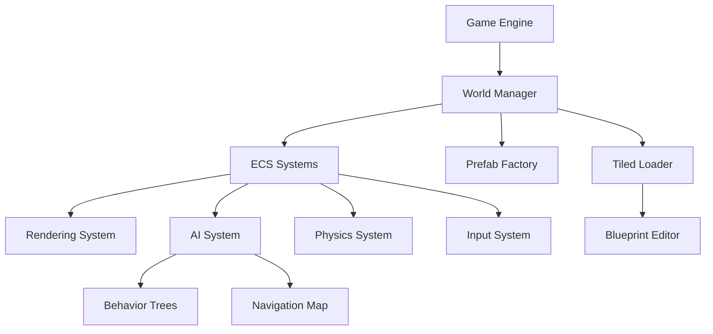

# Welcome to Olympe Engine

Olympe Engine is a powerful 2D game engine built with **Entity Component System (ECS)** architecture, providing developers with a flexible and performant foundation for creating 2D games.

## 🎯 Key Features

- **ECS Architecture** - Efficient and flexible entity component system
- **Advanced AI** - Behavior trees, pathfinding, and navigation
- **Tiled Integration** - Full support for Tiled map editor (orthogonal, isometric, hexagonal)
- **Prefab System** - Blueprint-based entity creation
- **Input Management** - Multi-device input handling
- **Camera System** - Advanced camera controls with zoom and pan
- **Collision & Navigation** - Built-in collision detection and pathfinding

## 📚 Documentation Structure

- **[Getting Started](getting-started/quick-start)** - Learn the basics and set up your first project
- **[API Reference](api-reference/index)** - Complete API documentation
- **[Contributing](contributing/code-style)** - Guidelines for contributors

## 🚀 Quick Start

```bash
# Clone the repository
git clone https://github.com/Atlasbruce/Olympe-Engine.git

# Build the project
mkdir build && cd build
cmake ..
make
slug: /
---

# Olympe Engine

**A powerful 2D game engine with Entity Component System architecture**

Olympe Engine is a modern 2D game engine built with C++14, designed for creating complex games with advanced AI, navigation systems, and flexible entity management. Whether you're building an RPG, strategy game, or action platformer, Olympe provides the tools you need.

## ✨ Key Features

<div className="features-grid">

### 🎯 Entity Component System (ECS)
Clean, modular architecture for managing game entities with a data-oriented approach. Define components, attach them to entities, and let specialized systems handle the logic.

### 🎨 Blueprint System
JSON-based entity definition format that allows designers to create and modify entities without touching code. Build prefabs, define components, and manage game objects declaratively.

### 🗺️ Tiled Map Integration
First-class support for Tiled MapEditor with support for orthogonal, isometric, and hexagonal maps. Load TMJ/TMX files with automatic collision detection, entity spawning, and layer-based navigation.

### 🤖 AI & Behavior Trees
Built-in AI system with behavior trees for complex NPC behaviors. Includes wander, patrol, chase, and flee behaviors with dependency scanning and prefab integration.

### 🧭 Navigation System
Advanced navigation with collision maps, pathfinding, and dynamic obstacle avoidance. Supports multiple projections (orthogonal, isometric, hexagonal) with visualization overlays.

### 🌍 Multi-Language Ready
Engine supports internationalization with multi-language resource management. Documentation available in English and French.

</div>

## 🚀 Quick Start

Get up and running in minutes:

```bash
# Clone the repository
git clone https://github.com/Atlasbruce/Olympe-Engine.git
cd Olympe-Engine

# Build with CMake
mkdir build && cd build
cmake ..
cmake --build .

# Run the engine
./OlympeEngine
```

## 💡 Need Help?

- Check out the [documentation](getting-started/quick-start)
- Browse the [API reference](api-reference/index)
- Visit our [GitHub repository](https://github.com/Atlasbruce/Olympe-Engine)

## 📝 License

Olympe Engine is open source software. Check the repository for license details.
Ready to create your first game? Check out the [Quick Start Guide](./getting-started/quick-start.md)!

## 🏗️ Architecture Overview

Olympe Engine follows a modular architecture with clear separation of concerns:



## 📚 Documentation Sections

<div className="doc-sections">

### [Getting Started](./getting-started/installation.md)
Installation guide, prerequisites, and your first project

### [User Guide](./user-guide/tiled-editor/tiled-introduction.md)
Learn how to use Tiled Editor, Blueprints, and Input System

### [Technical Reference](./technical-reference/architecture/ecs-overview.md)
Deep dive into ECS architecture, systems, and implementation details

### [API Reference](./api-reference/introduction.md)
Complete API documentation (auto-generated from code)

### [Contributing](./contributing/testing-guide.md)
Guidelines for contributing, adding components, and testing

</div>

## 💡 Why Olympe Engine?

- **Modern C++14**: Clean, maintainable codebase with modern C++ practices
- **SDL3 Powered**: Hardware-accelerated rendering with SDL3
- **Flexible Input**: Multi-device input system with keyboard, mouse, and gamepad support
- **Editor Tools**: Blueprint Editor and integration with Tiled MapEditor
- **Well Documented**: Comprehensive documentation with examples and guides
- **Open Architecture**: Easy to extend and customize for your needs

## 🎮 Example: Creating Your First Entity

```cpp
// Create an entity using the ECS system
EntityID player = World::Get().CreateEntity();

// Add components
World::Get().AddComponent<Position_data>(player, {100.0f, 200.0f, 0.0f});
World::Get().AddComponent<VisualSprite_data>(player);
World::Get().AddComponent<PhysicsBody_data>(player);
World::Get().AddComponent<Health_data>(player, {100, 100});

// Or load from a Blueprint
EntityID enemy = PrefabFactory::Get().CreateFromBlueprint("Blueprints/EntityPrefab/enemy.json");
```

## 🗺️ Example: Loading a Tiled Map

```cpp
// Load a Tiled TMJ map
bool success = World::Get().LoadLevel("Gamedata/Levels/dungeon.tmj");

// Navigation and collision maps are generated automatically
// Entities from object layers are spawned automatically
// Layer properties control navigation behavior
```

## 🛠️ System Requirements

- **Compiler**: C++14 compatible (GCC 7+, Clang 5+, MSVC 2017+)
- **CMake**: 3.14 or higher
- **SDL3**: Required for rendering and input
- **Operating Systems**: Windows, Linux, macOS

## 📖 Learn More

- [Installation Guide](./getting-started/installation.md) - Set up your development environment
- [Project Structure](./getting-started/project-structure.md) - Understand the codebase organization
- [ECS Overview](./technical-reference/architecture/ecs-overview.md) - Learn the Entity Component System
- [Blueprint System](./user-guide/blueprints/blueprints-overview.md) - Create entities without code
- [Testing Guide](./contributing/testing-guide.md) - Run and write tests

## 🤝 Community & Support

- **GitHub**: [Atlasbruce/Olympe-Engine](https://github.com/Atlasbruce/Olympe-Engine)
- **Issues**: [Report bugs or request features](https://github.com/Atlasbruce/Olympe-Engine/issues)
- **Discussions**: [Ask questions and share ideas](https://github.com/Atlasbruce/Olympe-Engine/discussions)

## 📜 License

Olympe Engine is open source. Check the repository for license details.

---

**Ready to start building?** Head to the [Quick Start Guide](./getting-started/quick-start.md) or explore the [full documentation](./getting-started/installation.md).
