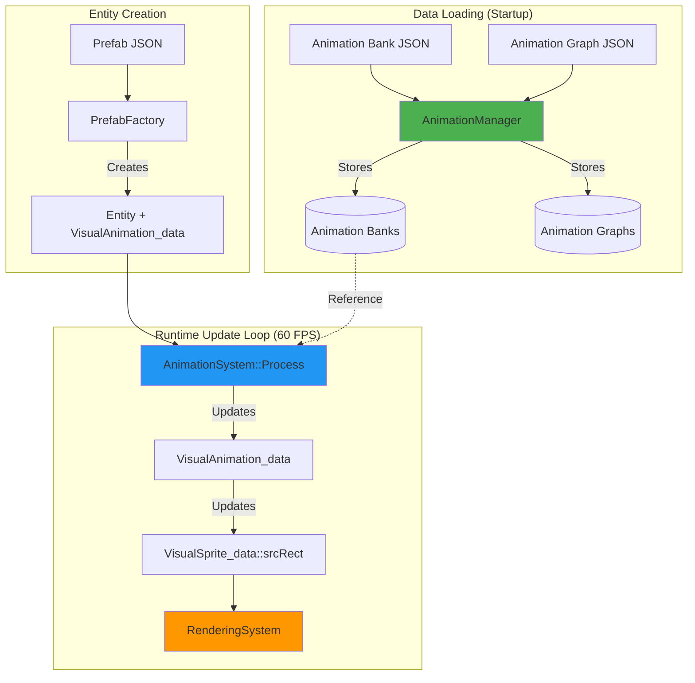
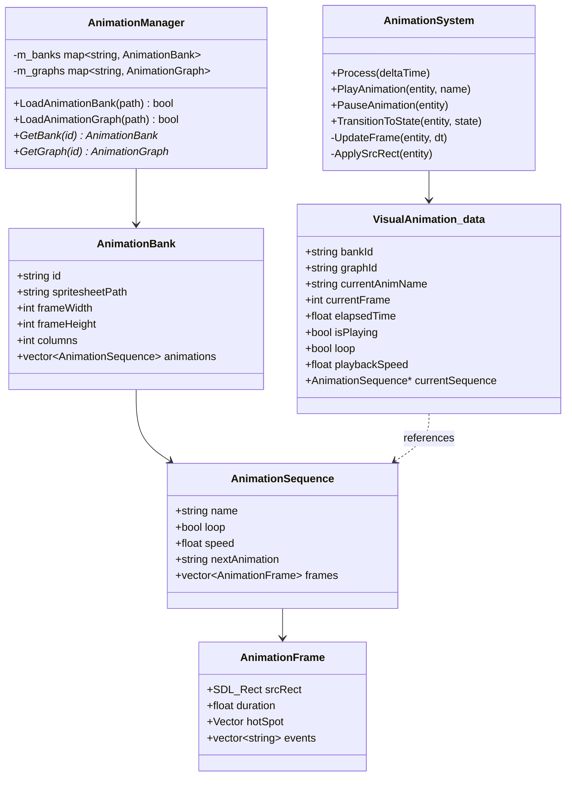

# Animation System Architecture

This document provides a technical deep-dive into the Olympe Engine 2D Animation System architecture, implementation details, and integration points.

## System Architecture Overview

The Animation System consists of three primary components:

1. **AnimationManager** (Singleton): Resource loading and management
2. **AnimationSystem** (ECS System): Per-frame animation updates
3. **VisualAnimation_data** (ECS Component): Animation state storage



## Component Diagram



## ECS Component Structure

### VisualAnimation_data Fields Explained

```cpp
struct VisualAnimation_data
{
    // Resource References (Set at creation)
    std::string bankId;              // Links to AnimationBank in AnimationManager
    std::string graphId;             // Optional: Links to AnimationGraph for FSM
    
    // Current State (Changes at runtime)
    std::string currentAnimName;     // Current animation name (e.g., "walk")
    std::string currentStateName;    // Current FSM state (if using graph)
    int currentFrame;                // Current frame index in sequence
    float elapsedTime;               // Time accumulated since last frame change
    
    // Playback Control
    bool isPlaying;                  // Whether animation is actively updating
    bool loop;                       // Whether current animation should loop
    float playbackSpeed;             // Speed multiplier (1.0 = normal, 2.0 = 2x speed)
    bool autoStart;                  // Start playing immediately on entity creation
    
    // Cached Pointers (Performance optimization)
    AnimationSequence* currentSequence;  // Pointer to current animation sequence
    SDL_Texture* cachedTexture;          // Cached texture pointer (avoid lookup)
    
    // Internal State
    bool isAnimationComplete;        // True when non-looping animation finishes
    int totalFrames;                 // Total frame count in current sequence
};
```

### Field Lifecycle

**Initialization** (Entity creation from prefab):
```cpp
// 1. Load from prefab JSON
anim.bankId = "character";
anim.currentAnimName = "idle";
anim.autoStart = true;

// 2. AnimationSystem resolves pointers on first update
auto bank = AnimationManager::Get().GetBank(anim.bankId);
anim.currentSequence = bank->GetAnimation(anim.currentAnimName);
anim.cachedTexture = DataManager::Get().GetTexture(bank->spritesheetPath);
anim.totalFrames = anim.currentSequence->frames.size();

// 3. Start playing if autoStart
if (anim.autoStart)
{
    anim.isPlaying = true;
    anim.currentFrame = 0;
    anim.elapsedTime = 0.0f;
}
```

**Runtime Update** (Every frame):
```cpp
// AnimationSystem::Process() for each entity
if (anim.isPlaying)
{
    anim.elapsedTime += deltaTime * anim.playbackSpeed;
    
    float frameDuration = anim.currentSequence->frames[anim.currentFrame].duration;
    
    if (anim.elapsedTime >= frameDuration)
    {
        anim.elapsedTime -= frameDuration;
        anim.currentFrame++;
        
        if (anim.currentFrame >= anim.totalFrames)
        {
            if (anim.loop)
            {
                anim.currentFrame = 0;  // Loop back to start
            }
            else
            {
                anim.currentFrame = anim.totalFrames - 1;  // Stay on last frame
                anim.isAnimationComplete = true;
                
                if (!anim.currentSequence->nextAnimation.empty())
                {
                    PlayAnimation(entity, anim.currentSequence->nextAnimation);
                }
            }
        }
    }
    
    // Update VisualSprite_data srcRect
    sprite.srcRect = anim.currentSequence->frames[anim.currentFrame].srcRect;
}
```

## Frame Timing Algorithm

The animation system uses **delta-time accumulation** for frame-rate independent playback.

### Algorithm Details

```cpp
void AnimationSystem::UpdateFrame(ECS_Entity entity, float deltaTime)
{
    auto& anim = World::Get().GetComponent<VisualAnimation_data>(entity);
    
    if (!anim.isPlaying || !anim.currentSequence)
        return;
    
    // Step 1: Accumulate time with playback speed
    float effectiveDeltaTime = deltaTime * anim.playbackSpeed;
    anim.elapsedTime += effectiveDeltaTime;
    
    // Step 2: Get current frame duration
    const AnimationFrame& currentFrame = anim.currentSequence->frames[anim.currentFrame];
    float frameDuration = currentFrame.duration;
    
    // Step 3: Check if frame should advance
    while (anim.elapsedTime >= frameDuration)
    {
        // Subtract frame duration (carry over excess time)
        anim.elapsedTime -= frameDuration;
        
        // Advance frame
        anim.currentFrame++;
        
        // Step 4: Handle end of sequence
        if (anim.currentFrame >= anim.currentSequence->frames.size())
        {
            if (anim.loop)
            {
                anim.currentFrame = 0;
            }
            else
            {
                // Clamp to last frame
                anim.currentFrame = anim.currentSequence->frames.size() - 1;
                anim.isAnimationComplete = true;
                anim.isPlaying = false;  // Stop playback
                
                // Trigger nextAnimation if defined
                if (!anim.currentSequence->nextAnimation.empty())
                {
                    PlayAnimation(entity, anim.currentSequence->nextAnimation, true);
                    return;
                }
            }
            break;
        }
        
        // Get next frame duration for next iteration
        const AnimationFrame& nextFrame = anim.currentSequence->frames[anim.currentFrame];
        frameDuration = nextFrame.duration;
    }
}
```

### Time Accumulation Benefits

1. **Frame-rate Independence**: Works correctly at any FPS (30, 60, 144)
2. **No Frame Skipping**: Excess time carries over to next frame
3. **Precise Timing**: Accurate even with variable delta times
4. **Smooth Playback**: No stuttering from rounding errors

### Example Timeline

```
Frame durations: [0.1s, 0.1s, 0.1s, 0.1s]
Delta time: 0.016s (60 FPS)

Update 1: elapsedTime = 0.016s (frame 0)
Update 2: elapsedTime = 0.032s (frame 0)
Update 3: elapsedTime = 0.048s (frame 0)
Update 4: elapsedTime = 0.064s (frame 0)
Update 5: elapsedTime = 0.080s (frame 0)
Update 6: elapsedTime = 0.096s (frame 0)
Update 7: elapsedTime = 0.112s → advance to frame 1, elapsedTime = 0.012s
Update 8: elapsedTime = 0.028s (frame 1)
...
```

## Spritesheet Calculation Math

### Frame Index to Source Rectangle

Given:
- `frameWidth`, `frameHeight`: Dimensions of each frame
- `columns`: Number of frames per row
- `spacing`: Pixels between frames
- `margin`: Border pixels around grid
- `frameIndex`: Frame number (0-based)

Calculate `srcRect`:

```cpp
SDL_Rect CalculateSrcRect(int frameIndex, 
                          int frameWidth, int frameHeight,
                          int columns, int spacing, int margin)
{
    // Calculate row and column
    int row = frameIndex / columns;
    int col = frameIndex % columns;
    
    // Calculate pixel coordinates
    int x = margin + col * (frameWidth + spacing);
    int y = margin + row * (frameHeight + spacing);
    
    return { x, y, frameWidth, frameHeight };
}
```

### Example Calculations

**Scenario 1: Simple Grid (no spacing/margin)**
```
Spritesheet: 512×256
Frame size: 64×64
Columns: 8
Spacing: 0
Margin: 0

Frame 0: (0, 0, 64, 64)
Frame 1: (64, 0, 64, 64)
Frame 7: (448, 0, 64, 64)
Frame 8: (0, 64, 64, 64)   // Next row
Frame 15: (448, 64, 64, 64)
```

**Scenario 2: With Spacing**
```
Frame size: 64×64
Columns: 8
Spacing: 2
Margin: 0

Frame 0: (0, 0, 64, 64)
Frame 1: (66, 0, 64, 64)     // 64 + 2 spacing
Frame 2: (132, 0, 64, 64)    // 64 + 2 + 64 + 2
Frame 8: (0, 66, 64, 64)     // New row with 2px spacing
```

**Scenario 3: With Margin and Spacing**
```
Frame size: 32×32
Columns: 4
Spacing: 1
Margin: 4

Frame 0: (4, 4, 32, 32)      // Starts at margin
Frame 1: (37, 4, 32, 32)     // 4 + 32 + 1 spacing
Frame 4: (4, 37, 32, 32)     // New row: 4 + 32 + 1
```

## Performance Characteristics

### Time Complexity

| Operation | Complexity | Notes |
|-----------|------------|-------|
| Load animation bank | O(n) | n = number of animations in bank |
| Get animation from bank | O(1) | Hash map lookup by name |
| Get bank from manager | O(1) | Hash map lookup by ID |
| Update single entity | O(1) | Direct component access |
| Update all entities | O(n) | n = number of animated entities |
| Play animation | O(1) | Pointer assignment + state update |
| Transition state | O(k) | k = number of transitions (typically < 10) |

### Space Complexity

**Per AnimationBank**:
- ~100 bytes overhead
- ~500 bytes per animation
- ~50 bytes per frame

**Example**: Character with 10 animations, 8 frames each
```
Bank: 100 bytes
Animations: 10 × 500 = 5,000 bytes
Frames: 10 × 8 × 50 = 4,000 bytes
Total: ~9 KB
```

**Per Entity**:
- VisualAnimation_data: ~100 bytes
- No frame data duplication (shared pointers)

**100 animated entities**: ~10 KB (component data only)

### Cache Locality

The system is designed for good cache performance:

1. **Component data is contiguous** (ECS architecture)
2. **Hot path avoids pointer chasing** (cached pointers in component)
3. **Animation sequences shared** (const references, no copies)
4. **Texture pointers cached** (avoid DataManager lookup every frame)

## Thread Safety Considerations

### Thread-Safe Operations

- **AnimationManager resource loading** (mutexes on map access)
- **Read-only access to banks/graphs** (const references)

### Not Thread-Safe

- **AnimationSystem::Process()** (single-threaded ECS update)
- **Component modification** (main thread only)
- **Texture access** (SDL3 is not thread-safe)

### Recommendations

- Load all animation resources **before starting game loop**
- Perform runtime loading on **main thread only**
- Use job system for **animation blending** (future feature)

## Memory Management

### Shared Pointers for Animation Sequences

```cpp
class AnimationBank
{
    std::vector<std::shared_ptr<AnimationSequence>> m_animations;
public:
    std::shared_ptr<AnimationSequence> GetAnimation(const std::string& name) const
    {
        // Returns shared_ptr - reference counted
        // Multiple entities can reference same sequence safely
    }
};
```

### Benefits

1. **Automatic cleanup**: Sequences deleted when last reference removed
2. **Safe sharing**: Multiple entities reference same data
3. **No double-free**: Reference counting prevents errors

### Pointer Resolution

```cpp
// Component stores raw pointer for performance
struct VisualAnimation_data
{
    AnimationSequence* currentSequence;  // Raw pointer (fast access)
};

// Resolved from shared_ptr on animation change
void AnimationSystem::PlayAnimation(ECS_Entity entity, const std::string& animName)
{
    auto bank = AnimationManager::Get().GetBank(anim.bankId);
    auto sequence = bank->GetAnimation(animName);  // Returns shared_ptr
    anim.currentSequence = sequence.get();         // Store raw pointer
}
```

**Safety**: Raw pointer is valid as long as bank is loaded (guaranteed during gameplay).

## Integration Points

### 1. DataManager (Texture Loading)

```cpp
// AnimationManager loads textures via DataManager
SDL_Texture* texture = DataManager::Get().LoadTexture(bank.spritesheetPath);
```

**Integration**: Uses existing texture cache, no duplication.

### 2. PrefabFactory (Entity Creation)

```cpp
// PrefabFactory reads VisualAnimation_data from prefab JSON
{
  "VisualAnimation_data": {
    "bankId": "character",
    "currentAnimName": "idle",
    "autoStart": true
  }
}

// Factory creates component
VisualAnimation_data anim;
anim.bankId = json["bankId"];
anim.currentAnimName = json["currentAnimName"];
World::Get().AddComponent<VisualAnimation_data>(entity, anim);
```

### 3. World (ECS System Registration)

```cpp
// In World::Init()
m_animationSystem = std::make_unique<AnimationSystem>();
m_animationSystem->RegisterComponent<VisualAnimation_data>();
m_animationSystem->RegisterComponent<VisualSprite_data>();
```

**Update Order**:
1. Physics System (update positions)
2. Animation System (update sprites)
3. Rendering System (draw sprites)

### 4. Behavior Tree (AI Integration)

```cpp
// Custom BT node
class PlayAnimationNode : public BT_Node
{
    BT_Status Execute(ECS_Entity entity) override
    {
        AnimationSystem::Get().PlayAnimation(entity, m_animName);
        return BT_Status::SUCCESS;
    }
};

// In BT JSON
{
  "type": "PlayAnimation",
  "animationName": "attack"
}
```

### 5. Input System (Player Control)

```cpp
void HandleInput()
{
    if (InputManager::Get().IsActionPressed("move_right"))
    {
        AnimationSystem::Get().PlayAnimation(player, "walk_right");
    }
}
```

## Design Patterns Used

### 1. Singleton Pattern
- **AnimationManager**: Centralized resource management
- **AnimationSystem**: Single system instance

### 2. Component Pattern (ECS)
- **VisualAnimation_data**: Pure data component
- **AnimationSystem**: Behavior on components

### 3. Flyweight Pattern
- **AnimationSequence**: Shared across entities
- **Textures**: Shared via DataManager cache

### 4. State Pattern
- **Animation Graphs**: FSM for animation states
- **State transitions**: Validated state changes

### 5. Strategy Pattern
- **Frame Definition**: frameRange vs explicit frames
- **Spritesheet Layout**: Flexible frame calculation

## Future Enhancements

Potential improvements to the system:

### Animation Blending
```cpp
// Blend between two animations
AnimationSystem::BlendAnimations(entity, "walk", "run", 0.5f);
```

### Animation Layers
```cpp
// Separate upper/lower body animations
layer1: "upper_body_attack"
layer2: "lower_body_walk"
```

### Inverse Kinematics
```cpp
// Procedural foot placement
AnimationSystem::SetIKTarget(entity, "left_foot", targetPosition);
```

### Animation Curves
```cpp
// Ease-in/ease-out for smooth transitions
"transitionCurve": "ease-in-out"
"transitionDuration": 0.2
```

## See Also

- [API Reference](api-reference.md) - Complete API documentation
- [Animation Banks Reference](../../user-guide/animation-system/animation-banks.md) - JSON format
- [Animation Graphs Reference](../../user-guide/animation-system/animation-graphs.md) - FSM documentation
- [Quick Start Guide](../../user-guide/animation-system/animation-system-quick-start.md) - Tutorial
