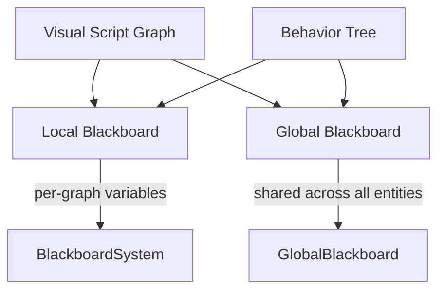

# Blackboard Architecture

The **Blackboard System** (`BlackboardSystem`) is a unified state container used by AI graphs to share named variables between nodes.

## Overview



## BlackboardType

```cpp
enum class BlackboardType : uint8_t {
    Int = 0,
    Float,
    Bool,
    String,
    Vector3
};
```

## BlackboardValue

```cpp
struct BlackboardValue {
    BlackboardType type;
    int    intValue;
    float  floatValue;
    bool   boolValue;
    std::string stringValue;
    float  vec3X, vec3Y, vec3Z;
};
```

## BlackboardSystem API

```cpp
// Set values
bb.SetInt("score", 100);
bb.SetFloat("speed", 3.5f);
bb.SetBool("isAlerted", true);
bb.SetString("state", "patrol");

// Get values
int score = bb.GetInt("score");
bool alerted = bb.GetBool("isAlerted");

// Check existence
if (bb.HasKey("health")) { ... }

// Serialization
nlohmann::json j = bb.Serialize();
bb.Deserialize(j);
```

## Global Blackboard

The `GlobalBlackboard` (Phase 2) stores variables shared across **all** entities:

```cpp
// Access global blackboard
auto& global = GlobalBlackboard::GetInstance();
global.SetFloat("game_time", elapsed);
```

Global variables are defined in `Config/global_blackboard.json`:

```json
{
  "variables": [
    { "key": "game_time",    "type": "float",  "value": 0.0 },
    { "key": "player_alive", "type": "bool",   "value": true }
  ]
}
```

## Condition Presets

Condition presets (Phase 24) are reusable condition groups embedded directly in graph JSON (v4 schema):

```json
{
  "presets": [
    {
      "id": "preset_001",
      "name": "PlayerNearby",
      "conditions": [
        {
          "leftPinID": "pin_health",
          "op": "<",
          "rightValue": 50
        }
      ]
    }
  ]
}
```

## Related

- [ECS Overview](ecs-overview)
- [Visual Scripting](../../user-guide/visual-scripting/visual-scripting-overview)
- [Task Execution](../../user-guide/visual-scripting/task-execution)
