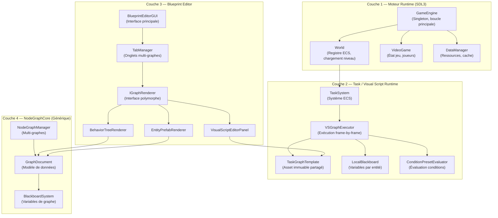
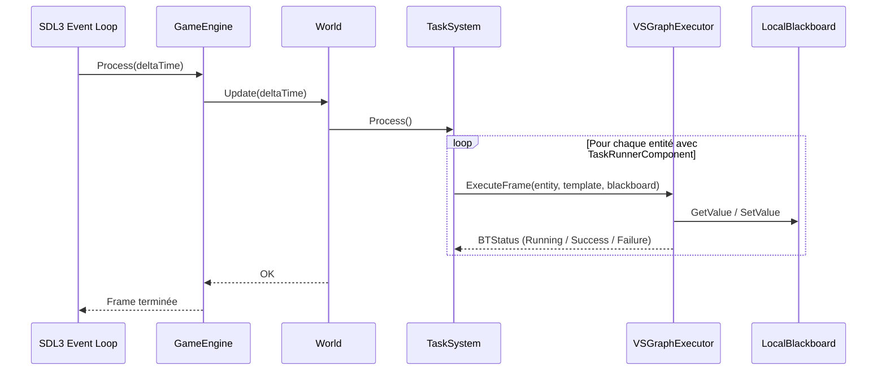
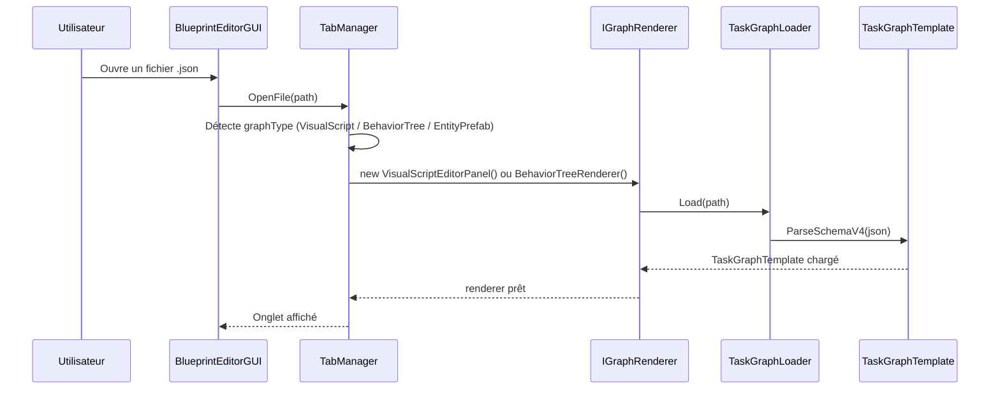
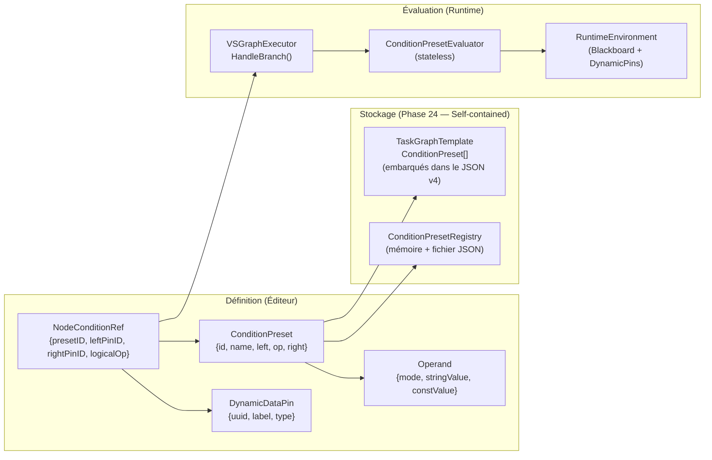
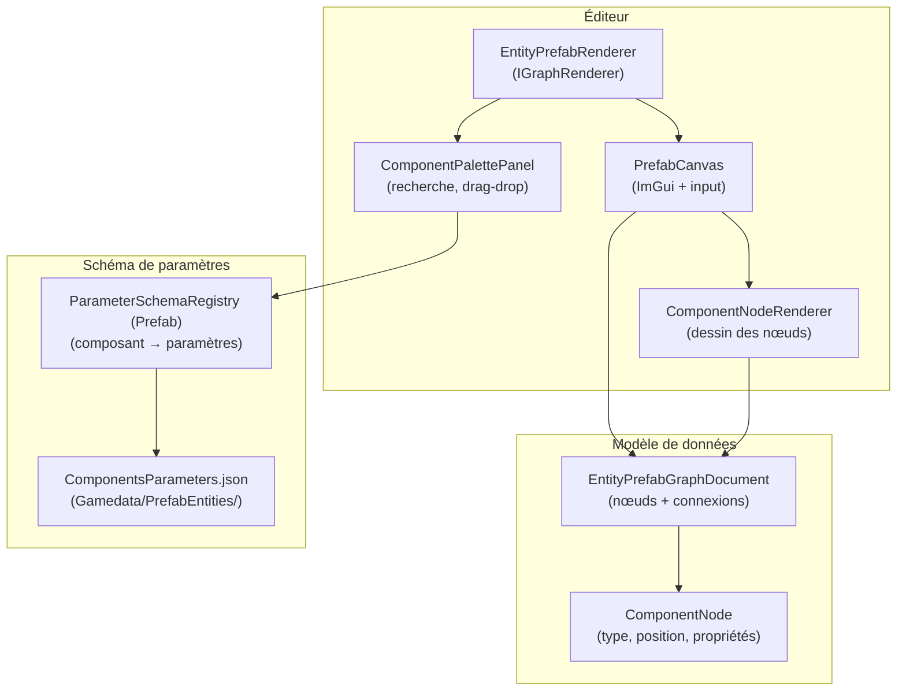
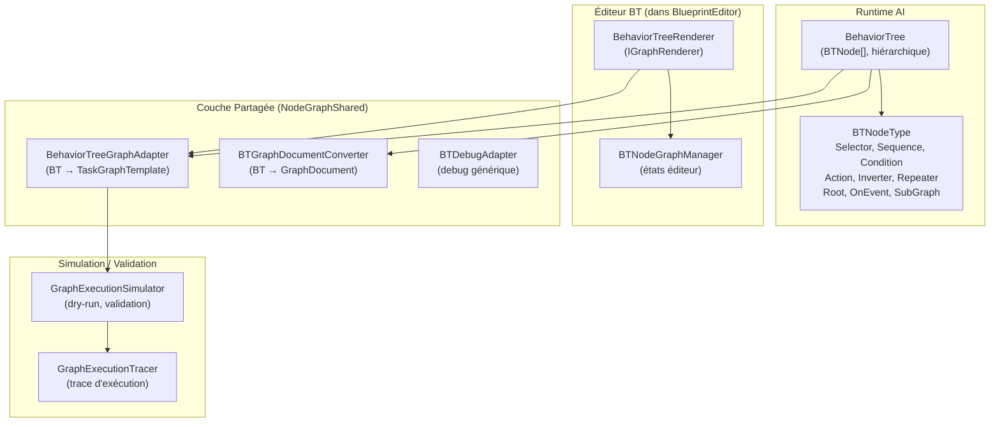
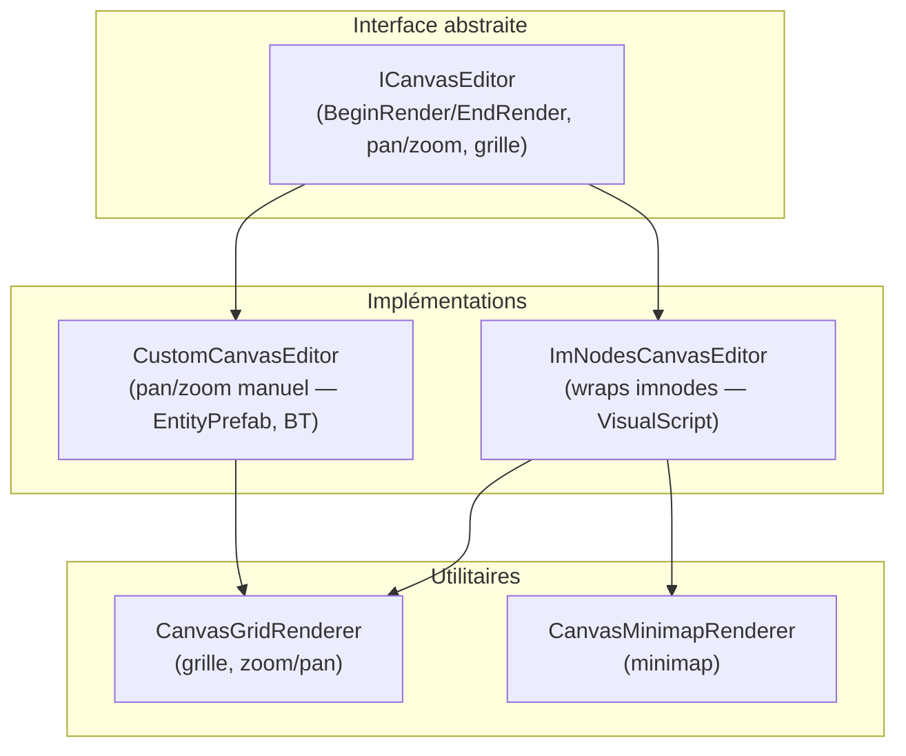

# Schéma Conceptuel de l'Architecture

Ce document présente l'organisation conceptuelle d'Olympe Engine en quatre couches indépendantes qui communiquent à travers des interfaces bien définies.

---

## Vue d'ensemble — Les 4 couches

---

## Flux principal : Boucle de jeu

---

## Flux éditeur : Ouverture d'un graphe

---

## Sous-système : Condition Preset (Phase 24)

---

## Sous-système : Entity Prefab Editor (Phases 27–29b)

---

## Sous-système : BehaviorTree (Runtime + Éditeur)

---

## Canvas standardisé (Phase 37)

