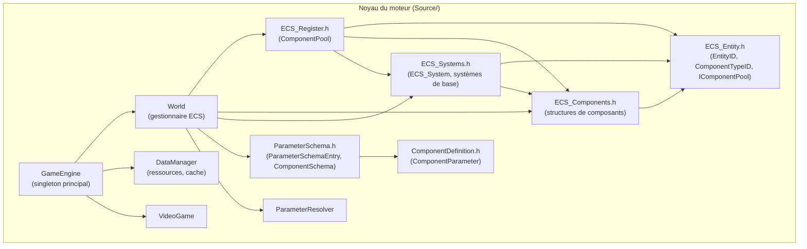
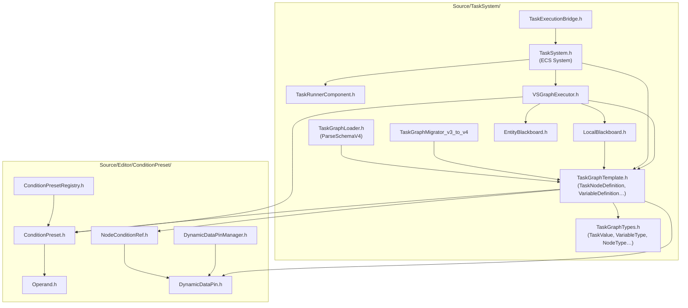
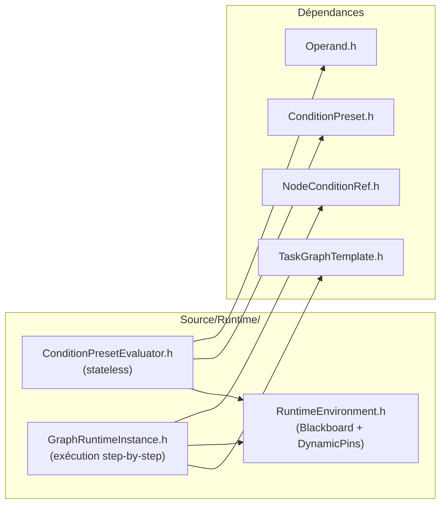
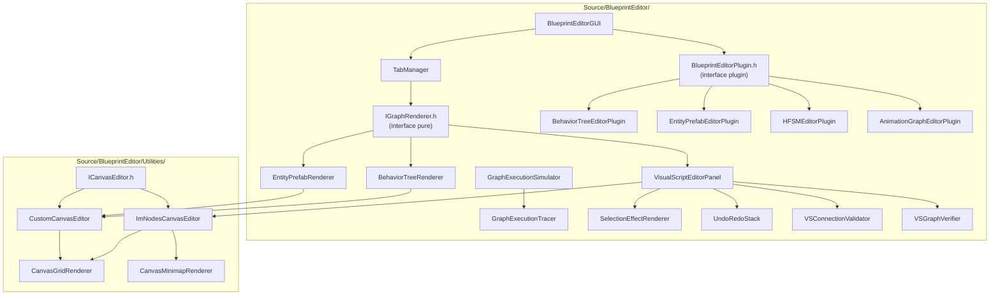
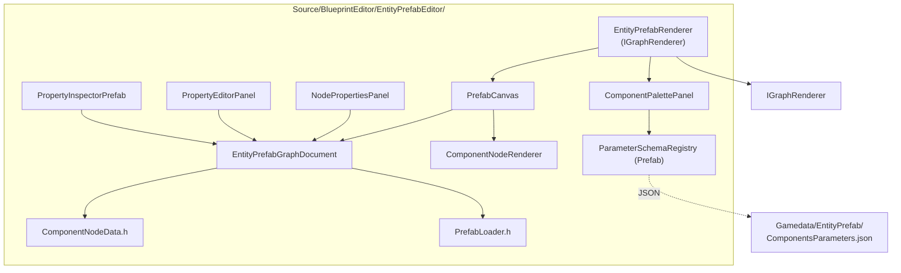
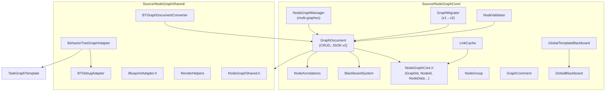
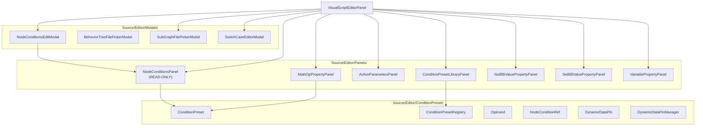
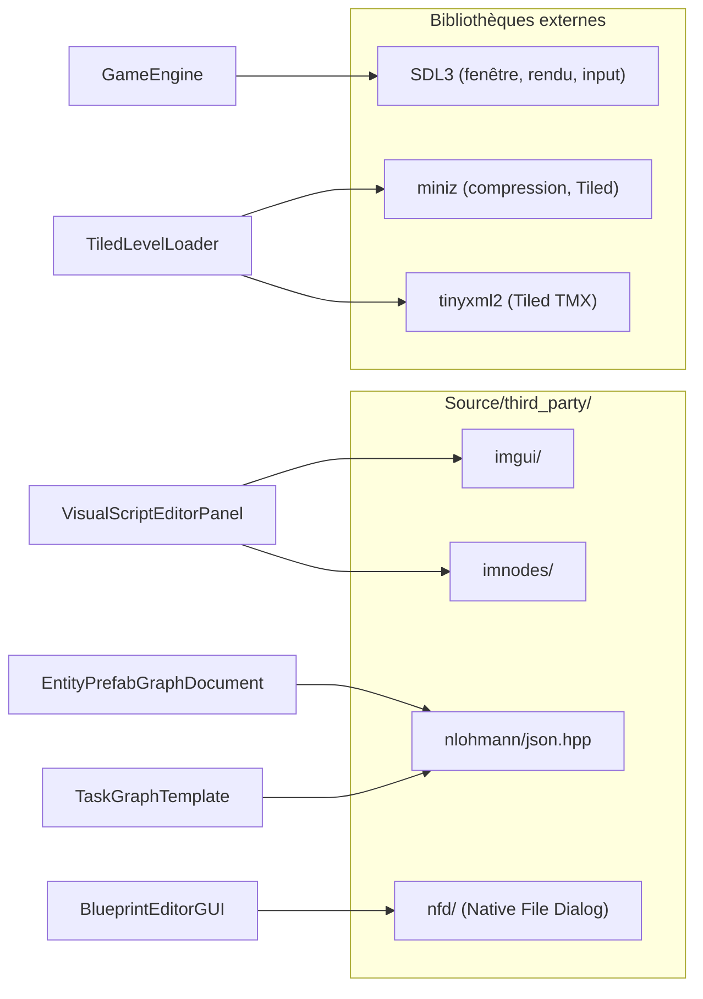
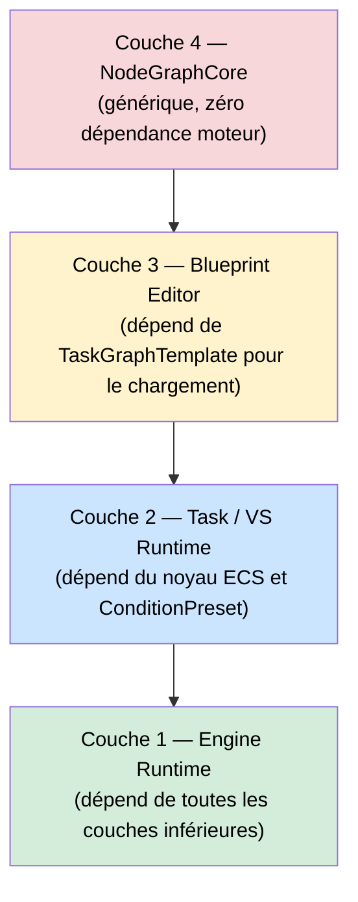

# Schéma de Dépendances des Modules

Ce document recense les dépendances entre les modules C++ du projet. Les flèches indiquent la direction de l'inclusion (`A → B` signifie que A dépend de B / inclut B).

:::note
Le projet cible le standard **C++14** partout. Il n'utilise pas `std::optional`, `std::variant`, les liaisons structurées ni `std::filesystem`.
:::

---

## Dépendances entre modules Source/

---

## Dépendances du TaskSystem (Couche 2)

---

## Dépendances du Runtime (Source/Runtime/)

---

## Dépendances du BlueprintEditor (Couche 3)

---

## Dépendances du sous-système Entity Prefab Editor

---

## Dépendances du NodeGraphCore (Couche 4)

---

## Dépendances de l'éditeur AI / Panels / Modals (Source/Editor/)

---

## Dépendances des librairies tierces

---

## Récapitulatif des dépendances descendantes par couche

| Module | Dépend de | Ne doit PAS dépendre de |
|---|---|---|
| `ECS_Entity.h` | *(rien)* | Tout le reste |
| `ECS_Components.h` | `ECS_Entity.h`, `DataManager`, SDL3 | Editor, Blueprint |
| `TaskGraphTypes.h` | *(rien)* | ECS, Editor, SDL3 |
| `TaskGraphTemplate.h` | `TaskGraphTypes`, `ConditionPreset`, `NodeConditionRef` | Editor UI, ImGui |
| `VSGraphExecutor` | `TaskGraphTemplate`, `LocalBlackboard`, `ConditionPresetEvaluator` | Editor UI, ImGui |
| `IGraphRenderer.h` | *(rien — interface pure)* | Runtime, ECS |
| `VisualScriptEditorPanel` | `TaskGraphTemplate`, `imnodes`, `imgui`, `ConditionPreset`, `ICanvasEditor` | `VSGraphExecutor` direct |
| `NodeGraphCore` | `json_helper.h`, `vector.h` | TaskSystem, ECS, Editor |
| `EntityPrefabEditor` | `imgui`, `nlohmann/json`, `ParameterSchemaRegistry` (prefab) | Runtime TaskSystem |

---

## Règle de dépendance stricte

:::caution Règle fondamentale
Les couches inférieures **ne doivent jamais** inclure de headers des couches supérieures. Par exemple, `TaskGraphTemplate.h` n'inclut aucun header ImGui ou éditeur. `VSGraphExecutor` n'appelle pas de fonctions de `VisualScriptEditorPanel`. Cette séparation garantit que la compilation runtime peut se faire sans les dépendances éditeur.
:::
