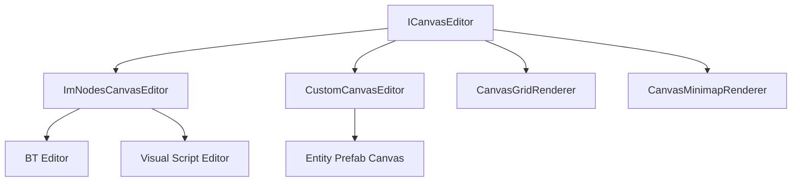

# Canvas System Overview

Olympe Engine uses a **standardized canvas system** (Phase 5) shared by all graph editors. All canvases implement the `ICanvasEditor` interface.

## Architecture



## ICanvasEditor Interface

The `ICanvasEditor` interface provides:
- `Pan(dx, dy)` – translate the viewport
- `Zoom(delta, centerX, centerY)` – scale with pivot point
- `ScreenToCanvas(screenX, screenY)` → canvas coords
- `CanvasToScreen(canvasX, canvasY)` → screen coords
- `GetZoom()` / `SetZoom()`
- `GetOffset()` / `SetOffset()`

## Coordinate Transformation

**Screen → Canvas:**
```
canvas = (screen - canvasOrigin - offset) / zoom
```

**Canvas → Screen:**
```
screen = canvas * zoom + offset + canvasOrigin
```

:::caution
Never multiply `offset` by `zoom` in the transformation — this was a critical bug fixed in Phase 29.
:::

## Grid Rendering

The `CanvasGridRenderer` draws a scalable grid overlay:
- Grid cells scale with zoom level
- Two grid levels: major (every 100 units) and minor (every 25 units)
- Grid pans with the canvas offset

## Related

- [Minimap System](minimap-system)
- [Coordinate Systems](coordinate-systems)
