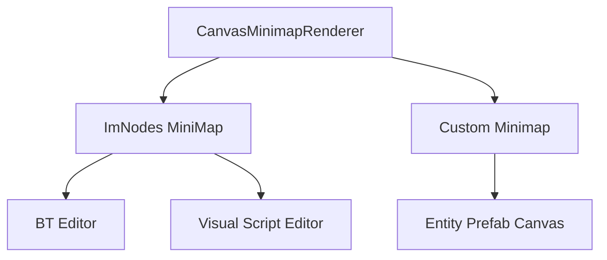

# Minimap System (Phase 37)

The **Centralized Minimap** (`CanvasMinimapRenderer`) provides a bird's-eye view for all graph editors.

## Overview



## Usage

```cpp
#include "Utilities/CanvasMinimapRenderer.h"

// In your canvas Render() call:
CanvasMinimapRenderer minimap;
minimap.SetPosition(MinimapPosition::BottomRight);
minimap.SetSize(0.15f); // 15% of canvas

minimap.Render(nodeList, viewport);
```

## Configuration

| Setting | Type | Default | Description |
|---------|------|---------|-------------|
| `position` | `MinimapPosition` | `BottomRight` | Corner placement |
| `size` | `float` | `0.2f` | Fraction of canvas area |
| `visible` | `bool` | `true` | Toggle visibility |
| `showViewport` | `bool` | `true` | Show viewport rectangle |

## MinimapPosition enum

```cpp
enum class MinimapPosition {
    TopLeft,
    TopRight,
    BottomLeft,
    BottomRight
};
```

## Normalized Coordinates

The minimap uses normalized [0..1] coordinates:
- All node positions are mapped from world-space to [0..1] range
- Viewport rectangle is similarly normalized
- ImGui draws the minimap using these normalized values

## ImNodes Integration

For ImNodes-based canvases (BT, Visual Script), the renderer wraps `ImNodes::MiniMap()`:

```cpp
ImNodes::MiniMap(minimapFraction, ImNodesMiniMapLocation_BottomRight);
```

## Custom Canvas Integration

For custom canvases (Entity Prefab), the renderer manually computes the minimap:

```cpp
// Compute bounds of all nodes
// Normalize positions to [0..1]
// Draw minimap background
// Draw node rectangles
// Draw viewport rectangle
```

## Related

- [Canvas Overview](canvas-overview)
- [Coordinate Systems](coordinate-systems)
