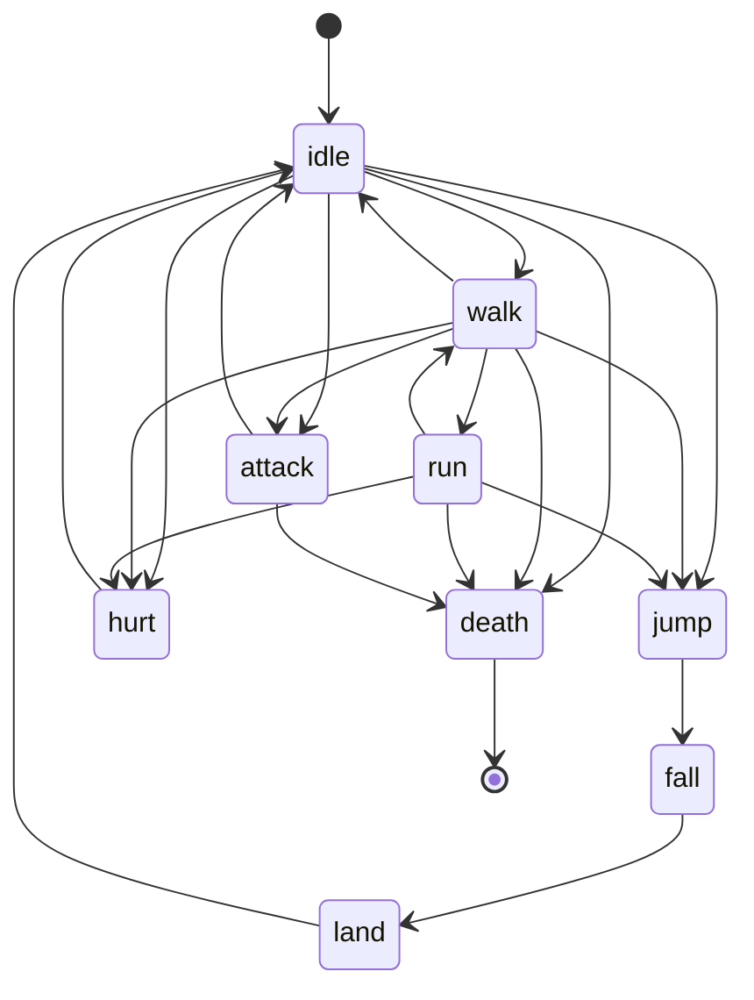
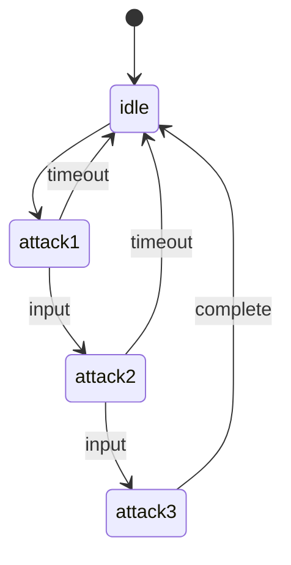
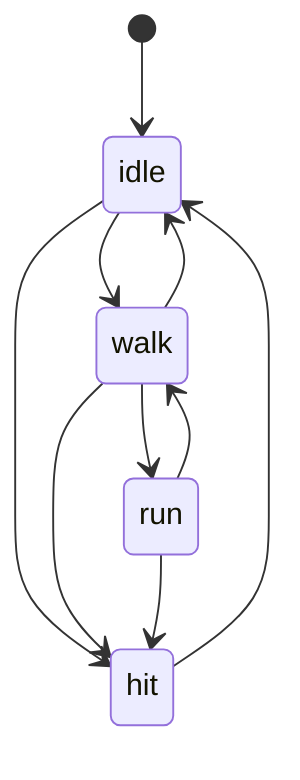

# Animation Graphs Reference

Animation graphs define finite state machines (FSM) that control animation flow and transitions. They ensure valid state changes and enable complex animation behaviors without code.

## Purpose of Animation Graphs

Animation graphs solve common animation control problems:

- **State Management**: Track what the character is doing (idle, walking, attacking)
- **Valid Transitions**: Prevent invalid animation switches (can't jump while dead)
- **Automatic Flow**: Chain animations together logically
- **Data-Driven**: Modify animation logic without recompiling
- **Integration**: Works seamlessly with Behavior Trees and game logic

### With vs Without Graphs

**Without Animation Graph** (manual control):
```cpp
// Fragile code - can easily create invalid states
if (isWalking && !isDead && !isAttacking) {
    PlayAnimation(entity, "walk");
} else if (isAttacking && !isDead) {
    PlayAnimation(entity, "attack");
} else if (isDead) {
    PlayAnimation(entity, "death");
}
// Easy to create bugs and invalid state combinations
```

**With Animation Graph** (state machine):
```cpp
// Robust state machine - only valid transitions allowed
AnimationSystem::TransitionToState(entity, "walk");  // Validated by FSM
AnimationSystem::TransitionToState(entity, "attack");  // Validated by FSM
```

The graph ensures only valid transitions occur.

## JSON Structure

```json
{
  "id": "string",
  "defaultState": "string",
  "states": [
    {
      "name": "string",
      "animation": "string",
      "transitions": [
        { "to": "string", "condition": "optional" }
      ]
    }
  ]
}
```

## Top-Level Properties

### id (required)

**Type**: `string`  
**Purpose**: Unique identifier for this animation graph

Used to reference the graph in:
- `VisualAnimation_data.graphId` component field
- `AnimationManager.GetGraph(id)` API calls
- Debug logs and state machine validation

**Rules**:
- Must be unique across all loaded graphs
- Case-sensitive
- Use alphanumeric characters and underscores
- Convention: append `_fsm` or `_animgraph`

**Examples**:
```json
"id": "player_fsm"           // Good: Clear purpose
"id": "enemy_goblin_fsm"     // Good: Specific entity type
"id": "boss_dragon_phase1_animgraph"  // Good: Detailed
"id": "states"               // Bad: Too generic
```

### defaultState (required)

**Type**: `string`  
**Purpose**: Starting state when entity is created

This state is automatically entered when:
- Entity is instantiated from a prefab
- Animation graph is first attached to an entity
- Animation system is reset

**Rules**:
- Must match a state `name` in the `states` array
- Should represent the idle/neutral state
- Typically `"idle"` for characters

**Examples**:
```json
"defaultState": "idle"       // Most common
"defaultState": "sleep"      // For NPCs that start sleeping
"defaultState": "closed"     // For doors, chests
"defaultState": "patrol"     // For enemies
```

### states (required)

**Type**: `array`  
**Purpose**: List of all states in the FSM

Each state represents a discrete animation state the entity can be in.

**Minimum**: 1 state (though typically 3+ for useful FSM)

## State Properties

### name (required)

**Type**: `string`  
**Purpose**: Unique identifier for this state

Used to:
- Transition to state: `TransitionToState(entity, "walk")`
- Reference in code and behavior trees
- Set as `defaultState`

**Rules**:
- Must be unique within this graph
- Case-sensitive
- Use descriptive names matching animation purpose

**Common State Names**:
```json
"name": "idle"       // Standing still
"name": "walk"       // Walking
"name": "run"        // Running
"name": "jump"       // Jumping
"name": "fall"       // Falling
"name": "land"       // Landing from fall
"name": "attack"     // Attacking
"name": "attack1"    // First attack in combo
"name": "hurt"       // Taking damage
"name": "death"      // Dead
"name": "cast"       // Casting spell
"name": "block"      // Blocking
```

### animation (required)

**Type**: `string`  
**Purpose**: Animation name to play when in this state

Must reference a valid animation in the linked animation bank.

**Example**:
```json
{
  "name": "walk",
  "animation": "walk"  // Plays the "walk" animation from the bank
}
```

**Common Patterns**:

**1:1 Mapping** (state name matches animation name):
```json
{ "name": "idle", "animation": "idle" }
{ "name": "walk", "animation": "walk" }
{ "name": "run", "animation": "run" }
```

**Different Names** (for clarity or multiple states using same animation):
```json
{ "name": "patrol_idle", "animation": "idle" }
{ "name": "combat_idle", "animation": "idle_combat_stance" }
{ "name": "victory", "animation": "idle_happy" }
```

**Directional Variants**:
```json
{ "name": "walk_north", "animation": "walk_n" }
{ "name": "walk_south", "animation": "walk_s" }
{ "name": "walk_east", "animation": "walk_e" }
{ "name": "walk_west", "animation": "walk_w" }
```

### transitions (required)

**Type**: `array`  
**Purpose**: List of valid state transitions from this state

Defines which states can be entered from the current state.

**Empty Array**: State is terminal (cannot transition out)
```json
{
  "name": "death",
  "animation": "death",
  "transitions": []  // Can't leave death state
}
```

**Multiple Transitions**: State can go to several other states
```json
{
  "name": "idle",
  "animation": "idle",
  "transitions": [
    { "to": "walk" },
    { "to": "run" },
    { "to": "jump" },
    { "to": "attack" },
    { "to": "hurt" }
  ]
}
```

## Transition Properties

### to (required)

**Type**: `string`  
**Purpose**: Target state name

**Rules**:
- Must reference a valid state `name` in this graph
- Can transition to self (useful for restarting animations)
- Validated on graph load

**Examples**:
```json
{ "to": "walk" }           // Transition to walk state
{ "to": "idle" }           // Transition to idle state
{ "to": "attack" }         // Transition to attack state
```

### condition (optional)

**Type**: `string`  
**Purpose**: Runtime condition that must be true for transition

**Note**: Conditions are currently **not validated automatically** by the engine. Your game code must check conditions before calling `TransitionToState()`.

**Usage Pattern**:
```json
{
  "name": "idle",
  "animation": "idle",
  "transitions": [
    { "to": "walk", "condition": "velocity > 0" },
    { "to": "jump", "condition": "input.jump && grounded" },
    { "to": "attack", "condition": "input.attack" }
  ]
}
```

**Game Code**:
```cpp
// You must check conditions in your game logic
if (velocity.Length() > 0.0f) {
    AnimationSystem::TransitionToState(entity, "walk");
}
```

The `condition` field serves as **documentation** and can be used for:
- Visual editors (Blueprint editor, FSM visualizer)
- Code generation tools
- Designer reference

## Transition Rules and Validation

### Rule 1: States must exist

All `to` references must point to valid state names.

**Invalid**:
```json
{
  "name": "idle",
  "transitions": [
    { "to": "wlak" }  // Typo! "walk" doesn't exist
  ]
}
```

**Result**: Loading error, graph rejected.

### Rule 2: Self-transitions are allowed

A state can transition to itself.

**Valid**:
```json
{
  "name": "idle",
  "animation": "idle",
  "transitions": [
    { "to": "idle" },  // Can restart idle animation
    { "to": "walk" }
  ]
}
```

**Use Case**: Restart a non-looping animation from the beginning.

### Rule 3: Circular paths are allowed

States can form cycles.

**Valid**:
```json
[
  {
    "name": "A",
    "transitions": [{ "to": "B" }]
  },
  {
    "name": "B",
    "transitions": [{ "to": "C" }]
  },
  {
    "name": "C",
    "transitions": [{ "to": "A" }]  // Back to A
  }
]
```

### Rule 4: Unreachable states are warnings

If a state has no incoming transitions and isn't the default state, it's unreachable.

**Warning**:
```json
{
  "defaultState": "idle",
  "states": [
    { "name": "idle", "transitions": [{ "to": "walk" }] },
    { "name": "walk", "transitions": [{ "to": "idle" }] },
    { "name": "secret", "transitions": [] }  // No way to reach "secret"
  ]
}
```

**Console**: `[AnimationManager] Warning: State 'secret' is unreachable`

## State Diagram Examples

### Example 1: Simple Character FSM



**JSON**:
```json
{
  "id": "character_fsm",
  "defaultState": "idle",
  "states": [
    {
      "name": "idle",
      "animation": "idle",
      "transitions": [
        { "to": "walk" },
        { "to": "jump" },
        { "to": "attack" },
        { "to": "hurt" },
        { "to": "death" }
      ]
    },
    {
      "name": "walk",
      "animation": "walk",
      "transitions": [
        { "to": "idle" },
        { "to": "run" },
        { "to": "jump" },
        { "to": "attack" },
        { "to": "hurt" },
        { "to": "death" }
      ]
    },
    {
      "name": "run",
      "animation": "run",
      "transitions": [
        { "to": "walk" },
        { "to": "jump" },
        { "to": "hurt" },
        { "to": "death" }
      ]
    },
    {
      "name": "jump",
      "animation": "jump",
      "transitions": [
        { "to": "fall" }
      ]
    },
    {
      "name": "fall",
      "animation": "fall",
      "transitions": [
        { "to": "land" }
      ]
    },
    {
      "name": "land",
      "animation": "land",
      "transitions": [
        { "to": "idle" }
      ]
    },
    {
      "name": "attack",
      "animation": "attack",
      "transitions": [
        { "to": "idle" },
        { "to": "death" }
      ]
    },
    {
      "name": "hurt",
      "animation": "hurt",
      "transitions": [
        { "to": "idle" }
      ]
    },
    {
      "name": "death",
      "animation": "death",
      "transitions": []
    }
  ]
}
```

### Example 2: Combat Combo Chain



**JSON**:
```json
{
  "id": "combat_combo_fsm",
  "defaultState": "idle",
  "states": [
    {
      "name": "idle",
      "animation": "idle",
      "transitions": [
        { "to": "attack1", "condition": "input.attack" }
      ]
    },
    {
      "name": "attack1",
      "animation": "attack1",
      "transitions": [
        { "to": "attack2", "condition": "input.attack && combo_window" },
        { "to": "idle", "condition": "animation_complete" }
      ]
    },
    {
      "name": "attack2",
      "animation": "attack2",
      "transitions": [
        { "to": "attack3", "condition": "input.attack && combo_window" },
        { "to": "idle", "condition": "animation_complete" }
      ]
    },
    {
      "name": "attack3",
      "animation": "attack3",
      "transitions": [
        { "to": "idle", "condition": "animation_complete" }
      ]
    }
  ]
}
```

**Game Logic**:
```cpp
void HandleCombatInput(ECS_Entity player)
{
    auto& anim = World::Get().GetComponent<VisualAnimation_data>(player);
    
    if (InputManager::Get().IsActionPressed("attack"))
    {
        if (anim.currentStateName == "idle")
        {
            AnimationSystem::Get().TransitionToState(player, "attack1");
        }
        else if (anim.currentStateName == "attack1" && IsInComboWindow())
        {
            AnimationSystem::Get().TransitionToState(player, "attack2");
        }
        else if (anim.currentStateName == "attack2" && IsInComboWindow())
        {
            AnimationSystem::Get().TransitionToState(player, "attack3");
        }
    }
    
    // Auto-return to idle after combo finishes
    if (anim.currentStateName.find("attack") != std::string::npos)
    {
        if (anim.currentFrame == anim.totalFrames - 1 && !IsInComboWindow())
        {
            AnimationSystem::Get().TransitionToState(player, "idle");
        }
    }
}
```

### Example 3: Thésée FSM (Tutorial)



**JSON**:
```json
{
  "id": "thesee_fsm",
  "defaultState": "idle",
  "states": [
    {
      "name": "idle",
      "animation": "idle",
      "transitions": [
        { "to": "walk" },
        { "to": "run" },
        { "to": "hit" }
      ]
    },
    {
      "name": "walk",
      "animation": "walk",
      "transitions": [
        { "to": "idle" },
        { "to": "run" },
        { "to": "hit" }
      ]
    },
    {
      "name": "run",
      "animation": "run",
      "transitions": [
        { "to": "walk" },
        { "to": "idle" },
        { "to": "hit" }
      ]
    },
    {
      "name": "hit",
      "animation": "hit",
      "transitions": [
        { "to": "idle" }
      ]
    }
  ]
}
```

## Integration with Behavior Trees

Animation graphs work seamlessly with Behavior Tree AI:

### Behavior Tree Node Example

```json
{
  "type": "Sequence",
  "children": [
    {
      "type": "ChangeAnimationState",
      "stateName": "patrol"
    },
    {
      "type": "FollowPath",
      "path": "patrol_route"
    }
  ]
}
```

### Custom BT Action Node

```cpp
class ChangeAnimationStateAction : public BT_Node
{
    std::string m_stateName;
    
public:
    BT_Status Execute(ECS_Entity entity) override
    {
        if (AnimationSystem::Get().TransitionToState(entity, m_stateName))
        {
            return BT_Status::SUCCESS;
        }
        return BT_Status::FAILURE;  // Invalid transition
    }
};
```

### AI Behavior Pattern

```cpp
void EnemyAI::Update(ECS_Entity enemy)
{
    // Behavior tree controls animation state
    if (CanSeePlayer())
    {
        AnimationSystem::Get().TransitionToState(enemy, "alert");
        // ... alert behavior
        AnimationSystem::Get().TransitionToState(enemy, "chase");
    }
    else
    {
        AnimationSystem::Get().TransitionToState(enemy, "patrol");
    }
}
```

## Dynamic State Switching at Runtime

### Basic Transition

```cpp
#include "ECS_Systems_Animation.h"

// Switch to walk state
bool success = AnimationSystem::Get().TransitionToState(entity, "walk");

if (success) {
    std::cout << "Transitioned to walk" << std::endl;
} else {
    std::cout << "Invalid transition to walk" << std::endl;
}
```

### State-Based Logic

```cpp
void UpdatePlayerAnimation(ECS_Entity player, Vector velocity)
{
    auto& anim = World::Get().GetComponent<VisualAnimation_data>(player);
    
    float speed = velocity.Length();
    
    // State-based animation switching
    if (speed < 0.1f)
    {
        if (anim.currentStateName != "idle")
        {
            AnimationSystem::Get().TransitionToState(player, "idle");
        }
    }
    else if (speed < 200.0f)
    {
        if (anim.currentStateName != "walk")
        {
            AnimationSystem::Get().TransitionToState(player, "walk");
        }
    }
    else
    {
        if (anim.currentStateName != "run")
        {
            AnimationSystem::Get().TransitionToState(player, "run");
        }
    }
}
```

### Forced Transitions

```cpp
// For cutscenes or special events, bypass FSM validation
void ForceCutsceneAnimation(ECS_Entity actor)
{
    auto& anim = World::Get().GetComponent<VisualAnimation_data>(actor);
    
    // Temporarily disable graph validation
    anim.graphId = "";  // Detach from FSM
    
    AnimationSystem::Get().PlayAnimation(actor, "cutscene_animation", true);
    
    // Re-attach FSM after cutscene
    // anim.graphId = "character_fsm";
}
```

## Best Practices

### 1. Design Clear State Hierarchies

**Good**:
```
idle → walk → run (speed-based progression)
idle → attack → idle (clean attack loop)
any → hurt → idle (interrupt pattern)
any → death (terminal state)
```

**Bad**:
```
idle ↔ walk ↔ run ↔ attack (too interconnected)
death → idle (can't resurrect easily)
```

### 2. Use Terminal States

```json
{
  "name": "death",
  "animation": "death",
  "transitions": []  // Terminal - no way out
}
```

Resurrection requires resetting the entire component.

### 3. Document Conditions

Even though conditions aren't validated, document them:

```json
{
  "to": "jump",
  "condition": "input.jump_pressed && is_grounded && !is_stunned"
}
```

This helps designers and programmers understand the FSM.

### 4. Avoid Deep Nesting

**Bad** (too many intermediate states):
```
idle → walk_start → walk → walk_end → idle
```

**Good** (direct transitions):
```
idle → walk → idle
```

Use animation `nextAnimation` for automatic chaining instead.

### 5. Group Related States

For large FSMs, use naming conventions:

```json
"combat_idle"
"combat_attack1"
"combat_attack2"
"combat_block"

"movement_idle"
"movement_walk"
"movement_run"
```

## Complete Example: Thésée FSM

File: `Gamedata/Animations/AnimationGraphs/thesee_animgraph.json`

```json
{
  "id": "thesee_fsm",
  "defaultState": "idle",
  "states": [
    {
      "name": "idle",
      "animation": "idle",
      "transitions": [
        { "to": "walk", "condition": "velocity > 0 && velocity < 150" },
        { "to": "run", "condition": "velocity >= 150" },
        { "to": "hit", "condition": "taking_damage" }
      ]
    },
    {
      "name": "walk",
      "animation": "walk",
      "transitions": [
        { "to": "idle", "condition": "velocity == 0" },
        { "to": "run", "condition": "velocity >= 150" },
        { "to": "hit", "condition": "taking_damage" }
      ]
    },
    {
      "name": "run",
      "animation": "run",
      "transitions": [
        { "to": "walk", "condition": "velocity < 150 && velocity > 0" },
        { "to": "idle", "condition": "velocity == 0" },
        { "to": "hit", "condition": "taking_damage" }
      ]
    },
    {
      "name": "hit",
      "animation": "hit",
      "transitions": [
        { "to": "idle", "condition": "animation_complete" }
      ]
    }
  ]
}
```

## See Also

- [Quick Start Guide](animation-system-quick-start.md) - Tutorial with Thésée FSM
- [Animation Banks Reference](animation-banks.md) - Define animations referenced by states
- [Examples Gallery](examples.md) - More FSM examples
- [API Reference](../../technical-reference/animation/api-reference.md) - AnimationSystem API
