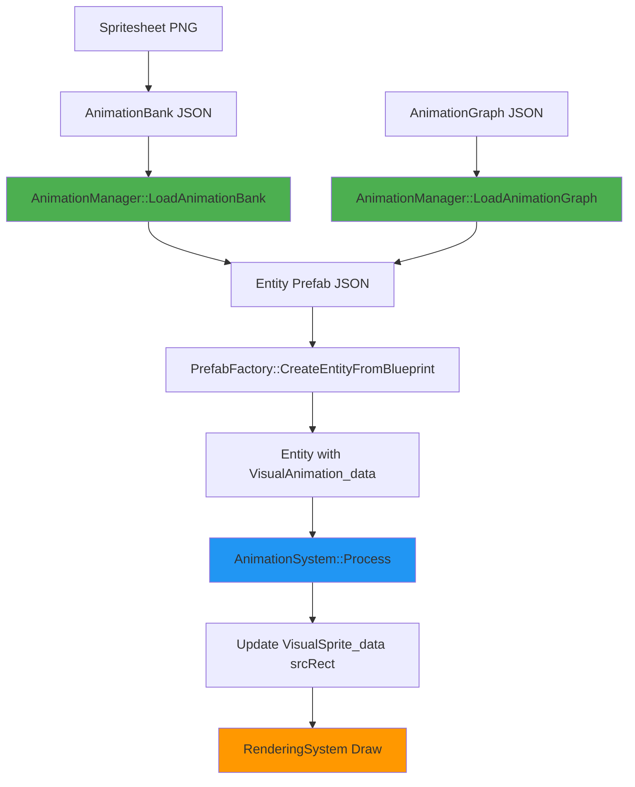

# Animation System Overview

The Olympe Engine Animation System provides a complete solution for 2D sprite animation, featuring spritesheet support, finite state machines (FSM), and seamless ECS integration.

## What is the Animation System?

The Animation System is a data-driven framework that allows you to:

- **Define animations** using JSON configuration files
- **Control playback** through spritesheet-based frame sequences
- **Manage states** with finite state machines (FSM)
- **Integrate seamlessly** with the ECS architecture
- **Create complex behaviors** without writing animation code

The system is designed to be artist-friendly and designer-friendly, requiring no code for most animation tasks.

## Key Features

### 1. Spritesheet Support

- **Multi-spritesheet** animations (different sprites per animation)
- **Flexible frame definition** (ranges or explicit frames)
- **Customizable timing** (per-frame or per-animation duration)
- **Frame events** (trigger sounds, effects, or gameplay logic)
- **Hot spots** for precise pivot points

### 2. Animation Banks

Animation banks are JSON files that define:
- Spritesheet locations and dimensions
- Frame calculations (columns, spacing, margins)
- Animation sequences with names and properties
- Loop behavior and playback speed
- Transitions between animations

### 3. Animation Graphs (FSM)

Finite state machines control animation flow:
- **States** correspond to animations (idle, walk, run, attack)
- **Transitions** define valid state changes
- **Default state** for initialization
- **Runtime switching** based on game logic
- **Integration** with Behavior Trees

### 4. ECS Integration

The system uses standard ECS patterns:
- `VisualAnimation_data` component stores animation state
- `AnimationSystem` updates frames each tick
- `AnimationManager` handles resource loading
- Compatible with `VisualSprite_data` for rendering

### 5. Performance

- **O(1) lookups** for animations and banks
- **Cache-friendly** data structures
- **Minimal overhead** per animated entity
- **Shared resources** (spritesheets, sequences)
- **Delta-time based** for frame-rate independence

## Architecture Diagram

### Component Interaction

- **AnimationManager** (Singleton): Loads and stores animation data from JSON files
- **AnimationSystem** (ECS System): Updates animation state each frame
- **AnimationBank**: Contains animation sequences for a character/object
- **AnimationGraph**: Defines state machine transitions between animations

## When to Use Animations vs Static Sprites

### Use the Animation System When:

- Entity has **multiple visual states** (idle, walk, attack)
- You need **frame-by-frame playback** from spritesheets
- Animations should **loop** or **chain** together
- You want **data-driven** configuration without code
- Visual behavior changes **based on game state**

### Use Static Sprites When:

- Entity has a **single, unchanging visual**
- No frame playback is needed
- Sprite changes are rare and code-driven
- Maximum performance is critical (thousands of entities)

### Example Scenarios

| Use Case | Recommendation |
|----------|---------------|
| Player character with walk/run/jump | ✅ Animation System |
| Enemy with idle/patrol/attack | ✅ Animation System |
| Static tree decoration | ❌ Static sprite |
| Coin pickup with spin animation | ✅ Animation System |
| UI button (hover/pressed states) | ❌ Static sprite (code-driven) |
| Torch with flame animation | ✅ Animation System |
| Background tile | ❌ Static sprite |

## Performance Considerations

### Memory

- **Shared spritesheets**: Multiple entities share the same texture in memory
- **Shared sequences**: Animation frame data shared across instances
- **Component overhead**: ~100 bytes per `VisualAnimation_data` component

### CPU

- **Frame updates**: O(1) per entity per frame
- **Texture lookups**: Cached pointers, no string lookups at runtime
- **Rendering**: Same cost as static sprites (one draw call per entity)

### Best Practices

1. **Batch animations**: Group related animations in the same bank
2. **Optimize spritesheets**: Use texture atlases, power-of-2 dimensions
3. **Limit frame count**: Keep animations under 30 frames when possible
4. **Use frame ranges**: More efficient than explicit frame lists
5. **Share banks**: Multiple entity types can reference the same bank

### Scalability

The system is designed to handle:
- **100+ animated entities** at 60 FPS without issue
- **10+ animation banks** loaded simultaneously
- **5+ animation graphs** for different entity types
- Spritesheets up to **4096×4096** pixels (hardware dependent)

## Quick Links

- [Quick Start Guide](animation-system-quick-start.md) - Get started with your first animation
- [Animation Banks Reference](animation-banks.md) - JSON format specification
- [Animation Graphs Reference](animation-graphs.md) - FSM configuration
- [Examples Gallery](examples.md) - Practical code examples
- [Troubleshooting Guide](troubleshooting.md) - Common issues and solutions
- [Technical Reference](../../technical-reference/animation/animation-system.md) - Architecture deep-dive
- [API Reference](../../technical-reference/animation/api-reference.md) - Complete API documentation

## Next Steps

Ready to create your first animation? Start with the [Quick Start Guide](animation-system-quick-start.md) for a step-by-step tutorial using the Thésée character example.
