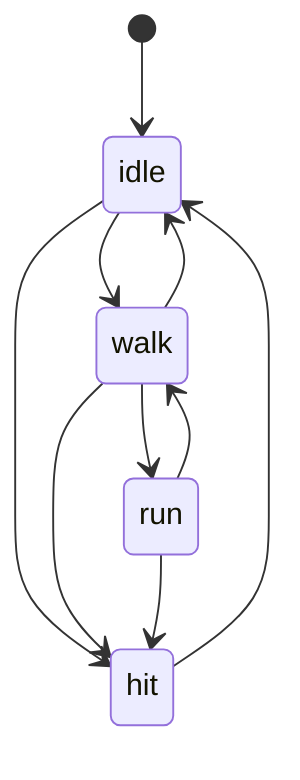

# Animation System Quick Start

This tutorial will guide you through creating a complete animated character from scratch using the Thésée character as an example. By the end, you'll have a character with idle, walk, run, and hit animations controlled by a finite state machine.

## Prerequisites

- Olympe Engine installed and running
- Basic understanding of JSON format
- Image editing software (for measuring spritesheets)
- Sample spritesheet file (`thesee_spritesheet.png`)

## Step 1: Prepare Your Spritesheet

### Analyze Spritesheet Dimensions

First, open your spritesheet in an image editor and note:

- **Total image size**: e.g., 512×256 pixels
- **Frame size**: e.g., 64×64 pixels per frame
- **Columns**: Number of frames horizontally (e.g., 8)
- **Rows**: Number of animation rows (e.g., 4)
- **Spacing**: Pixels between frames (e.g., 0)
- **Margin**: Border pixels around the grid (e.g., 0)

### Example: Thésée Spritesheet Layout

```
thesee_spritesheet.png (512×256)
┌────────────────────────────────────┐
│ Frame size: 64×64                  │
│ Columns: 8                         │
│ Rows: 4                            │
│                                    │
│ Row 0: Idle (8 frames)            │
│ Row 1: Walk (8 frames)            │
│ Row 2: Run (8 frames)             │
│ Row 3: Hit (4 frames + padding)   │
└────────────────────────────────────┘
```

### Place Spritesheet in Gamedata

Copy your spritesheet to:
```
Gamedata/Sprites/Characters/thesee_spritesheet.png
```

The path is relative to the executable, so ensure it's in the correct location.

## Step 2: Create Animation Bank JSON

Create `Gamedata/Animations/AnimationBanks/thesee_animations.json`:

```json
{
  "id": "thesee",
  "spritesheetPath": "Gamedata/Sprites/Characters/thesee_spritesheet.png",
  "frameWidth": 64,
  "frameHeight": 64,
  "columns": 8,
  "spacing": 0,
  "margin": 0,
  "animations": [
    {
      "name": "idle",
      "loop": true,
      "speed": 1.0,
      "frameRange": {
        "start": 0,
        "end": 7,
        "frameDuration": 0.1
      }
    },
    {
      "name": "walk",
      "loop": true,
      "speed": 1.0,
      "frameRange": {
        "start": 8,
        "end": 15,
        "frameDuration": 0.08
      }
    },
    {
      "name": "run",
      "loop": true,
      "speed": 1.0,
      "frameRange": {
        "start": 16,
        "end": 23,
        "frameDuration": 0.06
      }
    },
    {
      "name": "hit",
      "loop": false,
      "speed": 1.0,
      "nextAnimation": "idle",
      "frameRange": {
        "start": 24,
        "end": 27,
        "frameDuration": 0.1
      }
    }
  ]
}
```

### Understanding the Bank

- **id**: Unique identifier for this animation bank (`"thesee"`)
- **spritesheetPath**: Relative path to the PNG file
- **frameWidth/Height**: Size of each frame in pixels
- **columns**: Number of frames per row
- **spacing/margin**: Layout adjustments (0 if frames are tightly packed)
- **animations**: Array of animation definitions

### Animation Properties

Each animation has:
- **name**: Animation identifier (used in code and graphs)
- **loop**: Whether to repeat (true) or play once (false)
- **speed**: Playback speed multiplier (1.0 = normal)
- **nextAnimation**: Auto-transition when done (optional, for non-looping anims)
- **frameRange**: Defines which frames to use

### Frame Range Calculation

Frames are numbered left-to-right, top-to-bottom:
- Row 0, Column 0 = Frame 0
- Row 0, Column 7 = Frame 7
- Row 1, Column 0 = Frame 8
- Row 3, Column 3 = Frame 27

Formula: `frameIndex = row × columns + column`

## Step 3: Create Animation Graph JSON

Create `Gamedata/Animations/AnimationGraphs/thesee_animgraph.json`:

```json
{
  "id": "thesee_fsm",
  "defaultState": "idle",
  "states": [
    {
      "name": "idle",
      "animation": "idle",
      "transitions": [
        { "to": "walk" },
        { "to": "run" },
        { "to": "hit" }
      ]
    },
    {
      "name": "walk",
      "animation": "walk",
      "transitions": [
        { "to": "idle" },
        { "to": "run" },
        { "to": "hit" }
      ]
    },
    {
      "name": "run",
      "animation": "run",
      "transitions": [
        { "to": "walk" },
        { "to": "idle" },
        { "to": "hit" }
      ]
    },
    {
      "name": "hit",
      "animation": "hit",
      "transitions": [
        { "to": "idle" }
      ]
    }
  ]
}
```

### Understanding the Graph



- **defaultState**: Starting state when entity is created
- **states**: Array of FSM states
- **transitions**: Valid state changes (runtime validation)

The graph ensures only valid transitions occur. For example, you cannot go directly from `idle` to `run` without transitioning through `walk` (though in this example, we allow it for flexibility).

## Step 4: Create Entity Prefab

Create `Gamedata/Blueprints/Characters/thesee.json`:

```json
{
  "version": "1.0",
  "name": "Thésée Character",
  "description": "Animated player character with idle, walk, run, and hit animations",
  "components": {
    "VisualSprite_data": {
      "texturePath": "Gamedata/Sprites/Characters/thesee_spritesheet.png",
      "srcRect": { "x": 0, "y": 0, "w": 64, "h": 64 },
      "dstRect": { "x": 0, "y": 0, "w": 64, "h": 64 },
      "drawLayer": 5,
      "visible": true,
      "flipX": false,
      "flipY": false
    },
    "VisualAnimation_data": {
      "bankId": "thesee",
      "graphId": "thesee_fsm",
      "currentAnimName": "idle",
      "currentFrame": 0,
      "elapsedTime": 0.0,
      "isPlaying": true,
      "loop": true,
      "playbackSpeed": 1.0,
      "autoStart": true
    },
    "Transform_data": {
      "position": { "x": 400, "y": 300 },
      "scale": { "x": 2.0, "y": 2.0 },
      "rotation": 0.0
    },
    "Physics_data": {
      "velocity": { "x": 0, "y": 0 },
      "acceleration": { "x": 0, "y": 0 },
      "mass": 1.0,
      "drag": 0.1
    }
  }
}
```

### Key Component: VisualAnimation_data

- **bankId**: Links to `thesee_animations.json` (must match bank `id`)
- **graphId**: Links to `thesee_animgraph.json` (optional, for FSM control)
- **currentAnimName**: Starting animation (should match `defaultState` in graph)
- **autoStart**: Begin playing immediately when entity is created

The `VisualSprite_data` component works in tandem with animations. The `AnimationSystem` updates `srcRect` each frame to show the correct frame.

## Step 5: Load Animations at Startup

In your game initialization code (e.g., `main.cpp` or `GameState::Init()`):

```cpp
#include "Animation/AnimationManager.h"

void GameState::Init()
{
    // Option 1: Load individual files
    AnimationManager::Get().LoadAnimationBank("Gamedata/Animations/AnimationBanks/thesee_animations.json");
    AnimationManager::Get().LoadAnimationGraph("Gamedata/Animations/AnimationGraphs/thesee_animgraph.json");
    
    // Option 2: Batch load all banks from directory
    AnimationManager::Get().LoadAnimationBanksFromDirectory("Gamedata/Animations/AnimationBanks/");
    AnimationManager::Get().LoadAnimationGraphsFromDirectory("Gamedata/Animations/AnimationGraphs/");
    
    // Verify loading (optional, for debugging)
    AnimationManager::Get().ListLoadedBanks();
    AnimationManager::Get().ListLoadedGraphs();
}
```

### Error Handling

Check console output for loading errors:
```
[AnimationManager] Loaded bank 'thesee' with 4 animations
[AnimationManager] Loaded graph 'thesee_fsm' with 4 states
```

If loading fails, check:
- File paths are correct (relative to executable)
- JSON syntax is valid (use a JSON validator)
- Bank/graph IDs are unique

## Step 6: Instantiate Entity in Level

### Method 1: In Code

```cpp
#include "PrefabFactory.h"
#include "World.h"

void GameState::SpawnPlayer()
{
    ECS_Entity playerEntity = PrefabFactory::Get().CreateEntityFromBlueprint(
        "Gamedata/Blueprints/Characters/thesee.json"
    );
    
    // Entity is now in the world with animations ready
    std::cout << "Created player entity: " << playerEntity << std::endl;
}
```

### Method 2: In Tiled Level

Add an object in Tiled with custom properties:
- **Type**: `Entity`
- **blueprint**: `Gamedata/Blueprints/Characters/thesee.json`
- **x, y**: Position in level

The level loader will instantiate the entity automatically.

### Method 3: Runtime Spawning

```cpp
#include "World.h"
#include "ECS_Components.h"

void SpawnEnemy(Vector position)
{
    ECS_Entity entity = World::Get().CreateEntity();
    
    // Add components manually
    VisualSprite_data sprite;
    sprite.texturePath = "Gamedata/Sprites/Characters/thesee_spritesheet.png";
    sprite.srcRect = {0, 0, 64, 64};
    sprite.dstRect = {0, 0, 64, 64};
    World::Get().AddComponent<VisualSprite_data>(entity, sprite);
    
    VisualAnimation_data anim;
    anim.bankId = "thesee";
    anim.graphId = "thesee_fsm";
    anim.currentAnimName = "idle";
    anim.isPlaying = true;
    anim.autoStart = true;
    World::Get().AddComponent<VisualAnimation_data>(entity, anim);
    
    Transform_data transform;
    transform.position = position;
    World::Get().AddComponent<Transform_data>(entity, transform);
}
```

## Step 7: Control Animations via AnimationSystem API

### Basic Playback Control

```cpp
#include "ECS_Systems_Animation.h"

void OnPlayerInput(ECS_Entity player, const std::string& input)
{
    AnimationSystem& animSys = AnimationSystem::Get();
    
    if (input == "walk")
    {
        // Switch to walk animation
        animSys.PlayAnimation(player, "walk", false);
    }
    else if (input == "run")
    {
        animSys.PlayAnimation(player, "run", false);
    }
    else if (input == "attack")
    {
        // Restart attack animation from beginning
        animSys.PlayAnimation(player, "hit", true);
    }
    else if (input == "stop")
    {
        animSys.PlayAnimation(player, "idle", false);
    }
}
```

### Pause/Resume Control

```cpp
void OnGamePause(ECS_Entity player)
{
    AnimationSystem::Get().PauseAnimation(player);
}

void OnGameResume(ECS_Entity player)
{
    AnimationSystem::Get().ResumeAnimation(player);
}
```

### Dynamic Speed Control

```cpp
void ApplySlowMotionEffect(ECS_Entity entity)
{
    // Slow down animation to 50% speed
    AnimationSystem::Get().SetPlaybackSpeed(entity, 0.5f);
}

void ApplyHasteEffect(ECS_Entity entity)
{
    // Speed up animation to 200% speed
    AnimationSystem::Get().SetPlaybackSpeed(entity, 2.0f);
}
```

### Integration with Behavior Trees

```cpp
// In your custom BehaviorTree action node
class PlayAnimationAction : public BT_Node
{
    std::string m_animName;
    
public:
    BT_Status Execute(ECS_Entity entity) override
    {
        AnimationSystem::Get().PlayAnimation(entity, m_animName, false);
        return BT_Status::SUCCESS;
    }
};
```

## Step 8: Debug and Verify

### Check Animation Playback

Run the game and verify:

1. ✅ Entity appears with idle animation playing
2. ✅ Animations loop correctly (idle, walk, run)
3. ✅ Hit animation plays once and returns to idle
4. ✅ Frame transitions are smooth
5. ✅ Timing feels correct (not too fast/slow)

### Debug Logs

Enable animation debugging in `AnimationSystem.cpp`:

```cpp
// Logs frame changes
std::cout << "[Animation] Entity " << entity 
          << " frame " << anim.currentFrame 
          << " of " << anim.currentAnimName << std::endl;
```

Look for:
- Frame counter incrementing: `0 → 1 → 2 → ... → 7 → 0`
- Animation switches: `idle → walk`, `walk → idle`
- Non-looping completion: `hit (frame 3) → idle (frame 0)`

### Common First-Time Issues

| Symptom | Likely Cause | Solution |
|---------|--------------|----------|
| No animation plays | Bank not loaded | Check `LoadAnimationBank()` was called |
| Wrong frames show | Incorrect columns count | Measure spritesheet, update JSON |
| Animation too fast | frameDuration too small | Increase to 0.1 or higher |
| Animation too slow | frameDuration too large | Decrease to 0.05 or lower |
| Crash on startup | Invalid JSON syntax | Validate JSON with online tool |
| Black sprite | Texture path wrong | Check path relative to executable |

### Performance Check

Open the console and check:
```
FPS: 60
Animated Entities: 1
Frame Update Time: 0.02ms
```

If performance is poor:
- Reduce number of animated entities
- Use smaller spritesheets
- Optimize frame counts

## Next Steps

Congratulations! You've created your first animated character in Olympe Engine.

### Expand Your Knowledge

- [Animation Banks Reference](animation-banks.md) - Learn advanced bank features
- [Animation Graphs Reference](animation-graphs.md) - Master FSM transitions
- [Examples Gallery](examples.md) - See more complex scenarios
- [Troubleshooting Guide](troubleshooting.md) - Solve common problems

### Try These Challenges

1. **Add directional animations**: Create 8-directional walk (N, NE, E, SE, S, SW, W, NW)
2. **Implement attack combos**: Chain hit1 → hit2 → hit3 animations
3. **Add animation events**: Trigger footstep sounds on specific frames
4. **Create boss with phases**: Use multiple animation banks for transformations
5. **Blend animations**: Smoothly transition between states with interpolation

### Join the Community

- Share your animated characters on Discord
- Contribute example animations to the repository
- Report bugs or suggest features on GitHub

Happy animating! 🎮✨
