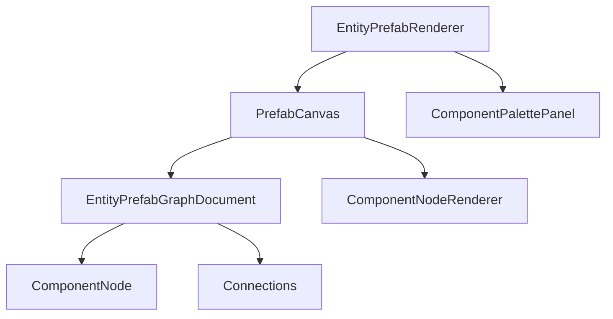

# Entity Prefab Editor Overview

The **Entity Prefab Editor** (Phase 27-31) provides a visual, node-based interface for creating reusable entity templates. Each prefab is a JSON file that describes a set of components and their connections.

## Key Concepts

- **Component Nodes**: Visual representations of ECS components (Transform, Sprite, AIBlackboard, etc.)
- **Connections**: Bezier curves linking components with dependencies
- **Canvas**: Pan, zoom, and multi-select enabled workspace
- **Component Palette**: Searchable panel to add new components via drag-drop

## Architecture



## Phases Implemented

| Phase | Feature |
|-------|---------|
| 27 | Basic rendering pipeline (IGraphRenderer adapter) |
| 28 | Interactive features: pan, zoom, drag, delete, selection |
| 29 | Drag-drop component instantiation + New Prefab menu |
| 29b | Dynamic component loading from JSON |
| 30 | Connection creation between nodes |
| 31 | Rectangle selection + Properties panel |

## File Format

Prefab files are stored as JSON in `Gamedata/PrefabEntities/`:

```json
{
  "nodes": [
    {
      "nodeId": 1,
      "componentType": "Transform",
      "componentName": "Position",
      "position": [100, 200]
    }
  ],
  "connections": [
    { "sourceId": 1, "targetId": 2 }
  ]
}
```

## Related

- [Component Library](component-library) – Available component types
- [Editor Guide](editor-guide) – Detailed usage guide
- [Runtime Instantiation](runtime-instantiation) – How prefabs are loaded at runtime
