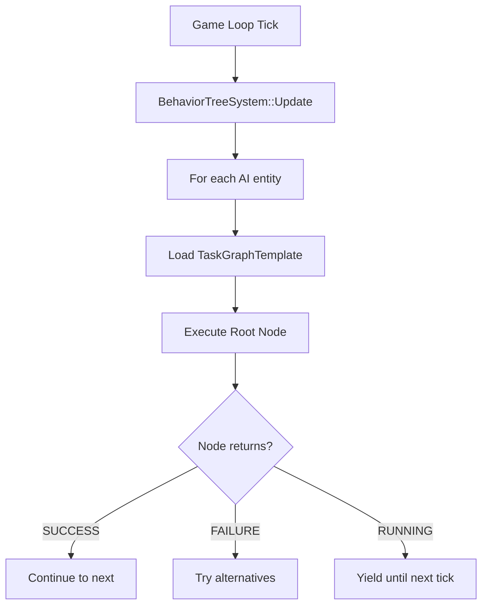

# Task Execution Pipeline

## Overview

Visual Script graphs are executed as **Behavior Trees** at runtime. The execution follows a tick-based model where the root node is evaluated each frame.

## Execution Loop



## Return Values

| Status | Meaning |
|--------|---------|
| `SUCCESS` | Node completed successfully |
| `FAILURE` | Node failed |
| `RUNNING` | Node is still executing (async) |

## Blackboard Access

Nodes access shared state via the `BlackboardSystem`:

```cpp
// In a custom node's Execute():
auto& bb = context.GetBlackboard();
float health = bb.GetFloat("health");
bb.SetBool("isAlerted", true);
```

## Condition Evaluation

Conditions use the `ConditionEvaluator` to evaluate pin-based expressions:

```cpp
ConditionEvaluator eval;
bool result = eval.Evaluate(conditionRef, blackboard);
```

## SubGraph Execution

SubGraph nodes load and execute a nested `.ats` file. The path is resolved using:

```cpp
DataManager::FindResourceRecursive(relativePath, "GameData")
```

## Related

- [Node Catalog](node-catalog)
- [Blackboard Architecture](../../technical-reference/architecture/blackboard-architecture)
