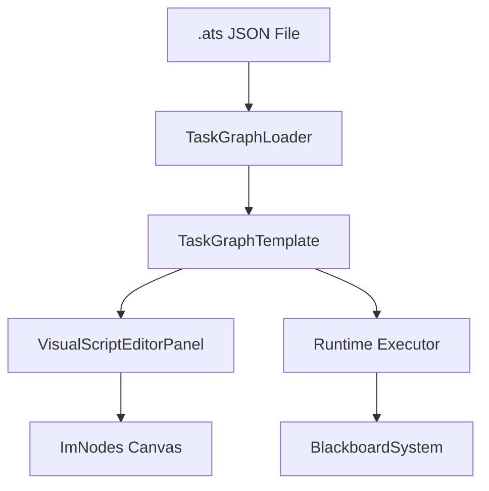

# Visual Scripting Overview

The **Visual Script System** (`.ats` files) provides a node-based programming environment for defining entity behavior without writing C++ code.

## Architecture



## Key Components

| Class | Role |
|-------|------|
| `VisualScriptEditorPanel` | Main editor panel (split into ~10 files) |
| `TaskGraphTemplate` | In-memory graph data model |
| `TaskGraphLoader` | JSON deserialization (v4 schema) |
| `VisualScriptNodeRenderer` | Per-node ImGui rendering |
| `BlackboardSystem` | Local variable storage for graphs |

## Graph File Format (v4)

```json
{
  "version": 4,
  "nodes": [ ... ],
  "connections": [ ... ],
  "presets": [ ... ],
  "localBlackboard": { ... }
}
```

## Features

- **Node types**: Action, Condition, Sequence, Selector, Decorator, SubGraph
- **Pin system**: Typed input/output pins with dynamic data support
- **Condition presets**: Reusable condition groups embedded in graph JSON
- **SubGraph navigation**: Double-click to enter subgraph files
- **Blackboard integration**: Local and global variable sharing

## Related

- [Node Catalog](node-catalog) – Complete node reference
- [Task Execution](task-execution) – How graphs execute at runtime
- [Best Practices](best-practices)
